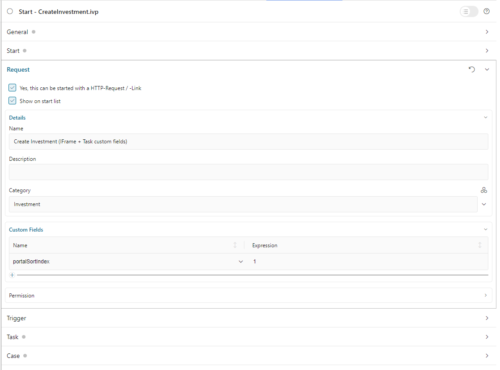

.. _configure-new-dashboard-proces-widget:

Configure Process Widget
========================

Define Process Widget
---------------------

The Process widget of the Portal dashboard is a flexible Process list with three modes.
Refer to :ref:`Process List Widget <new-dashboard-process-list-widget>` for details.

The basic structure of the JSON of a process widget is as follows:

   .. code-block:: javascript

      {
         "type": "compact-process",
         "id": "process-widget",
         "names": [
            {
               "locale": "en",
               "value": "Process Widget"
            }
         ],
         "layout": {
            "x": 10, "y": 0, "w": 2, "h": 4
         },
         "showFullscreenMode" : true,
         "showWidgetInfo" : true
      }
   ..

The basic structure of the JSON of a Process widget

   ``type``: type of the process widget. There are four types for related display
   modes: ``compact-process`` (compact mode), ``combined-process`` (combined mode),
   ``full-process`` (full mode), and ``image-process`` (image mode).

   ``id``: ID of the widget

   ``names``: multilingual name of the widget on UI.

   ``layout``: layout definition of the widget

      ``x``: HTML DOM Style ``left`` is calculated as formula ``x / 12 * 100%``

      ``y``: HTML DOM Style ``top`` is calculated as formula ``y / 12 * 100%``

      ``w``: HTML DOM Style ``width`` is calculated as formula ``60 * w + 20 * (w - 1)``

      ``h``: HTML DOM Style ``height`` is calculated as formula ``60 * h + 20 * (h - 1)``

      ``styleClass`` (optional): add CSS Classes to HTML DOM of the widget

      ``style`` (optional): add inline style to HTML DOM of the widget
      
   ``showFullscreenMode``: visibility of the fullscreen mode icon. The default
   value is ``true``, set to ``false`` to hide the icon.
   
   ``showWidgetInfo``: visibility of the widget information icon. The default
   value is ``true``, set to ``false`` to hide the icon.

Each mode has differences in its JSON definition. Refer to the below sections to
understand how to define the process widget in these modes properly.

Compact Mode
------------

Below is a standard JSON definition of a Process widget in compact mode

   .. code-block:: javascript

      {
         "type": "compact-process",
         "id": "compact_mode",
         "names": [
            {
               "locale": "en",
               "value": "Process Widget"
            }
         ],
         "layout": {
            "x": 10, "y": 0, "w": 2, "h": 4
         },
         "processPaths": ["designer/portal-developer-examples/Start Processes/Request/createNewRequest.ivp", "designer/portal-developer-examples/Start Processes/Request/collectDataRequest.ivp"],
         "categories": ["/Categories/Showcase/Customized", "/Categories/Showcase/PortalDialogExample"],
         "sorting": "SORTING_INDEX",
         "enableQuickSearch": false,
         "showFullscreenMode" : true,
         "showWidgetInfo" : true
      }
   ..

``processPaths``: the :dev-url:`|ivy| IWebStartable </doc/|version|/public-api/ch/ivyteam/ivy/workflow/start/IWebStartable.html>` identifier of the processes that you want to
show.

``categories``: categories of processes that you want to show. The value should be the :dev-url:`CMS URI </doc/|version|/designer-guide/how-to/workflow/categories.html#workflow-categories>` of this category. Process widget
will show all processes that belonged to these categories.

If you define both ``processPaths`` and ``categories``, the process widget will
show processes by ``processPaths``.

If you don't define these attributes, the process widget will show all available
processes by default.

``sorting``: define the order of process shown on widget. The default value is sorting by alphabetically. 

   If you want to order processes by Index, you must define a custom field name ``portalSortIndex`` with numeric value in process start.

   |dashboard-process-sort-index|

``enableQuickSearch``: enable the quick search feature for the widget. By default, this
feature is activated and searches for ``the process name``.

      Valid values:

      - ``true``: show the quick search text box.
      - ``false``: hide the quick search text box.
      - ``not defined``: show the quick search text box as default.

Combined Mode
-------------

Below is a standard JSON definition of a Process widget in combined mode

   .. code-block:: javascript

      {
         "type": "combined-process",
         "id": "combined_mode",
         "names": [
            {
               "locale": "en",
               "value": "Process Widget"
            }
         ],
         "layout": {
            "x": 0, "y": 0, "w": 6, "h": 7
         },
         "processPath": "designer/portal-developer-examples/Start Processes/CreateTestData/createNewPayment.ivp",
         "rowsPerPage": 5,
         "showFullscreenMode" : true,
         "showWidgetInfo" : true
      }
   ..

``processPath``: the :dev-url:`|ivy| IWebStartable </doc/|version|/public-api/ch/ivyteam/ivy/workflow/start/IWebStartable.html>` identifier of the process you want to display.
The Process widget will show all tasks and cases of this process, too.

``rowsPerPage``: the number of tasks/cases that are displayed on one page. 
If you don't define this attribute, the default value is 5 rows per page.

Full mode
---------

Below is a standard JSON definition of a Process widget in full mode

   .. code-block:: javascript

      {
         "type": "full-process",
         "id": "full_mode",
         "names": [
            {
               "locale": "en",
               "value": "Process Widget"
            }
         ],
         "layout": {
            "x": 0, "y": 0, "w": 6, "h": 7
         },
         "processPath": "designer/portal-developer-examples/Start Processes/CreateTestData/createNewPayment.ivp",
         "showFullscreenMode" : true,
         "showWidgetInfo" : true
      }
   ..

Image Mode
----------

Below is a standard JSON definition of the Process widget in image mode

   .. code-block:: javascript

      {
         "type": "image-process",
         "id": "image_mode",
         "names": [
            {
               "locale": "en",
               "value": "Process Widget"
            }
         ],
         "layout": {
            "x": 0, "y": 0, "w": 6, "h": 7
         },
         "processPath": "designer/portal-developer-examples/Start Processes/CreateTestData/createNewPayment.ivp",
         "showFullscreenMode" : true,
         "showWidgetInfo" : true
      }
   ..

