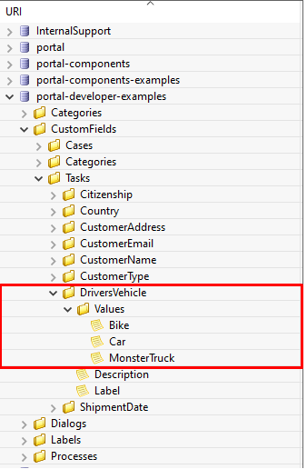

.. _configure-new-dashboard-task-widget:

Configure Task Widget
=====================

Define Task Widget
------------------

The Task widget of the Portal dashboard is an interactive task list. Refer
to :ref:`Task List Widget <new-dashboard-task-list-widget>` for details.

Below is a sample JSON definition of a task widget in the Portal dashboard

.. code-block:: javascript

   {
      "type": "task",
      "id": "task-widget",
      "names": [
         {
            "locale": "en",
            "value": "Task Widget"
         }
      ],
      "layout": {
         "x": 0,
         "y": 0,
         "w": 10,
         "h": 9,
         "style": "color: red;",
         "styleClass": "your-widget-class"
      },
      "sortField": "name",
      "rowsPerPage": 20,
      "showWidgetInfo": true,
      "showFullscreenMode": true,
      "isTopMenu": false,
      "columns": [
         {
            "field": "start"
         },
         {
            "field": "priority",
            "visible": "false"
         },
         {
            "field": "id"
         },
         {
            "field": "name"
         },
         {
            "field": "state",
            "headers": [
            {
               "locale": "en",
               "value": "State"
            },
            {
               "locale": "de",
               "value": "Status"
            }
            ]
         },
         {
            "field": "startTimestamp"
         },
         {
            "field": "actions"
         }
      ]
   }
..

The basic JSON structure of a Task widget

   ``type``: type of the widget. Use ``task`` for a task widget

   ``id``: ID of the widget

   ``names``: multilingual name of the widget on the UI

   ``layout``: layout definition of the widget

      ``x``: HTML DOM Style ``left`` is calculated as formula ``x / 12 * 100%``

      ``y``: HTML DOM Style ``top`` is calculated as formula ``y / 12 * 100%``

      ``w``: HTML DOM Style ``width`` is calculated as formula ``60 * w + 20 * (w - 1)``

      ``h``: HTML DOM Style ``height`` is calculated as formula ``60 * h + 20 * (h - 1)``

      ``styleClass`` (optional): add CSS Classes to HTML DOM of the widget

      ``style`` (optional): add inline style to HTML DOM of the widget

   ``sortField``: default sort field for the widget

   ``sortDescending``: sort direction of the default sort field. The default value is ``false`` (sort ascending)

   ``rowsPerPage``: maximum number of tasks can be displayed on one page of the task widget. 
   The default value is 10 rows per page

   ``showWidgetInfo``: visibility of the widget information icon. The default value is ``true``, set to ``false`` to hide the icon

   ``showFullscreenMode``: visibility of the fullscreen mode icon. The default value is ``true``, set to ``false`` to hide the icon

   ``isTopMenu``: if the value is ``true``, the dashboard appears as a top-level item in the navigation bar. 
   If the value is ``false``, it appears as a sub-item under the `Dashboard` menu. 
   The default value is ``false``.

   ``columns``: column configurations for each of the columns in the widget. You
   can predefine filters, styles, visibility,... of columns and define custom
   columns, too:

      ``field``: the field name of the column
         
         For standard columns, ``field`` must be one of these:
         
            - ``start``: column which contains start button to start the task directly.
  
            - ``priority``: task priority

            - ``id``: task ID

            - ``name``: task name

            - ``description``: task description

            - ``activator``: task activator

            - ``state``: task business state

            - ``startTimestamp``: created date and time of the task

            - ``expiryTimestamp``: expiry date and time of the task
            
            - ``actions``: for further actions: access task details, reset task, delegate task, reserve, destroy task, trigger escalation task and add Ad-hoc task

         For custom columns, ``field`` is the name of a task custom field.
         Portal will use the value of ``field`` to get the value of the column.

      ``canWorkOn``: filter only tasks that the current user can work on. The default value is "false".

      ``visible``: visibility of a column. The default value is "true".
      Set to "false" to hide the column.

      ``quickSearch``: Adds this field to the search scope of the quick search. The default value is ``false``.
      Set it to ``true`` to apply search condition for the column.

   -  ``headers``: multilingual header of the column.

.. _configure-new-dashboard-task-widget-custom-columns:

Custom Columns
--------------

|ivy| supports custom fields for tasks. You can show them in the Task widget
as a column.

You can predefine which column to show, and other attributes such as filter, format, and style. Below is a standard JSON of a custom column.

.. code-block:: javascript
   
   {
      ...

      "columns": [
            {
               "type": "CUSTOM",
               "field": "HIDE",
               "style": "width: 110px"
            }
      ]
   }

..

Besides attributes explained in the previous section, a custom column has two
differences:

   - ``type``: type of the widget column. There are two options: ``STANDARD`` and ``CUSTOM``.

   - ``field``: this attribute is the name of the task's custom field which will
     be used to get data for the column.

.. important::
   Portal only displays custom fields declared in the ``custom-fields.yaml`` file.
   Refer to :dev-url:`Custom Fields Meta Information </doc/|version|/designer-guide/how-to/workflow/custom-fields.html#meta-information>` for more information.

Filter Conditions
-----------------

You can predefine filter conditions for most columns of the task widget. Each
column has different requirements: some accept only a list, some accept only a
string, and others require a string in a specific format, such as date-time.
Please refer to :ref:`Complex Filter <complex-filter>` for more details.

Base structure of filter json:

   .. code-block:: javascript

         {
            ...

            "columns" : [
               {
                  "field" : "description"
               }
            ],
            "filters" : [
                  {
                     "field" : "description",
                     "values" : [ "Leave Request" ],
                     "operator" : "contains",
                     "type" : "standard"
                  }
            ]
         }

   ..

..  _configure-new-dashboard-task-widget-filter-structure:

   - ``field``: filter field name corresponding with column name
   - ``values``: filter value, could be a list, a string or a number
   - ``operator``: filter operator, operators can be difference depend on each field type.

      - **String column**: is, is_not, empty, not_empty, contains, not_contains, start_with, not_start_with, end_with, not_end_with

      - **Number column**: between, not_between, empty, not_empty, equal, not_equal, less, less_or_equal, greater, greater_or_equal

      - **Date column**: today, yesterday, is, is_not, before, after, between, not_between, current, last, next, empty, not_empty

   - ``type``: ``standard`` for standard column or ``custom`` for custom column

   - Date type additional field:

      - ``periodType``: string value. E.g.: ``YEAR``, ``MONTH``, ``WEEK``, ``DAY``

      - ``from``: string value. E.g.: "04/04/2024"

      - ``to``: string value. E.g.: "05/05/2024"

There are additional fields dependent on the operator and many specific filters
for each field type. Below is the list of filterable columns and their
corresponding filter conditions.

.. tip::
   We encourage utilizing dashboard configurations to edit widgets and then leveraging the export dashboard feature to ensure better expectations when customizing these widgets.

Standard Column:

   - ``activator``

      .. code-block:: javascript

         {
            ...

            "columns": [
               {
                  "field": "activator"
               }
            ],
            "filters": [
               {
                  "field": "activator",
                  "values": [ "backendDev2" ],
                  "operator": "not_in",
                  "type": "standard"
               }
            ]
         }

      ..

      This column only accepts a list of role names or usernames as filter conditions
      for the task's responsible username. The available filter operators are ``in``, ``not_in`` and ``current_user``.
      The ``current_user`` operator does not require value field.

   - ``name``

      .. code-block:: javascript

         {
            ...

            "columns": [
               {
                  "field": "name"
               }
            ],
            "filters" : [
               {
                  "field": "name",
                  "values": [ "Task", "Leave Request" ],
                  "operator": "contains",
                  "type": "standard"
               }
            ]
         }
      ..

      This column accepts all operators available for String column.
      Additionally, it accepts ``value`` as a list of string.

   - ``description``

      .. code-block:: javascript

         {
            ...

            "columns": [
               {
                  "field": "description"
               }
            ],
            "filters": [
               {
                  "field": "description",
                  "values": [
                  "leave request"
                  ],
                  "operator": "contains",
                  "type": "standard"
               }
            ]
         }

      ..

      This column accepts all operators available for String column. Additionally, it accepts ``value`` as a list of string.

   - ``priority``

      .. code-block:: javascript

         {
            ...

            "columns": [
               {
                  "field": "priority"
               }
            ],
            "filters": [
               {
                  "field": "priority",
                  "values": [ "HIGH", "NORMAL", "LOW" ],
                  "operator": "in",
                  "type": "standard"
               }
            ]
         }

      ..

      This column only accepts a list of priorities' names as the filter
      condition. The available filter operator is ``in``.

      Refer to :dev-url:`Task Priority </doc/|version|/public-api/ch/ivyteam/ivy/workflow/WorkflowPriority.html>` for
      available task priorities.

   - ``state``

      .. code-block:: javascript

         {
            ...

            "columns": [
               {
                  "field": "state"
               },
            ],
            "filters": [
               {
                  "field": "state",
                  "value": [ "DELAYED", "DESTROYED" ],
                  "operator" : "in",
                  "type" : "standard"
               }
            ]
         }
      ..

      This column only accepts a list of task business state names as its filter
      condition. The available filter operator is ``in``. 

      Refer to :dev-url:`Task Business States </doc/|version|/public-api/ch/ivyteam/ivy/workflow/TaskBusinessState.html>` for
      available task business states.

   - ``startTimestamp`` and ``expiryTimestamp`` : created date and finished date of the Task

      .. code-block:: javascript

         {
            ...
      
            "columns": [
               {
                  "field": "startTimestamp"
               }
            ],
            "filters" : [
               {
                  "field": "startTimestamp",
                  "operator": "today",
                  "type" : "standard"
               },
               {
                  "field" : "startTimestamp",
                  "from" : "04/04/2024",
                  "operator" : "before",
                  "type" : "standard"
               },
               {
                  "field" : "expiryTimestamp",
                  "from" : "04/04/2024",
                  "to" : "04/06/2024",
                  "operator" : "between",
                  "type" : "standard"
               },
               {
                  "field" : "expiryTimestamp",
                  "operator" : "last",
                  "periods" : 1,
                  "periodType" : "YEAR",
                  "type" : "standard"
               }       
            ]
         }

      ..

      These columns accept all operators available for Date column. Fields may
      vary depending on the operator. The JSON example above covers most use
      cases for the Date field. Acceptable date formats: ``dd.MM.yyyy``, ``dd.MM.yyyy HH:mm``, ``MM/dd/yyyy`` and
      ``MM/dd/yyyy HH:mm``.

   - ``application``

      .. code-block:: javascript

         {
            ...

            "columns": [
               {
                  "field": "application"
               }
            ],
            "filters": [
               {
               "field" : "application",
               "values" : [ "designer" ],
               "operator" : "in",
               "type" : "standard"
               }
            ]
         }

Custom Field Column :

   -  :ref:`configure-new-dashboard-task-widget-custom-columns` are using the
      same operator as :ref:`Standard Column
      <configure-new-dashboard-task-widget-filter-structure>`.

   - ``type`` field must be ``custom`` for Custom Field and ``custom_case`` for Custom Case Field.

   .. code-block:: javascript
      
         {
            ...

            "columns": [
               {
                  "field" : "CustomerName"
               }
            ],
            "filters": [
               {
                  "field" : "CustomerName",
                  "operator" : "not_empty",
                  "type" : "custom"
               }
            ]
         }
   
   ..

Quick Search
------------

The quick search is a useful function for users to quickly search the tasks within the task widget.
The configuration of the quick search has two attributes:
   
   * ``enableQuickSearch``: enables the quick search feature for the widget.

   * ``quickSearch``: indicates that a column is searchable using the quick search feature.

If you set the ``enableQuickSearch`` attribute to ``false``, the quick search feature will be disabled,
regardless of the ``quickSearch`` attribute's value.

Conversely, if you set the ``enableQuickSearch`` attribute to ``true``, the quick search feature will
search within the values of all columns that have the ``quickSearch`` attribute set to ``true``.
If you haven't assigned the ``quickSearch`` attribute to any column in the task widget,
the quick search feature will default to searching the name and description fields.

Below are the definition of these attributes:

   * ``enableQuickSearch``: to enable/disable the quick search feature, set the
     ``enableQuickSearch`` field of the Task widget as shown below.

      .. code-block:: javascript

         {
            ...
            "type": "task",
            "id": "task_98ae4fc1c83f4f22be5244c8027ecf40"
            ...
            "enableQuickSearch": "true",
            ...
         }

      ..

      Valid values:

      * ``true``: show the quick search text box.
      * ``false``: hide the quick search text box.
      * ``not defined``: hide the quick search text box.

   * ``quickSearch``: to choose which columns can be searched by the quick search
     feature, set the ``quickSearch`` field for each column as shown below.

      .. code-block:: javascript

         {
            ...
            "type": "task",
            "id": "task_98ae4fc1c83f4f22be5244c8027ecf40"
            ...
            "columns": [
               {
                  "field": "id",
                  "quickSearch": "false"
               },
               ...
            ]
            ...
         }

      ..

      Valid values:

      * ``true``: apply quick search for this column.
      * ``false``: do not apply quick search for this column.
      * ``not defined``: the ``name`` and ``description`` columns are ``true``, other columns are ``false`` by default.

Multi-Language Support for Custom String Fields
-----------------------------------------------

With the **Multi-Language Support for Custom Fields** feature, we enable the provision of values in a custom field in multiple languages.
The field content is displayed based on the user's selected language in the custom field.

.. important::
   Portal only supports Multi-Language for Custom Fields with ``TYPE: STRING``.

Enabling Multi-Language Support
^^^^^^^^^^^^^^^^^^^^^^^^^^^^^^^

To allow a custom field to retrieve multilingual values from the CMS, set the ``HasCmsValue`` attribute to ``true`` in the corresponding ``custom-field`` yaml file configuration.
Otherwise, the logic remains unchanged, and the custom field uses the static value.
Additionally, the value must be entered and maintained in the CMS in different
languages.

Following this path to add your custom field values: ``/CustomFields/Tasks/{fieldName}/Values/{value}``
Please follow this :dev-url:`Localize Label, Description, Category
and Values </doc/|version|/designer-guide/configuration/custom-fields.html#localize-label-description-category-and-values>`
to get more information.

Example YAML Configuration
^^^^^^^^^^^^^^^^^^^^^^^^^^

.. code-block:: yaml

   DriversVehicle:
      Label: Drivers Vehicle
      Description: Vehicle they use for delivery
      HasCmsValues: true
      TYPE: STRING

In your CMS, the path should be
``/CustomFields/Tasks/DriversVehicle/Values/Bike``,
``/CustomFields/Tasks/DriversVehicle/Values/Car`` or
``/CustomFields/Tasks/DriversVehicle/Values/MonsterTruck``.

|task-field-cms|

Result
^^^^^^

- If ``HasCmsValues`` is set with ``true``, the values from the CMS are used.
- If the values are entered and translated in the CMS, then the custom field is displayed based on the selected language.
- If the translation for a value is missing in the CMS, the static value from the entry is used instead.

Sorting, Filtering, and Searching for Multi-Language Custom Fields
^^^^^^^^^^^^^^^^^^^^^^^^^^^^^^^^^^^^^^^^^^^^^^^^^^^^^^^^^^^^^^^^^^

Sorting
^^^^^^^

1. ``HasCmsValues = false`` or not set. Sorting is performed as usual based on the stored values.
2. ``HasCmsValues = true``. Sorting is performed based on the translated values in the currently selected language.

.. note::

   If ``HasCmsValues = true`` but a translation is missing in a specific language, the untranslated value is sorted below the translated values and displayed with the static value.

Searching
^^^^^^^^^

1. ``HasCmsValues = false`` or not set. The search is performed as usual based on the stored value.
2. ``HasCmsValues = true``. The search is conducted in both the CMS translations and the original value.

Example: When language is German, a user can search for **Fahrrad** or the original value **Bike**.

Filtering
^^^^^^^^^

1. ``HasCmsValues = false`` or not set. Filtering is performaed as usual based on the stored value.
2. ``HasCmsValues = true``. Filtering is based on the translated value from the CMS.

.. important::

   When enabling the Multi-Language for Custom Fields, only ``CONTAINS`` operator which is allowed to be used.

.. tip::

   If a value needs to be filtered in multiple languages, all corresponding translations must be in the filter.

Conclusion
^^^^^^^^^^

With Multi-Language Support for Custom Fields, we enable flexible and dynamic
provision of field content in multiple languages. The functionalities for
searching, sorting, and filtering have been adapted accordingly to ensure
consistent behavior for multilingual content.

