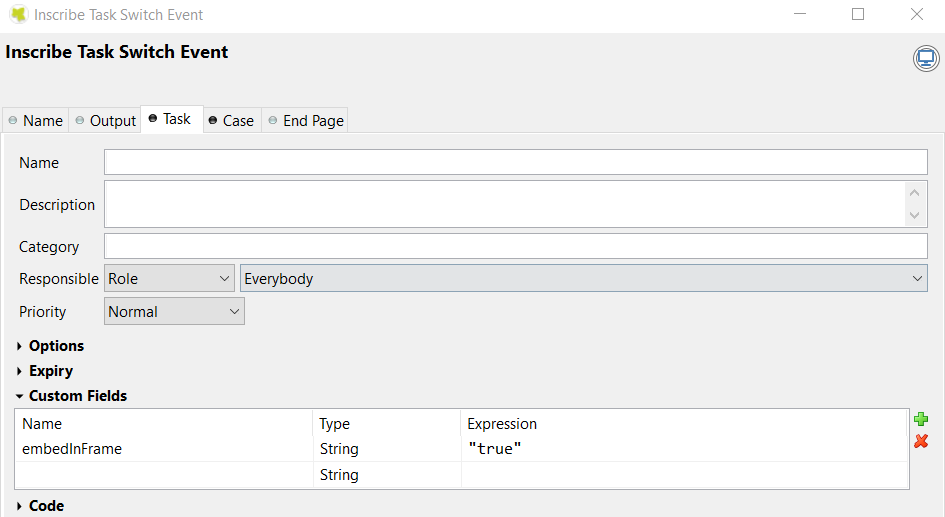
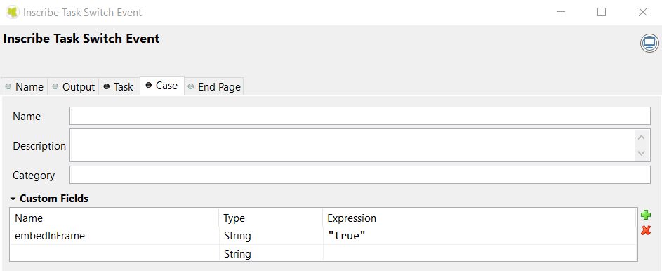

.. _iframe-in-portal:

IFrame in Portal
****************

Do you want to decouple your project and **Portal** when start a task to reduce your migration effort?
If the answer is yes, this chapter will help you.

Since **Portal** 8, we introduce new feature that a process/task could be started inside iFrame, means that you can feel free to design
your html dialog independent from **Portal**, it is rendered automatically inside iFrame as default in order to reduce migration effort.

.. _iframe-usage:

How to use
==========

.. important::
	If there is no configuration, a process/task is started inside iFrame as default.

Follow these steps:
 
#. Your HTML User Dialog must be independent from **Portal**, could use the ``frame-9`` template in designer, or your own template, **Portal** will render it automatically in iFrame
	
#. To pass some supported params in iFrame such as process steps, refer to :ref:`IFrameTaskTemplate <components-layout-templates-iframe-task-template>`

#. If you don't want to use the default configuration, follow one of these 3 levels to open your task(s) in iFrame:

   - Task level: in Task custom fields, set the ``embedInFrame`` String field to
   
   	- ``true``: start inside iFrame
   	- ``false``: not start inside iFrame
   	- Don't set to check case level
   	
   	|task-embedInFrame|
   
   - Case level: in Case custom fields, set the ``embedInFrame`` String field to 
   
   	- ``true``: start inside iFrame 
   	- ``false``: not start inside iFrame 
   	- Don't set to check engine level
   	
   	|case-embedInFrame|
   
   - Engine level:
   
   	- **Portal Administrator** could choose the option that all of the tasks in whole engine are started inside iFrame or not via the ``Portal.EmbedInFrame`` Portal settings, refer to :ref:`update-portal-settings`

Customization
=============

In case you had built your own portal and **had copied the** ``PortalStart`` **process** from ``<PortalTemplate>`` to your project.

You must follow some important steps to ensure that your processes/tasks can be rendered inside an iFrame:

  1. Make sure your own portal project depends on the ``<PortalTemplate>``

     - E.g: ``<CustomizedPortal>`` depends on the ``<PortalTemplate>``

  2. Create a business project that contains all business processes.

     a. E.g: A project name ``<BusinessProject>``

     b. If your business project (``<BusinessProject>``) needs some data/ressources from the portal project (``<CustomizedPortal>``) 
        then create a dependency between these two projects. If not, please **skip step 2.b**.

       * E.g. ``<BusinessProject>`` depends on ``<CustomizedPortal>``

  3. Change the ``DefaultPages`` in ``StandardProcesses`` to your customized portal project library id.
     Refer to :dev-url:`Standard Processes </doc/9.3.5/engine-guide/deployment/advanced/index.html>` documentation.

     - E.g: DefaultPages: ``<CustomizedPortal>`` ID.

Now you can develop your own processes inside the ``<BusinessProject>`` and the dialogs will be rendered automatically using iFrame.

.. important:: 
    We must create 2 projects: ``<CustomizedPortal>`` and ``<BusinessProject>`` and create your process start in ``<BusinessProject>``, not in ``<CustomizedPortal>``.

    Because you copied ``PortalStart.mod`` and this mod contains the ``DefaultFramePage.ivp`` start.
    So every process start which is in the same **PMV** as the ``DefaultFramePage.ivp`` is not opened in the IFrame, to avoid recursion.
    This means that not the iFrame Dialog itself is opened again in an IFrame and so on.

