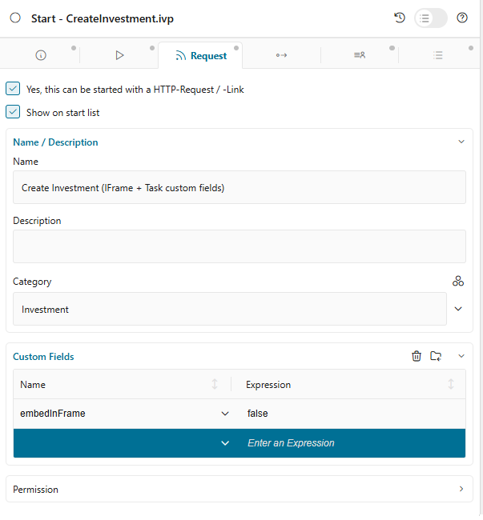

.. _iframe-in-portal:

IFrame In Portal
****************

Since Portal 8, all processes and tasks start inside an iFrame by default. Your HTML dialogs are automatically rendered in an isolated iFrame context, providing decoupling from Portal internals, simplified migrations, CSS/JavaScript isolation, and full responsive design support.

.. important::
   By default, processes and tasks start inside an iFrame. No configuration is required unless you want to customize this behavior.

Templates to Use with IFrame
=============================

Use the ``frame-10`` templates provided by Axon Ivy core (using the Freya theme). These templates are optimized for iFrame rendering and fully support responsive designs.

**Template Features:**

``Automatic iFrame Integration``
   Seamless integration with Portal iFrame architecture

``Responsive Layout``
   Full support for responsive designs across all device sizes

``Portal UI Components``
   Includes task actions, case information, and process step visualization

``Configurable Details``
   Customizable task details and branding options

Configuration Levels
=====================

Control whether tasks start in an iFrame at multiple levels. Portal evaluates these settings in priority order, with more specific levels overriding general ones.

**Priority Order:** Request Start (highest) → Task → Case → Engine (lowest, default: ``true``)

**Priority Order:** Request Start (highest) → Task → Case → Engine (lowest, default: ``true``)

.. list-table::
   :widths: 20 15 65
   :header-rows: 1

   * - Level
     - Priority
     - Description
   * - **Request Start**
     - Highest
     - Set ``embedInFrame`` in Request tab custom fields. Overrides all other settings
   * - **Task**
     - High
     - Set ``embedInFrame`` in Task custom fields. Overrides Case and Engine settings
   * - **Case**
     - Medium
     - Set ``embedInFrame`` in Case custom fields. Overrides Engine settings
   * - **Engine**
     - Lowest
     - Global setting ``Portal.EmbedInFrame`` in Portal admin settings

Request Start Level
-------------------

Set the ``embedInFrame`` field in Request tab custom fields:

- ``true``: Start inside iFrame
- ``false``: Do not start inside iFrame
- Unset: Use Task, Case, or Engine configuration

|request-tab-embedInFrame|

Task Level
----------

Set the ``embedInFrame`` field in Task custom fields:

- ``true``: Start inside iFrame
- ``false``: Do not start inside iFrame  
- Unset: Use Case or Engine configuration

|task-embedInFrame|

Case Level
----------

Set the ``embedInFrame`` String field in Case custom fields:

- ``true``: Start inside iFrame
- ``false``: Do not start inside iFrame
- Unset: Use Engine configuration

|case-embedInFrame|

Engine Level
------------

Portal Administrators can globally configure all tasks to start inside iFrames by setting the ``Portal.EmbedInFrame`` value in Portal admin settings.

Refer to :ref:`update-portal-settings` for configuration details.

.. _iframe-configure-template:

Configure IFrame Template
==========================

Portal provides extensive configuration options for iFrame templates to customize the appearance and behavior of embedded tasks, including task name and icon customization, process chain visualization, case information display, task action buttons, custom breadcrumb views, and card-style frame layout.

Template Parameters Reference
------------------------------

Task Details
^^^^^^^^^^^^

``taskName`` (string)
   Custom text for the task name display.

``taskIcon`` (string)
   Icon using Streamline or Font Awesome (e.g., ``"si si-bulb"``).

``isHideTaskName`` (boolean, default: false)
   ``true`` = hide task name, ``false`` = show.

Case Information
^^^^^^^^^^^^^^^^

``caseId`` (string)
   ID of the case to display in case information dialog.

``isHideCaseInfo`` (boolean, default: false)
   ``true`` = hide "Show Information" button, ``false`` = show.

Process Steps
^^^^^^^^^^^^^

``currentProcessStep`` (string/number)
   Current step index or step name.

``processSteps`` (string/array)
   List of step names or JSON string.

``isShowAllSteps`` (boolean, default: false)
   ``true`` = show all steps on large screens, ``false`` = compact view.

``processChainDirection`` (string)
   ``"VERTICAL"`` or ``"HORIZONTAL"``.

``processChainShape`` (string)
   ``"LINE"`` or ``"CIRCLE"``.

Task Actions
^^^^^^^^^^^^

``isHideTaskAction`` (boolean, default: false)
   ``true`` = hide task action button, ``false`` = show.

``isWorkingOnATask`` (boolean, default: true)
   ``true`` = show navigation warning, ``false`` = no warning.

Miscellaneous
^^^^^^^^^^^^^

``announcementInvisible`` (boolean, default: false)
   ``true`` = hide announcements, ``false`` = show.

``isCardFrame`` (boolean, default: false)
   ``true`` = display content in card-style container, ``false`` = standard.

``viewName`` (string)
   Custom breadcrumb view (see View Names below).

**Available View Names:**

``HOME``, ``PROCESS``, ``TASK``, ``TASK_DETAIL``, ``CASE_DETAIL``, ``CASE``, ``TECHNICAL_CASE``, ``RELATED_TASK``, ``USER_PROFILE``, ``ABSENCES_MANAGEMENT``, ``DASHBOARD_CONFIGURATION``, ``EDIT_DASHBOARD_DETAILS``, ``PROCESS_VIEWER``, ``PORTAL_MANAGEMENT``, ``NOTIFICATION``

Configuration Methods
=====================

Configure iFrame templates using the ``IFrameTaskConfig`` component.

.. note::
   Always sanitize your parameters before passing them to avoid XSS vulnerabilities. Use ``SanitizeAPI.escapeForJavascript`` for dynamic values.

Using IFrameTaskConfig Component
--------------------------------

The recommended approach uses the Portal component for type-safe configuration:

.. code-block:: xml

   <h:body>
      <ui:composition template="/layouts/frame-10.xhtml">
         <ui:define name="content">
            <ic:com.axonivy.portal.components.IFrameTaskConfig 
               taskName="Approve Investment" 
               taskIcon="si si-bulb"
               isHideTaskName="false"
               caseId="123456"
               isHideCaseInfo="false"
               currentProcessStep="0"
               processSteps='["Create Investment Request", "Approve Investment Request"]'
               isShowAllSteps="true"
               processChainDirection="VERTICAL"
               processChainShape="LINE"
               isHideTaskAction="false"
               isWorkingOnATask="true"
               announcementInvisible="false"
               isCardFrame="true"
               viewName="TASK_DETAIL"
            />
            
            <!-- Your custom UI content -->
            <h:form>
               <!-- ... -->
            </h:form>
         </ui:define>
      </ui:composition>
   </h:body>

Configuration Examples
======================

Configure Task Details
----------------------

You can customize task details, such as the task name and icon.

.. code-block:: xml

   <ic:com.axonivy.portal.components.IFrameTaskConfig
      taskName="Approve Investment Request"
      taskIcon="si si-bulb"
      isHideTaskName="false"
   />

Configure Case Information
--------------------------

Customize how case details are displayed and whether to show the “Show Information” button.

.. code-block:: xml

   <ic:com.axonivy.portal.components.IFrameTaskConfig
      caseId="#{ivy.case.uuid}"
      isHideCaseInfo="false"
   />

Configure Process Steps
-----------------------

.. code-block:: xml

   <ic:com.axonivy.portal.components.IFrameTaskConfig 
      currentProcessStep="1"
      processSteps='["Create Request", "Manager Approval", "Finance Review", "Complete"]'
      isShowAllSteps="true"
      processChainDirection="HORIZONTAL"
      processChainShape="LINE"
   />

.. note::
   Add JSP function tag to your HTML dialog: ``xmlns:fn="http://xmlns.jcp.org/jsp/jstl/functions"``

Configure Task Actions
----------------------

Control the visibility and behavior of task-related buttons and actions.

.. code-block:: xml

   <ic:com.axonivy.portal.components.IFrameTaskConfig
      isHideTaskAction="false"
      isWorkingOnATask="true"
   />

Configure Card Frame Layout
---------------------------

.. code-block:: xml

   <ic:com.axonivy.portal.components.IFrameTaskConfig
      isCardFrame="true"
      announcementInvisible="false"
      viewName="TASK_DETAIL"
   />

Complete Configuration Example
------------------------------

.. code-block:: xml

   <h:body>
      <ui:composition template="/layouts/frame-10.xhtml">
         <ui:define name="content">
            <ic:com.axonivy.portal.components.IFrameTaskConfig 
               taskName="#{data.taskName}"
               taskIcon="si si-file-edit"
               isHideTaskName="false"
               caseId="#{ivy.case.uuid}"
               isHideCaseInfo="false"
               currentProcessStep="#{data.currentStep}"
               processSteps="#{portalComponentUtilsBean.convertToJSON(data.processSteps)}"
               isShowAllSteps="true"
               processChainDirection="HORIZONTAL"
               processChainShape="LINE"
               isHideTaskAction="false"
               isWorkingOnATask="true"
               announcementInvisible="false"
               isCardFrame="true"
               viewName="TASK_DETAIL"
            />
            
            <h:form id="investmentForm">
               <p:panel header="Investment Request">
                  <!-- Your form fields -->
               </p:panel>
               
               <p:commandButton value="Submit" action="#{logic.submit}" />
               <p:commandButton value="Cancel" action="#{logic.cancel}" />
            </h:form>
         </ui:define>
      </ui:composition>
   </h:body>

Developer Tips
==============

Navigation Without Task Completion
-----------------------------------

If your project has navigation buttons that don't complete a task (e.g., Cancel), redirect users to the desired page (application home, task list, process list, etc.) directly in the HTML dialog.

**Example:**

.. code-block:: java

   public void cancelTask() {
      // Redirect to task list instead of completing task
      String taskListUrl = PortalNavigatorAPI.buildUrlByKeyword("TASK");
      Ivy.html().sendRedirect(taskListUrl);
   }

JavaScript String Sanitization
-------------------------------

Always sanitize your data before sending it to prevent XSS attacks. Portal provides the public API ``SanitizeAPI.escapeForJavascript`` in the ``portal-components`` project.

**Example:**

.. code-block:: java

   import ch.ivy.addon.portalkit.publicapi.SanitizeAPI;

   public class TaskBean {
      public String getSafeTaskName() {
         String rawTaskName = getUserInputTaskName();
         return SanitizeAPI.escapeForJavascript(rawTaskName);
      }
   }

**In your HTML dialog:**

.. code-block:: xml

   <ic:com.axonivy.portal.components.IFrameTaskConfig 
      taskName="#{taskBean.safeTaskName}"
   />

.. tip::
   Always sanitize user input, database values, or any dynamic content before passing to Portal components or JavaScript.

Best Practices
==============

#. **Use IFrameTaskConfig Component**: Prefer the component-based approach over JavaScript configuration
#. **Sanitize All Parameters**: Use ``SanitizeAPI.escapeForJavascript`` for dynamic values
#. **Process Steps**: Provide clear, descriptive step names for better user experience
#. **Task Icons**: Use consistent icon styles (Streamline or Font Awesome) across your application
#. **Card Frame**: Enable ``isCardFrame`` for better visual separation of embedded content

.. |task-embedInFrame| image:: images/task-embedInFrame.png
.. |case-embedInFrame| image:: images/case-embedInFrame.png
.. |case-list-template| image:: ../../screenshots/case/case-key-information.png
.. |task-list-template| image:: ../../screenshots/task/task-key-information.png
.. |task-name-template| image:: ../../screenshots/layout-template/task-template.png
