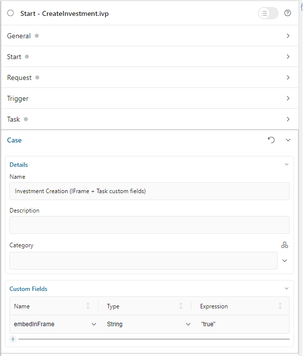

.. _iframe-in-portal:

IFrame In Portal
****************

Do you want to decouple your project and the **Portal** when starting a task to reduce your migration efforts?
If the answer is yes, this chapter will help you.

Since **Portal** 8, we introduced a new feature that a process/task can be started inside an IFrame This means that you can design
your HTML dialog independent of the  **Portal**. It is rendered automatically inside an IFrame by default.

.. _iframe-usage:

Templates to use with IFrame:

#. frame-8 template (Provided by core, uses Serenity theme)

#. frame-10 templates (Provided by core, uses Freya theme)

These templates fully support responsiveness.

How To Use
==========

.. important::
	By default, i.e. if there is no configuration, a process/task is started inside an IFrame.

Follow these steps to use the IFrame approach:
 
#. Your HTML User Dialog has to be independent of the **Portal**. You can use
   the ``frame-_x_`` template in designer, or your own template. **Portal** will
   render it automatically in an IFrame.

#. If you don't want to use the default configuration, apply one of the following three
   levels to open your task(s) in an IFrame:

   - Task level: in Task custom fields, set the ``embedInFrame`` String field to
   
   	- ``true``: start inside IFrame
   	- ``false``: not start inside IFrame
   	- Don't set if you want to use case or engine level
   	
   	|task-embedInFrame|
   
   - Case level: in Case custom fields, set the ``embedInFrame`` String field to 
   
   	- ``true``: start inside IFrame 
   	- ``false``: not start inside IFrame 
   	- Don't set if you want to use engine level
   	
   	|case-embedInFrame|
   
   - Engine level:
   
     - The **Portal Administrator** can define globally that all of the tasks
       running on the engine are started inside IFrames by using the
       ``Portal.EmbedInFrame`` Portal setting. refer to
       :ref:`update-portal-settings`

Configure template
==================

**Portal** supports some layout options for the templates mentioned above.

#. ``Task name``: name of the working task.

#. ``Process steps``: Refer to :ref:`components-portal-components-process-chain`.

#. ``Show Information``: button to show Case details and other actions.

|task-name-template|

You can configure those options by using Javascript from your HTML dialog as follows:

.. code-block:: xml

   <h:body>
      <ui:composition template="/layouts/frame-10.xhtml">
         ...
         
         ...
      </ui:composition>
   </h:body>

Configure Task name
-------------------

By default, **Portal** uses the name of the working task.

Options for ``Task name``

.. csv-table::
  :file: documents/available_task_options.csv
  :widths: 20 50
  :header-rows: 1
  :class: longtable

Example:

.. code-block:: xml

   <h:body>
      <ui:composition template="/layouts/frame-10.xhtml">
         ...
         
         ...
      </ui:composition>
   </h:body>

Configure Show Information
--------------------------

When you click the ``Show Information`` button, **Portal** will show  details of the
running case in a modal dialog.

Options for ``Show Information``

   - ``caseId``: Case ID of the case you want to show in the modal dialog.
   - ``isHideCaseInfo``: Hide the ``Show Information`` button

.. csv-table::
  :file: documents/available_show_information_options.csv
  :widths: 20 50
  :header-rows: 1
  :class: longtable

Example:

.. code-block:: xml

   <h:body>
      <ui:composition template="/layouts/frame-10.xhtml">
         ...
         
         ...
      </ui:composition>
   </h:body>

Configure Process steps
-----------------------

``Process steps`` have many options to be configured from the list of steps to layout and shape.

Options for ``Process steps``

.. csv-table::
  :file: documents/available_process_steps_options.csv
  :widths: 20 50
  :header-rows: 1
  :class: longtable

.. note::

       When defining parameter ``processSteps``, please make sure that you add this JSP function tag to your HTML dialog:
       ``xmlns:fn="http://xmlns.jcp.org/jsp/jstl/functions"``

Example:

.. code-block:: xml

   <h:body>
      <ui:composition template="/layouts/frame-10.xhtml">
         ...
         
         ...
      </ui:composition>
   </h:body>

Other options
-------------

Various options can affect functions and layout.

.. csv-table::
  :file: documents/available_other_options.csv
  :widths: 20 50
  :header-rows: 1
  :class: longtable

Example:

.. code-block:: xml

   <h:body>
      <ui:composition template="/layouts/frame-10.xhtml">
         ...
         
         ...
      </ui:composition>
   </h:body>

Developer tips
==============

In case your project has a navigation button that does not complete a task, e.g.,Cancel, redirect in your HTML dialog 
to the page you want to display (i.e., default pages like application home, task list, process list, etc.)

.. |task-embedInFrame| image:: images/task-embedInFrame.png

.. |case-list-template| image:: ../../screenshots/case/case-key-information.png
.. |task-list-template| image:: ../../screenshots/task/task-key-information.png
.. |task-name-template| image:: ../../screenshots/layout-template/task-template.png