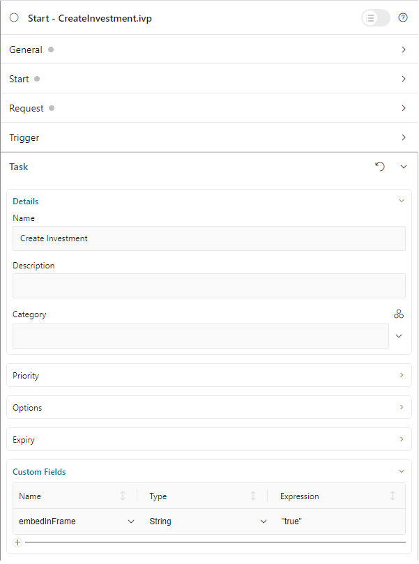
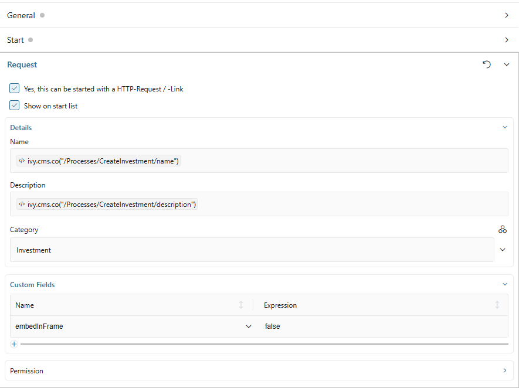

.. _iframe-in-portal:

IFrame In Portal
****************

Overview
========

Since Portal 8, all processes and tasks start inside an iFrame by default. Your HTML dialogs remain independent of Portal's implementation and are automatically rendered in an isolated iFrame context. This architecture provides:

- **Decoupling**: Your UIs are independent of Portal internals
- **Simplified Migrations**: Easier Portal upgrades without breaking custom UIs
- **Isolation**: CSS and JavaScript don't interfere between Portal and your apps
- **Responsive Design**: Full support for modern responsive layouts

.. important::
   By default, processes and tasks start inside an iFrame. No configuration is required unless you want to customize this behavior.

Templates to Use with IFrame
=============================

Use the ``frame-10`` templates provided by Axon Ivy core (using the Freya theme). These templates are optimized for iFrame rendering and fully support responsive designs.

**Template Features:**

- Automatic iFrame integration with Portal
- Responsive layout support
- Portal UI components (task actions, case info, process steps)
- Configurable task details and branding

Configuration Levels
=====================

You can control whether tasks start in an iFrame at multiple levels. Portal evaluates these settings in order, with more specific levels overriding general ones.

.. list-table::
   :widths: 20 15 65
   :header-rows: 1

   * - Level
     - Priority
     - Description
   * - **Request Start**
     - Highest
     - Set ``embedInFrame`` in Request tab custom fields. Overrides all other settings
   * - **Task**
     - High
     - Set ``embedInFrame`` in Task custom fields. Overrides Case and Engine settings
   * - **Case**
     - Medium
     - Set ``embedInFrame`` in Case custom fields. Overrides Engine settings
   * - **Engine**
     - Lowest
     - Global setting ``Portal.EmbedInFrame`` in Portal admin settings

**Configuration Priority:**

Request Start → Task → Case → Engine (default: ``true``)

Request Start Level
-------------------

Set the ``embedInFrame`` field in Request tab custom fields:

- ``true``: Start inside iFrame
- ``false``: Do not start inside iFrame
- Unset: Use Task, Case, or Engine configuration

|request-tab-embedInFrame|

Task Level
----------

Set the ``embedInFrame`` field in Task custom fields:

- ``true``: Start inside iFrame
- ``false``: Do not start inside iFrame  
- Unset: Use Case or Engine configuration

|task-embedInFrame|

Case Level
----------

Set the ``embedInFrame`` String field in Case custom fields:

- ``true``: Start inside iFrame
- ``false``: Do not start inside iFrame
- Unset: Use Engine configuration

|case-embedInFrame|

Engine Level
------------

Portal Administrators can globally configure all tasks to start inside iFrames by setting the ``Portal.EmbedInFrame`` value in Portal admin settings.

Refer to :ref:`update-portal-settings` for configuration details.

.. _iframe-configure-template:

Configure IFrame Template
==========================

Portal provides extensive configuration options for iFrame templates to customize the appearance and behavior of embedded tasks.

**Configuration Capabilities:**

- Task name and icon customization
- Process chain visualization
- Case information display
- Task action buttons
- Custom breadcrumb views
- Card-style frame layout

Template Parameters Reference
------------------------------

**Task Details**

``taskName`` (string)
   Custom text for the task name display

``taskIcon`` (string)
   Icon using Streamline or Font Awesome (e.g., ``"si si-bulb"``)

``isHideTaskName`` (boolean, default: ``false``)
   ``true`` = hide task name, ``false`` = show

**Case Information**

``caseId`` (string)
   ID of the case to display in case information dialog

``isHideCaseInfo`` (boolean, default: ``false``)
   ``true`` = hide "Show Information" button, ``false`` = show

**Process Steps**

``currentProcessStep`` (string/number)
   Current step index or step name

``processSteps`` (string/array)
   List of step names or JSON string

``isShowAllSteps`` (boolean, default: ``false``  
   ``true`` = show all steps on large screens, ``false`` = compact view

``processChainDirection`` (string)
   ``"VERTICAL"`` or ``"HORIZONTAL"``

``processChainShape`` (string)
   ``"LINE"`` or ``"CIRCLE"``

**Task Actions**

``isHideTaskAction`` (boolean, default: ``false``)
   ``true`` = hide task action button, ``false`` = show

``isWorkingOnATask`` (boolean, default: ``true``)
   ``true`` = show navigation warning, ``false`` = no warning

**Miscellaneous**

``announcementInvisible`` (boolean, default: ``false``)
   ``true`` = hide announcements, ``false`` = show

``isCardFrame`` (boolean, default: ``false``)
   ``true`` = display content in card-style container, ``false`` = standard

``viewName`` (string)
   Custom breadcrumb view (see View Names below)

**Available View Names:**

``HOME``, ``PROCESS``, ``TASK``, ``TASK_DETAIL``, ``CASE_DETAIL``, ``CASE``, ``TECHNICAL_CASE``, ``RELATED_TASK``, ``USER_PROFILE``, ``ABSENCES_MANAGEMENT``, ``DASHBOARD_CONFIGURATION``, ``EDIT_DASHBOARD_DETAILS``, ``PROCESS_VIEWER``, ``PORTAL_MANAGEMENT``, ``NOTIFICATION``

Configuration Methods
=====================

You can configure iFrame templates using the ``IFrameTaskConfig`` component or JavaScript (deprecated).

.. note::
   Always sanitize your parameters before passing them to avoid XSS vulnerabilities.

Using IFrameTaskConfig Component (Recommended)
-----------------------------------------------

The recommended approach uses the Portal component for type-safe configuration:

.. code-block:: xml

   <h:body>
      <ui:composition template="/layouts/frame-10.xhtml">
         <ui:define name="content">
            <ic:com.axonivy.portal.components.IFrameTaskConfig 
               taskName="Approve Investment" 
               taskIcon="si si-bulb"
               isHideTaskName="false"
               caseId="123456"
               isHideCaseInfo="false"
               currentProcessStep="0"
               processSteps='["Create Investment Request", "Approve Investment Request"]'
               isShowAllSteps="true"
               processChainDirection="VERTICAL"
               processChainShape="LINE"
               isHideTaskAction="false"
               isWorkingOnATask="true"
               announcementInvisible="false"
               isCardFrame="true"
               viewName="TASK_DETAIL"
            />
            
            <!-- Your custom UI content -->
            <h:form>
               <!-- ... -->
            </h:form>
         </ui:define>
      </ui:composition>
   </h:body>

Using JavaScript (Deprecated)
------------------------------

.. warning::
   This method is deprecated and will be removed in Portal 14. Migrate to ``IFrameTaskConfig`` component.

.. code-block:: xml

   <h:body>
      <ui:composition template="/layouts/frame-10.xhtml">
         <ui:define name="content">
            
            
            <!-- Your custom UI content -->
         </ui:define>
      </ui:composition>
   </h:body>

Configuration Examples
======================

Configure Task Details
----------------------

Customize the task name and icon displayed in the Portal header.

.. code-block:: xml

   <ic:com.axonivy.portal.components.IFrameTaskConfig
      taskName="Approve Investment Request"
      taskIcon="si si-bulb"
      isHideTaskName="false"
   />

Configure Case Information
--------------------------

Control case details display and "Show Information" button visibility.

.. code-block:: xml

   <ic:com.axonivy.portal.components.IFrameTaskConfig
      caseId="#{ivy.case.uuid}"
      isHideCaseInfo="false"
   />

When users click "Show Information", Portal displays case details in a modal dialog.

Configure Process Steps
-----------------------

Display a visual process chain showing the current step and workflow progress.

.. note::
   Add JSP function tag to your HTML dialog: ``xmlns:fn="http://xmlns.jcp.org/jsp/jstl/functions"``

.. code-block:: xml

   <ic:com.axonivy.portal.components.IFrameTaskConfig 
      currentProcessStep="1"
      processSteps='["Create Request", "Manager Approval", "Finance Review", "Complete"]'
      isShowAllSteps="true"
      processChainDirection="HORIZONTAL"
      processChainShape="LINE"
   />

**Process Chain Options:**

- **Direction**: ``HORIZONTAL`` (default) or ``VERTICAL``
- **Shape**: ``LINE`` (default) or ``CIRCLE``
- **Show All Steps**: ``true`` displays all steps on large screens, ``false`` shows compact view

Configure Task Actions
----------------------

Control task action buttons and navigation warnings.

.. code-block:: xml

   <ic:com.axonivy.portal.components.IFrameTaskConfig
      isHideTaskAction="false"
      isWorkingOnATask="true"
   />

**Behavior:**

- ``isHideTaskAction="true"``: Hides task action buttons (useful for read-only views)
- ``isWorkingOnATask="true"``: Shows warning when user navigates away from active task

Configure Card Frame Layout
---------------------------

Display iFrame content in a card-style container for better visual separation.

.. code-block:: xml

   <ic:com.axonivy.portal.components.IFrameTaskConfig
      isCardFrame="true"
      announcementInvisible="false"
      viewName="TASK_DETAIL"
   />

Complete Configuration Example
------------------------------

Full example with all major configuration options:

.. code-block:: xml

   <h:body>
      <ui:composition template="/layouts/frame-10.xhtml">
         <ui:define name="content">
            <ic:com.axonivy.portal.components.IFrameTaskConfig 
               taskName="#{data.taskName}"
               taskIcon="si si-file-edit"
               isHideTaskName="false"
               caseId="#{ivy.case.uuid}"
               isHideCaseInfo="false"
               currentProcessStep="#{data.currentStep}"
               processSteps="#{portalComponentUtilsBean.convertToJSON(data.processSteps)}"
               isShowAllSteps="true"
               processChainDirection="HORIZONTAL"
               processChainShape="LINE"
               isHideTaskAction="false"
               isWorkingOnATask="true"
               announcementInvisible="false"
               isCardFrame="true"
               viewName="TASK_DETAIL"
            />
            
            <h:form id="investmentForm">
               <p:panel header="Investment Request">
                  <!-- Your form fields -->
               </p:panel>
               
               <p:commandButton value="Submit" action="#{logic.submit}" />
               <p:commandButton value="Cancel" action="#{logic.cancel}" />
            </h:form>
         </ui:define>
      </ui:composition>
   </h:body>

Developer Tips
==============

Navigation Without Task Completion
-----------------------------------

If your project has navigation buttons that don't complete a task (e.g., Cancel), redirect users to the desired page (application home, task list, process list, etc.) directly in the HTML dialog.

**Example:**

.. code-block:: java

   public void cancelTask() {
      // Redirect to task list instead of completing task
      String taskListUrl = PortalNavigatorAPI.buildUrlByKeyword("TASK");
      Ivy.html().sendRedirect(taskListUrl);
   }

JavaScript String Sanitization
-------------------------------

When using Portal features that communicate through JavaScript, always sanitize your data before sending it to prevent XSS attacks.

**Portal provides the public API:**

``SanitizeAPI.escapeForJavascript`` in the ``portal-components`` project

**Example:**

.. code-block:: java

   import ch.ivy.addon.portalkit.publicapi.SanitizeAPI;

   public class TaskBean {
      public String getSafeTaskName() {
         String rawTaskName = getUserInputTaskName();
         return SanitizeAPI.escapeForJavascript(rawTaskName);
      }
   }

**In your HTML dialog:**

.. code-block:: xml

   <ic:com.axonivy.portal.components.IFrameTaskConfig 
      taskName="#{taskBean.safeTaskName}"
   />

.. tip::
   Always sanitize user input, database values, or any dynamic content before passing to Portal components or JavaScript.

Best Practices
==============

#. **Use IFrameTaskConfig Component**: Prefer the component-based approach over JavaScript configuration
#. **Sanitize All Parameters**: Use ``SanitizeAPI.escapeForJavascript`` for dynamic values
#. **Process Steps**: Provide clear, descriptive step names for better user experience
#. **Task Icons**: Use consistent icon styles (Streamline or Font Awesome) across your application
#. **Card Frame**: Enable ``isCardFrame`` for better visual separation of embedded content

Whenever you use a Portal feature that communicates through JavaScript, ensure that you sanitize your data before sending it to the Portal

The Portal provides the public API ``SanitizeAPI.escapeForJavascript`` in the ``portal-components`` project to help sanitize JavaScript strings by escaping special characters — one of the most common techniques for JavaScript string sanitization.

.. |case-embedInFrame| image:: images/case-embedInFrame.png

.. |case-list-template| image:: ../../screenshots/case/case-key-information.png
.. |task-list-template| image:: ../../screenshots/task/task-key-information.png
.. |task-name-template| image:: ../../screenshots/layout-template/task-template.png
