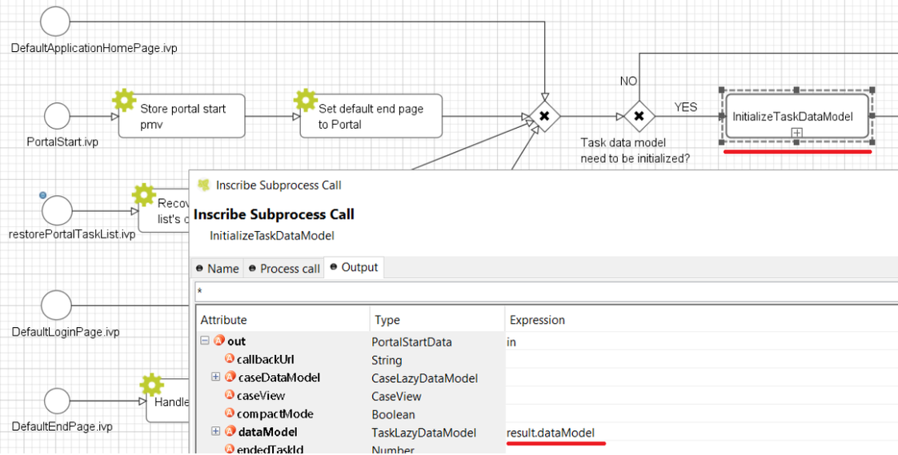
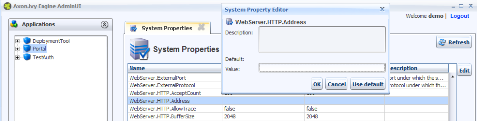

.. _installation:

Installation
************

Installation section describes all steps, that are necessary for install and setup Portal.
If you install your application first time then it’s important to start with Basic installation. It describes all initial steps that must be done for first installation.
If application is already installed and initial prepared, refer
to `Migration notes`_ to migrate it.

Basic installation
==================

Project modules
---------------

The application consists of 5 process modules. For detailed information
of each module, refer to :ref:`architecture` .

-  portal-components

-  PortalStyle

-  PortalKit

-  PortalTemplate

-  AxonIvyExpress

The project deployment of Ivy project are described in :dev-url:`project
deployment </doc/8.0/engine-guide/administration/deployment.html>`.

.. _installation-basic-portal-mode:

Portal mode
-----------

-  **Single application mode**: One Portal application on one engine. It must include portal-components,
   PortalKit, PortalTemplate and PortalStyle modules.

-  **Multi applications mode**: Multiple Portal applications on one engine.
   Each Portal application must include portal-components, PortalKit, PortalTemplate and PortalStyle modules.

.. important::
   In multi applications mode, if you need overall dashboard, create
   an application named **Portal** with the Portal modules.

Installation
------------

Designer
^^^^^^^^

Import Portal modules to Designer.

.. important:: Designer only supports single application mode.

Engine without license (demo mode)
^^^^^^^^^^^^^^^^^^^^^^^^^^^^^^^^^^

The engine automatically deploys the Portal application with default users. You do
not need to deploy anything (Single application mode).

.. table::

   +-----------------------+-----------------------+-----------------------+
   | Username              | Password              | Description           |
   +=======================+=======================+=======================+
   | admin                 | admin                 | This user has all     |
   |                       |                       | Portal permissions,   |
   |                       |                       | can access to Portal  |
   |                       |                       | Admin Settings.       |
   +-----------------------+-----------------------+-----------------------+
   | demo                  | demo                  | This user has         |
   |                       |                       | permission to manage  |
   |                       |                       | user absences.        |
   +-----------------------+-----------------------+-----------------------+
   | guest                 | guest                 | Default normal user   |
   |                       |                       | of portal.            |
   +-----------------------+-----------------------+-----------------------+

Engine with license (production mode)
^^^^^^^^^^^^^^^^^^^^^^^^^^^^^^^^^^^^^

The engine does not deploy anything, you need to deploy and configure Portal application
manually.

Single application mode
"""""""""""""""""""""""

Create an application and deploy Portal modules.

.. important::

   Only one active application contains Portal modules.

Multi applications mode
"""""""""""""""""""""""

Refer :ref:`settings-admin-settings-setup-multi-portals`.

.. _installation-migration-notes:

Migration notes
===============

This document informs you in detail about incompatibilities that were
introduced between Portal versions and tells you what needs to be done
to make your existing Portal working with current Axon Ivy Engine.

How to migrate
--------------

.. important::
   If you call any Portal API which is not mentioned in the document. It could be changed or removed without inform. Don't forget
   to re-implement the concerning API in your own project.

   In order to migrate Portal, you need to migrate Axon Ivy, refer
   :dev-url:`Axon Ivy migration
   notes </doc/8.0/engine-guide/installation/upgrade.html>`.
   Changes in Axon Ivy could lead to problems if customer project is not
   migrated properly.

In designer
-----------

1. Replace all Portal projects
2. Update PortalTemplate dependency of customer project in pom.xml.
3. If PortalStyle is customized, copy logo, customization.scss,
   font-faces.scss, customized stuff from old to new PortalStyle, run
   maven to compile CSS.
4. Follow detailed migration notes for each version below.
5. If customization needs copying code from Portal, merge changes
   between two versions of Portal for copied code.

..

In engine
---------

1. Convert database schema if needed.
2. If your ivy version is before 7.3.0 : deactivate standard Portal
   application if it's not needed.
3. Redeploy Portal projects (exclude PortalConnector) and customer
   project.
4. Follow detailed migration notes for each version below.

Migrate 8.0.27 to 8.0.28
-----------------------
Project ``portal-component`` changed its name to ``portal-components``, and also changed package name, cms, and CSS file name. Please update your dependency accordingly.

Migrate 8.0.x to 8.0.27
-----------------------
1. :ref:`The deprecated User Selection component <components-additional-components-old-user-selection>` is still working well without further migration. But if you want to upgrade it to :ref:`the new User Selection component <components-additional-components-user-selection>`, please follow :ref:`these migration steps <components-additional-components-migrate-from-old-user-selection>`.
2. :ref:`The deprecated Role Selection component <components-additional-components-old-role-selection>` is still working well without further migration. But if you want to upgrade it to :ref:`the new Role Selection component <components-additional-components-role-selection>`, please follow :ref:`these migration steps <components-additional-components-migrate-from-old-role-selection>`.
3. :ref:`The deprecated Document Table component <components-additional-components-old-document-table>` is still working well without further migration. But if you want to upgrade it to :ref:`the new Document Table component <components-additional-components-document-table>`, please follow :ref:`these migration steps <components-additional-components-migrate-from-old-document-table>`.
4. :ref:`The deprecated Process History component <components-additional-components-old-process-history>` is still working well without further migration. But if you want to upgrade it to :ref:`the new Process History component <components-additional-components-process-history>`, please follow :ref:`these migration steps <components-additional-components-migrate-from-old-process-history>`.
5. :ref:`The deprecated Document Chain component <components-additional-components-old-process-chain>` is still working well without further migration. But if you want to upgrade it to :ref:`the new Process Chain component <components-additional-components-process-chain>`, please follow :ref:`these migration steps <components-additional-components-migrate-from-old-process-chain>`.

Migrate 8.0.x to 8.0.19
-----------------------
Portal date filter such as TaskCreationDateFilter, CaseCreationDateFilter... messages ``<p:messages for="..." />`` have been added for each calendar component to validate date format.
If you use have any customized date filters in your project, update template accordingly.

Migrate 8.0.x to 8.0.16
-----------------------
Portal introduced a new file ``variables-customization.scss`` for customizing Portal style variables.
If you have overridden variables in customization.scss, please move those changes to variables-customization.scss, otherwise it won’t work.

Migrate 8.0.x to 8.0.13
-----------------------
Portal filter such as TaskNameFilter, CaseNameFilter... package name has been change from
``ch.ivy.addon.portalkit.casefilter`` to ``ch.ivy.addon.portalkit.casefilter.impl``, ``ch.ivy.addon.portalkit.taskfilter`` to ``ch.ivy.addon.portalkit.taskfilter.impl``.
If you use these filters in your project, update pakage name accordingly.

Migrate 8.0.x to 8.0.12
-----------------------

1. When a task is finished, Portal could show a link to case details in Global Growl. Due to this new feature, PortalStart.mod file is changed. If you have
customized this process in your project, copy new PortalStart from
Portal Template to your project and re-apply your customization.

Migrate 8.0.7 to 8.0.11
-----------------------

1. Since 8.0.11, statistic chart has multiple names for supported languages in application. Therefore you must run a migration process by the following steps:

   - Deploy :download:`MigrateStatisticChartTo8.iar <documents/MigrateStatisticChartTo8.iar>` project to your Ivy application. This project requires ``PortalKit`` to run.

   - Login to Portal by the admin user who have role ``AXONIVY_PORTAL_ADMIN``

   - Run ``MigrateStatisticChart/MigrateStatisticChart.ivp`` to migrate all statistic charts in your application.

   - Restart Ivy engine.

Migrate 8.0.x to 8.0.7
----------------------

PortalStart.mod file is changed. If you have
customized this process in your project, copy new PortalStart from
Portal Template to your project and re-apply your customization.

Migrate 8.0.1 to 8.0.2
----------------------

1. ``CalculateTaskDelegate.mod`` callable process has been changed. If you overrode this callable process before,
remove old implementation and adapt it accordingly.
We changed ``IUser`` to ``UserDTO``, ``IRole`` to ``RoleDTO`` and ``ISecurityMember`` to ``SecurityMemberDTO``.

2. In this Portal version, we introduced ``External link`` as a process item in Full Process List.
You need to migrate external links for all users in User Favorites to Full Process List.
Please deploy :download:`ExternalLinkMigration.iar <documents/ExternalLinkMigration.iar>` project
then run ``migrateExternalLinkFromUserFavorites.ivp``
and wait until it is redirected to another page without error (E.g: Homepage).

Migrate 8.0.0 to 8.0.1
----------------------

PortalStart.mod file is changed. If you have
customized this process in your project, copy new PortalStart from
Portal Template to your project and re-apply your customization.

PortalStart.ivp is removed, if you use it to configure the start link in application registration, change it to DefaultApplicationHomePage.ivp

:ref:`Non-ajax handling <components-error-handling-nonajax-error-handling>` is changed. Follow the instructions and reconfigure it.

.. _installation-migration-notes-8-0-0:

Migrate 7.x to 8.0.0
--------------------

Follow these migration guides.

.. toctree::
   :maxdepth: 2

   migration-notes/8-0-0/installation-migration-notes-8-0-0-less-to-sass
   migration-notes/8-0-0/installation-migration-notes-8-0-0-migrate-font-family
   migration-notes/8-0-0/installation-migration-notes-8-0-0-migrate-templates
   migration-notes/8-0-0/installation-migration-notes-8-0-0-task-body
   migration-notes/8-0-0/installation-migration-notes-8-0-0-case-body
   migration-notes/8-0-0/installation-migration-notes-8-0-0-hidden-task-case

.. _installation-release-notes:

Release notes
=============

This part lists all relevant changes since the last official product
releases of Axon Ivy.

Changes in 8.0.27
-----------------

- Introduce some components in new ``portal-components`` project.

   - :ref:`User Selection Component <components-additional-components-user-selection>`

   - :ref:`Role Selection Component <components-additional-components-role-selection>`

   - :ref:`Document Table Component <components-additional-components-document-table>`

   - :ref:`Process History Component <components-additional-components-process-history>`

   - :ref:`Process Chain Component <components-additional-components-process-chain>`

Changes in 8.0.25
-----------------
- The ``BEHAVIOUR_WHEN_CLICKING_ON_LINE_IN_TASK_LIST`` Portal setting is introduced to run the task/go to task details when clicking on a line in task list.

- Introduce :ref:`Workflow Events table <how-to-show-workflow-events>`, user who has permission ``WORKFLOW_EVENT_READ_ALL`` can see all ``WORKFLOW_EVENTS``.

- Introduce new ``Task ID``, ``Task Name``, ``Case ID`` and ``Case Name`` filter in the Portal full task list and case list.

Changes in 8.0.18
-----------------

- No need to update PortalGroupId variable when you change group id of Portal.

Changes in 8.0.12
-----------------
-  Portal supports multilingual user favorites

Changes in 8.0.8
----------------
-  The ``SHOW_GLOBAL_SEARCH`` Portal setting is introduced to show/hide the global search feature.

-  We introduce 2 new Portal settings: ``HIDE_SYSTEM_NOTES_FROM_HISTORY`` and ``HIDE_SYSTEM_NOTES_FROM_HISTORY_ADMINISTRATOR``.
   These variables control visibility of System notes for normal and admin users.

Changes in 8.0.3
----------------
-  User Selection Component is introduced, refer to :ref:`User
   Selection <components-additional-components-user-selection>` for more details.

Changes in 8.0
--------------

-  Upgraded to Serenity's theme, refer to :ref:`Migration
   Notes <installation-migration-notes-8-0-0>` for more details.

-  Support to see case if user is an owner. Administrator can activate/deactivate it via the ``ENABLE_CASE_OWNER`` Portal settings, default is false.

-  Support to start a task in IFrame, refer to :ref:`IFrame in Portal <iframe-in-portal>`.

-  Refactor ``TaskTemplate.xhtml``, refer to :ref:`Migration
   Notes <installation-migration-notes-8-0-0-migrate-templates>` for more details.

-  Remove ``caseBody`` inside CaseWidget, refer to :ref:`Migration
   Notes <installation-migration-notes-8-0-0-case-body>` for more details.

-  Introduce new actions button on :ref:`CaseWidget's
   header <customization-case-widget-how-to-override-ui-case-header>`.

-  Introduce new page as the Case item details. The default page is
   portal case details, refer to
   :ref:`Case item details <customization-case-item-details>`
   for the customization.

-  Remove ``taskBody`` inside TaskWidget, refer to :ref:`Migration
   Notes <installation-migration-notes-8-0-0-task-body>` for more details.

-  Introduce two new actions button on :ref:`TaskWidget's
   header <customization-task-widget-how-to-overide-ui-task-header>`.

-  Introduce new page as Task item details. The default page is portal
   task details, refer to
   :ref:`Task item details <customization-task-item-details>`
   for the customization.

-  Task list customization now support responsiveness. refer to :ref:`this
   part <customization-task-widget-responsive-layout>` for more details.

-  Case list customization now support responsiveness. refer to  :ref:`this
   part <customization-case-widget-responsive-layout>` for more details.

-  Start link ivp can not start outside Portal.

-  Portal variable for Global growl setting ``DISPLAY_MESSAGE_AFTER_FINISH_TASK`` displays growl message for two situations: finish task and leave task.

