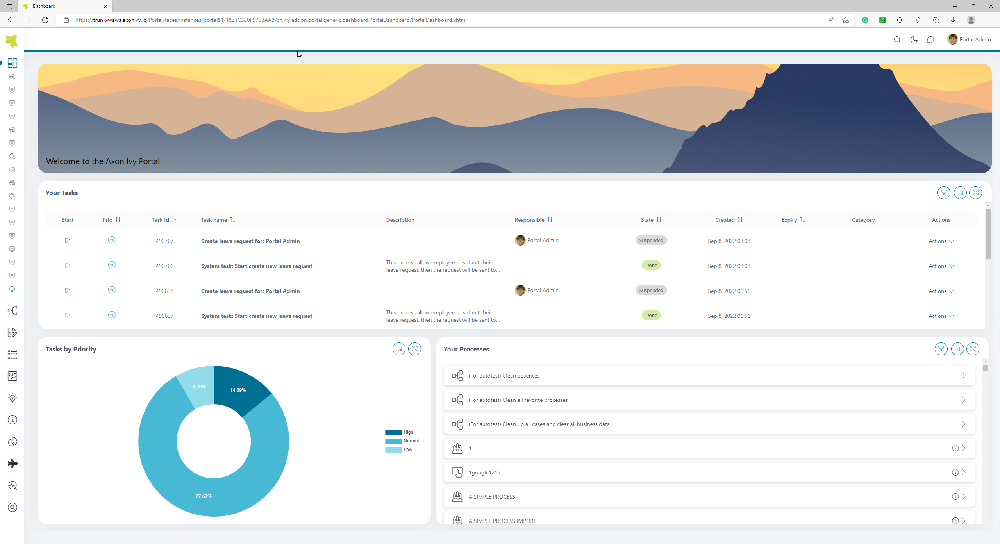
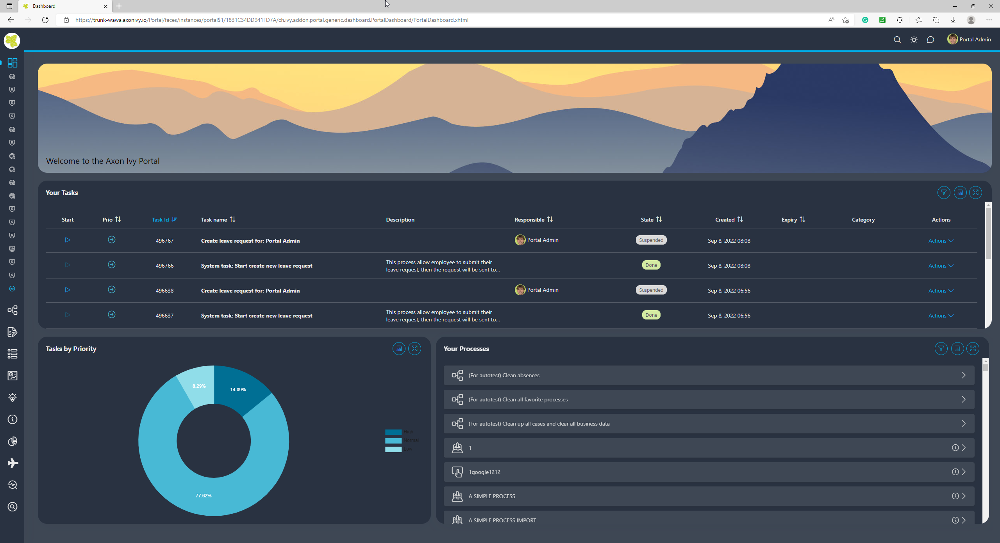
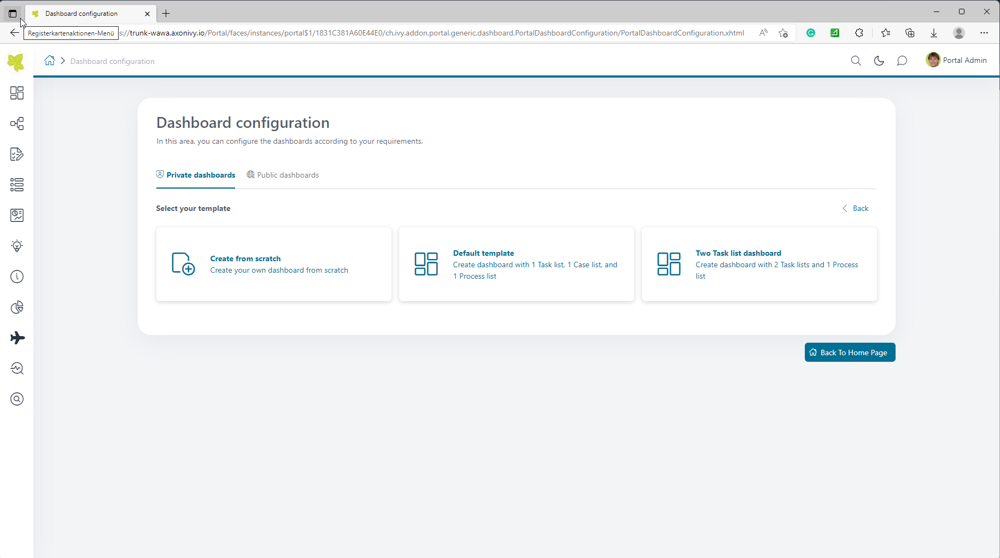
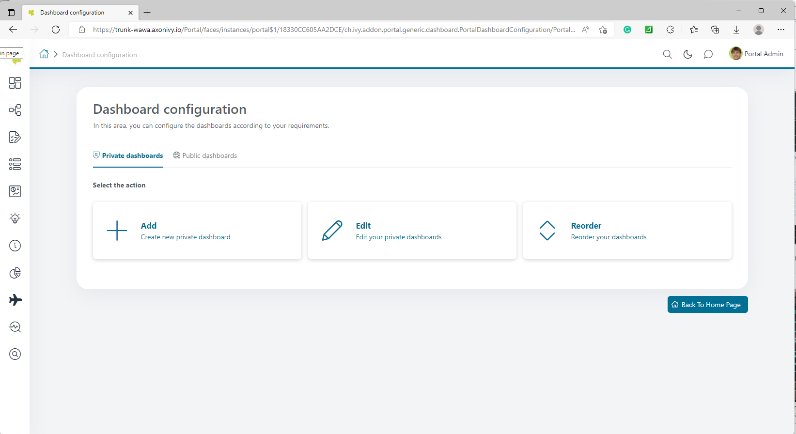
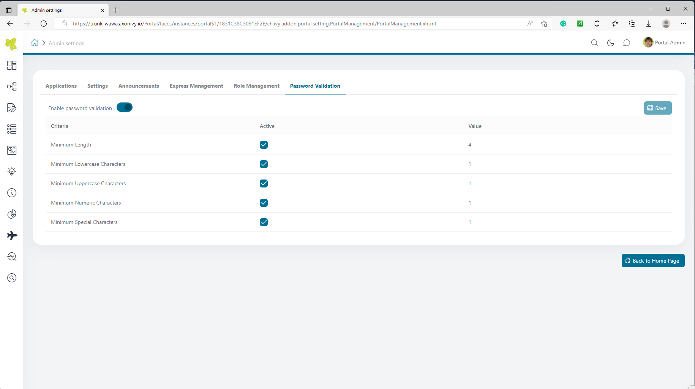
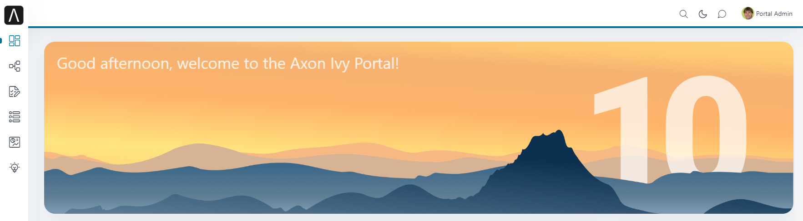
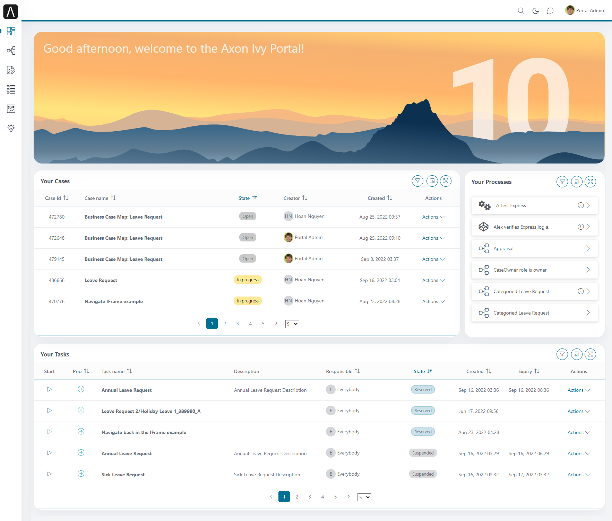

.. _introduction:

Introduction
************

Portal Developer Guide provides information to set up, configure, customize
Portal so that it could fit customer need.

.. _introduction-new-and-note-worthy-12.0:

New & Noteworthy 12
-------------------

Check out more information on `release 12.0 <https://dev.axonivy.com/news/12.0>`__.

.. _introduction-new-and-note-worthy-11.2:

New & Noteworthy 11
-------------------

Check out more information on `release 11.3 <https://dev.axonivy.com/news/11.3>`__, `release 11.2 <https://dev.axonivy.com/news/11.2>`__ and `release 11.1 <https://dev.axonivy.com/news/11.1>`__.

.. _introduction-new-and-note-worthy-10.0:

New & Noteworthy 10
-------------------

The focus with Release 10 was to finalize the new portal approach of enabling the portal users to configure the portal to their custom needs and make the portal more adaptable to the various use cases of the |ivy| Platform.

As part of this journey, the portal dashboards were completely redesigned giving more power to the end user in making the portal his own workbench, interacting with processes and tasks, reporting on process progress and managing workloads. With the update of the overall theme, the portal now also supports dark mode giving the portal a more modern overall look & feel.

|new-dashboard|

Within the dashboards, the portal now offers:

- Public Dashboards with permissions
- Private Dashboards that users can fit to their needs
- Many Standard Widgets like configurable task, case and process start list with filters and sorting
- Custom Widgets for integrating existing processes directly into the dashboard
- Custom filters and sorting, even on custom task and case fields
- Welcome Widget with custom images and messages

Also other parts of the portal have improved:

- Password recovery flows for an automated reset of lost passwords
- New Password complexity rules and validations for more secure passwords.
- Advanced absence management for personal and role deputies with full transparency
- Advanced user specific settings for notifications, language, and formatting preferences
- Configurable case details page
- New menu with a cleaner look and an easier navigation between dashboards
- Custom Avatars within all dialogs

Not only for the end user but also for developers, the portal was updated:

- The portal projects have been simplified, two projects are left:  Portal & Portal-Components
- The multiapp approach is now covered by the |ivy| core, making the use of the portal for displaying tasks from more than one application much easier
- Through the separation of process and portal by the iframe approach, supported by the portal templates on portal, can serve multiple applications
- Dialog Templates now offer portal functions, e.g., forwarding the user in an exit event, or interacting with the portal from within the iframe template.
- The portal-components project now offers ready to use components like a documents-component or user choosers that can be reused in your |ivy| Projects

New Welcome Widget
^^^^^^^^^^^^^^^^^^

The new welcome widget greets the user based on the local time and enables a friendlier approach, thus also adding more CI/CD elements into the portal, making it your own.

|new-welcome-widget|

|

Inviting and modern Look & Feel for |ivy| Portal 9.4. Refer to :ref:`introduction-new-and-note-worthy-9.4`.

- Welcome Screen
- Dashboard Wizards
- New Portal Theme Freya
- Change password validations

The Individual Dashboard for |ivy| Portal 9.3. Refers to :ref:`introduction-new-and-note-worthy-9.3`.

- Customizable Dashboard
- Default Widgets
- Custom Widgets
- Adjustable Look for Process List

More UX for |ivy| Portal 9.2. Refer to :ref:`introduction-new-and-note-worthy-9.2`.

- Enhanced forgot password features
- Simplified tasks and cases export
- Redesigned process list
- Additional drag and drop widgets in task and case detail pages
- Advanced user specific settings

.. _introduction-new-and-note-worthy-9.4:

New & Noteworthy 9.4
--------------------

Welcome Screen
^^^^^^^^^^^^^^

First impressions matter; a nice user experience also means engaging and motivating the end user.
That’s the idea of the new configurable welcome dashboard widget.

|dashboard-light-mode|

This feature includes displaying your own welcome image and attaching personalized messages with your own styling, embedded into the fully configurable dashboard.

Freya Theme featuring Dark Mode
^^^^^^^^^^^^^^^^^^^^^^^^^^^^^^^

Another step in this direction is the upgrade to a new UI theme. The latest trends and design patterns are ideally included in the fresh `Freya <https://www.primefaces.org/freya/>`_ theme by PrimeFaces.
Moreover, the entire |ivy| Portal can now be used in Dark Mode.

|dashboard-dark-mode|

A dark mode color scheme can be more visually appealing and easier on the eyes. End users can switch between the light and dark color schemes as needed.

Dashboard Configuration Wizard
^^^^^^^^^^^^^^^^^^^^^^^^^^^^^^

All dashboards within the |ivy| Portal can now be configured and arranged with a wizard according to individual preferences.

|dashboard-configuration-wizard|

Now, it is possible to create and manage private and public Dashboards. Creating those dashboards is now done conveniently via a significantly simplified and enhanced wizard. 
Additionally, the dashboards can be rearranged as desired.

|dashboard-configuration-wizard-create|

When creating new dashboards, the wizard goes one step further and offers predefined templates based on our experience.

Password Validation
^^^^^^^^^^^^^^^^^^^

Password policies are different in each company. This fact is fully taken into account in the |ivy| Portal.

This applies to users managed by the |ivy-engine| only. If users are imported from an external Identity Provider (IDP), this IDP manages passwords as well as password policy.

|password-validation|

Portal administrators can enable or disable password validation and also freely define the following criteria:

    - Minimum length
    - Minimum number of lower case characters
    - Minimum number of upper case characters
    - Minimum number of numbers
    - Minimum number of special characters

.. _introduction-new-and-note-worthy-9.3:

New & Noteworthy 9.3
--------------------

Customizable Dashboard
^^^^^^^^^^^^^^^^^^^^^^
End-users can choose between different layouts,
enable and disable default columns and even add custom columns at will.

|customizable-dashboard|

This feature allows multiple task lists with different filter options.
For example, separating HR tasks from Finance tasks provides a better overview and more transparency.

Default Widgets
^^^^^^^^^^^^^^^
|ivy| Portal supports a sophisticated concept featuring default widgets for Process Starts, Task Lists, and Case Lists.

|default-widgets|

Processes, tasks, and cases are essential when it comes to business process automation and workflow management. Therefore, the |ivy| Portal gives you full power by providing these standard widgets out-of-the-box.

|default-widgets-configuration|

Each configuration is intuitive, and users can make their settings meticulously.

Custom Widgets
^^^^^^^^^^^^^^
Individuality is king. End-users can easily create custom widgets in the dashboard.

|custom-widgets|

There are two different widgets types available:

- |ivy| Process
- External URL

An external URL embeds the corresponding website into your dashboard. This feature is helpful to integrate enterprise content management systems or knowledge sites.

Specify your |ivy| Process as a widget element and display your process directly in your custom dashboard.

Adjustable Look for Process List
^^^^^^^^^^^^^^^^^^^^^^^^^^^^^^^^

Switch between an image, grid, and compact mode to display available processes.

|adjustable-look-for-process-list|

A picture says a thousand words. This saying is true and applies to business processes. The requirements of end-users must be met. The process starts with image support to contribute to a beautiful appearance and help work quickly and purposefully.

.. _introduction-new-and-note-worthy:

.. _introduction-new-and-note-worthy-9.2:

New & Noteworthy 9.2
--------------------

.. _introduction-new-and-note-worthy-task-case-details-configuration:

Task/Case details configuration
^^^^^^^^^^^^^^^^^^^^^^^^^^^^^^^

Task/Case details are well structured, user can drag and drop the widgets and they can be configured via variable (JSON file).

Enhanced forgot password features
^^^^^^^^^^^^^^^^^^^^^^^^^^^^^^^^^
Users can reset their passwords easily using the standard password reset feature integrated in |ivy| Portal

|login-screen|
|send-email-screen|

Simplified tasks and cases export
^^^^^^^^^^^^^^^^^^^^^^^^^^^^^^^^^
We have listened to you! Business users requested to export specific lists from |ivy| Portal to perform further analysis in Microsoft Excel.
Now they have the possibility to export any list with one mouse click.

|task-key-information|

Redesigned process list
^^^^^^^^^^^^^^^^^^^^^^^
You don’t see the forest for the trees? Not anymore! Switch to the new grid view to display your process list in a more user-friendly way.

|portal-process-grid-view-page|

Additional drag and drop widgets in task and case detail pages
^^^^^^^^^^^^^^^^^^^^^^^^^^^^^^^^^^^^^^^^^^^^^^^^^^^^^^^^^^^^^^
Only you know the details and therefore, any detail page for tasks or cases can be restyled using drag and drop widgets. Create your own detail page with your specific content and without the need of programming.

|detailed-task-information|

|case-details|

Advanced user specific settings
^^^^^^^^^^^^^^^^^^^^^^^^^^^^^^^

Make it your own way with the |ivy| Portal. Users can optimize process work and customize the |ivy| Portal to their own taste.

|my-profile-save|

New override approach
^^^^^^^^^^^^^^^^^^^^^

Portal uses HTML Dialog Override instead of Subprocess Override for customization.

User and role selection component
^^^^^^^^^^^^^^^^^^^^^^^^^^^^^^^^^

If you need user and role selection, use Portal component instead of implementing yourself. For details refer to :ref:`components-portal-components-user-selection`
and :ref:`components-portal-components-role-selection`.

New & Noteworthy 9.1
--------------------

My profile
^^^^^^^^^^

My profile replaces for language setting and email setting. Also, introduce the general setting for you can configure the Portal according to your requirements

|my-profile|

New absence management
^^^^^^^^^^^^^^^^^^^^^^

New UI and user can choose substitute as permanent or temporary for personal task.

|absence|

.. _introduction-new-and-note-worthy-further-improvement:

Further improvements
^^^^^^^^^^^^^^^^^^^^

Filter case by owner in case list and task analysis if case owner is enabled.

.. |my-profile| image:: ../../screenshots/my-profile/my-profile.png
.. |absence| image:: ../../screenshots/settings/absence.png
.. |login-screen| image:: ../../screenshots/login/login-form.png
.. |send-email-screen| image:: ../../screenshots/forgot-password/send-email-screen.png
.. |task-key-information| image:: ../../screenshots/task/task-key-information.png
.. |portal-process-grid-view-page| image:: ../../screenshots/process/portal-process-grid-view-page.png
.. |detailed-task-information| image:: ../../screenshots/task-detail/detailed-task-information.png
.. |case-details| image:: ../../screenshots/case-detail/case-details.png
.. |my-profile-save| image:: ../../screenshots/my-profile/my-profile.png
.. |customizable-dashboard| image:: images/customizable-dashboard.png
.. |default-widgets| image:: images/default-widgets.png
.. |default-widgets-configuration| image:: images/default-widgets-configuration.png
.. |custom-widgets| image:: images/custom-widgets.png
.. |adjustable-look-for-process-list| image:: images/adjustable-look-for-process-list.png

