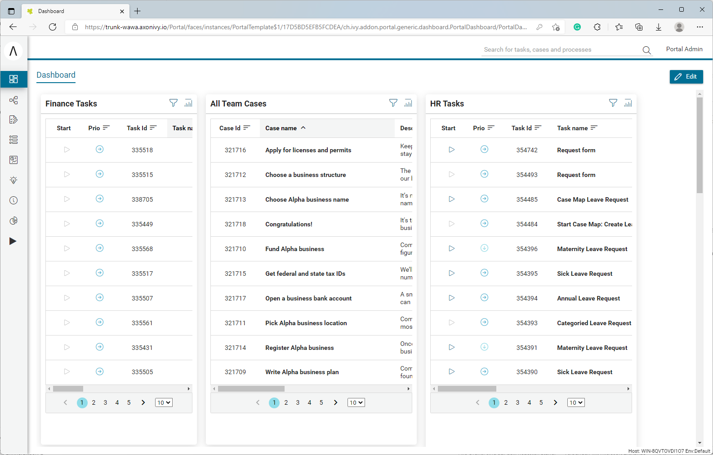
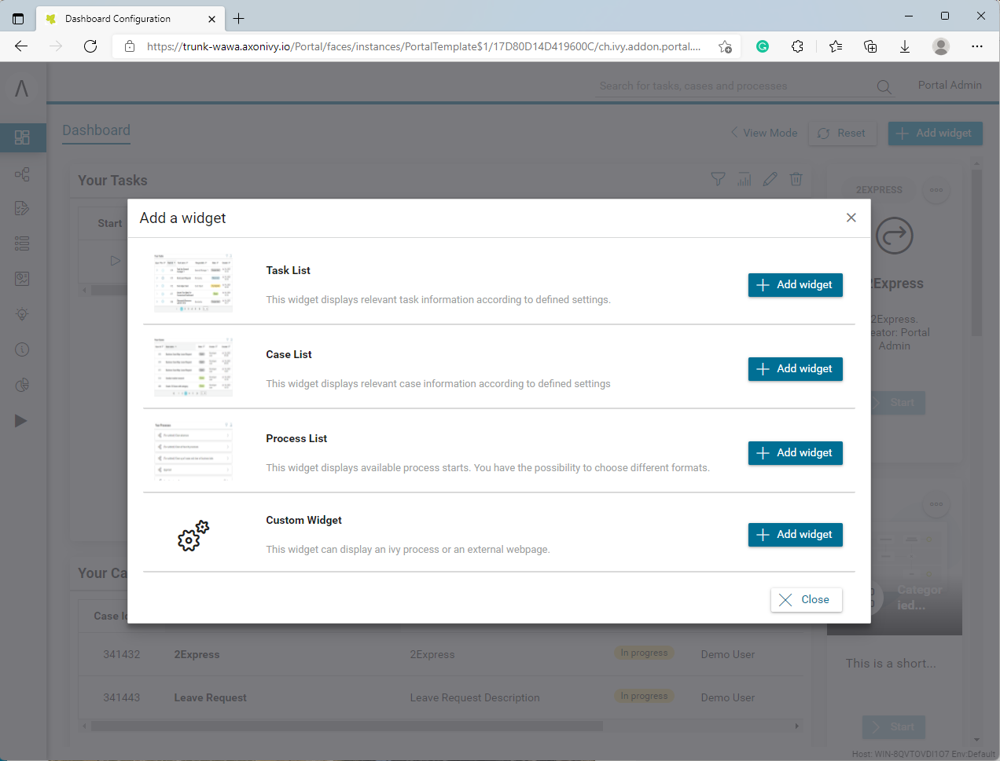
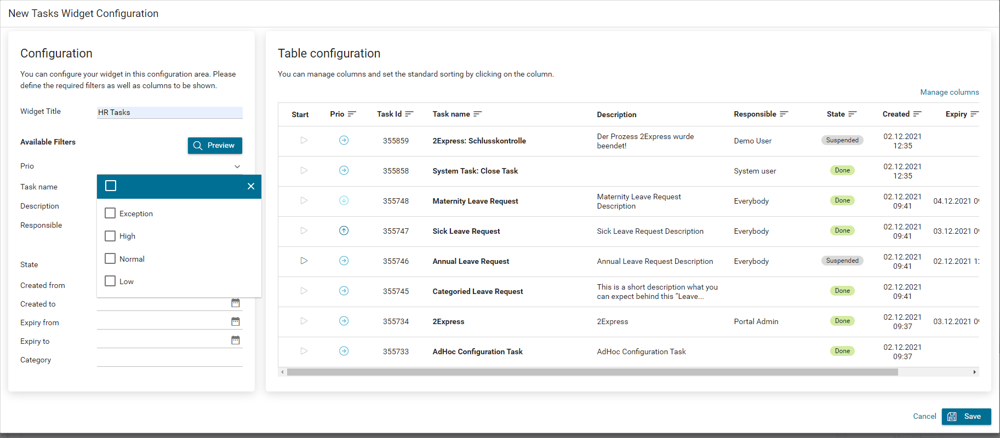
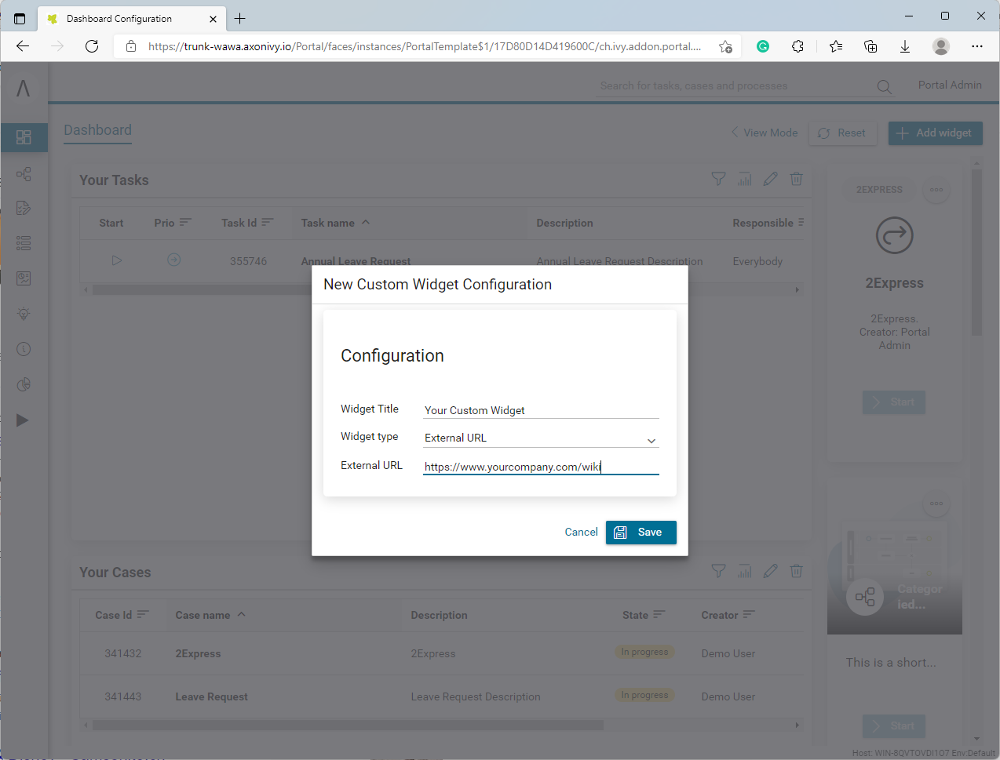
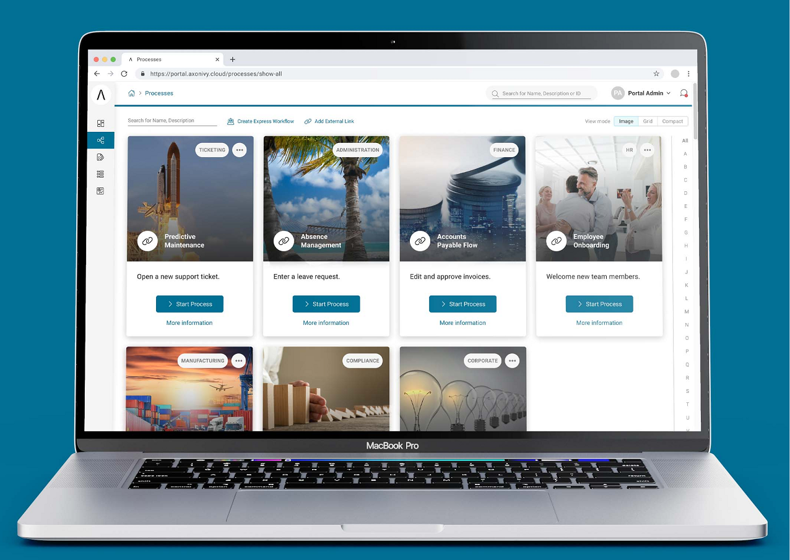

.. _introduction:

Introduction
************

Portal Developer Guide provides information to set up, configure, customize 
Portal so that it could fit customer need.

The Individual Dashboard for Axon Ivy Portal 9.3 refers to :ref:`introduction-new-and-note-worthy-9.3`.
 
- Customizable Dashboard
- Default Widgets
- Custom Widgets
- Adjustable Look for Process List

More UX for Axon Ivy Portal 9.2, refer to :ref:`introduction-new-and-note-worthy-9.2`.

- Enhanced forgot password features
- Simplified tasks and cases export
- Redesigned process list
- Additional drag and drop widgets in task and case detail pages
- Advanced user specific settings 

.. _introduction-new-and-note-worthy-9.3:

New & Noteworthy 9.3
--------------------

Customizable Dashboard
^^^^^^^^^^^^^^^^^^^^^^
End-users can choose between different layouts, 
enable and disable default columns and even add custom columns at will.

|customizable-dashboard|

This feature allows multiple task lists with different filter options. 
For example, separating HR tasks from Finance tasks provides a better overview and more transparency.

Default Widgets
^^^^^^^^^^^^^^^
Axon Ivy Portal supports a sophisticated concept featuring default widgets for Process Starts, Task Lists, and Case Lists.

|default-widgets|

Processes, tasks, and cases are essential when it comes to business process automation and workflow management. Therefore, the Axon Ivy Portal gives you full power by providing these standard widgets out-of-the-box.

|default-widgets-configuration|

Each configuration is intuitive, and users can make their settings meticulously.

Custom Widgets
^^^^^^^^^^^^^^
Individuality is king. End-users can easily create custom widgets in the dashboard.

|custom-widgets|

There are two different widgets types available:

- Axon Ivy Process
- External URL

An external URL embeds the corresponding website into your dashboard. This feature is helpful to integrate enterprise content management systems or knowledge sites.

Specify your Axon Ivy Process as a widget element and display your process directly in your custom dashboard.

Adjustable Look for Process List
^^^^^^^^^^^^^^^^^^^^^^^^^^^^^^^^

Switch between an image, grid, and compact mode to display available processes.

|adjustable-look-for-process-list|

A picture says a thousand words. This saying is true and applies to business processes. The requirements of end-users must be met. The process starts with image support to contribute to a beautiful appearance and help work quickly and purposefully.

.. _introduction-new-and-note-worthy:

.. _introduction-new-and-note-worthy-9.2:

New & Noteworthy 9.2
--------------------

.. _introduction-new-and-note-worthy-task-case-details-configuration:

Task/Case details configuration
^^^^^^^^^^^^^^^^^^^^^^^^^^^^^^^

Task/Case details are well structured, user can drag and drop the widgets and they can be configured via variable (JSON file).

Enhanced forgot password features
^^^^^^^^^^^^^^^^^^^^^^^^^^^^^^^^^
Users can reset their passwords easily using the standard password reset feature integrated in Axon Ivy Portal

|login-screen|
|send-email-screen|

Simplified tasks and cases export
^^^^^^^^^^^^^^^^^^^^^^^^^^^^^^^^^
We have listened to you! Business users requested to export specific lists from Axon Ivy Portal to perform further analysis in Microsoft Excel. 
Now they have the possibility to export any list with one mouse click.

|task-key-information|

Redesigned process list
^^^^^^^^^^^^^^^^^^^^^^^
You don’t see the forest for the trees? Not anymore! Switch to the new grid view to display your process list in a more user-friendly way.

|portal-process-grid-view-page|

Additional drag and drop widgets in task and case detail pages
^^^^^^^^^^^^^^^^^^^^^^^^^^^^^^^^^^^^^^^^^^^^^^^^^^^^^^^^^^^^^^
Only you know the details and therefore, any detail page for tasks or cases can be restyled using drag and drop widgets. Create your own detail page with your specific content and without the need of programming.

|detailed-task-information|

|case-details|

Advanced user specific settings
^^^^^^^^^^^^^^^^^^^^^^^^^^^^^^^

Make it your own way with the Axon Ivy Portal. Users can optimize process work and customize the Axon Ivy Portal to their own taste.

|my-profile-save|

New override approach
^^^^^^^^^^^^^^^^^^^^^

Portal uses HTML Dialog Override instead of Subprocess Override for customization.

User and role selection component
^^^^^^^^^^^^^^^^^^^^^^^^^^^^^^^^^

If you need user and role selection, use Portal component instead of implementing yourself. For details refer to :ref:`components-additional-components-user-selection` 
and :ref:`components-additional-components-role-selection`.

New & Noteworthy 9.1
--------------------

Overlay guide
^^^^^^^^^^^^^

At first login, an introduction will be shown to introduce all main features of Portal.

|overlay-guide|

My profile 
^^^^^^^^^^

My profile replaces for language setting and email setting. Also, introduce the general setting for you can configure the Portal according to your requirements

|my-profile|

New absence management
^^^^^^^^^^^^^^^^^^^^^^

New UI and user can choose deputy as permanent or temporary for personal task.

|absence|

.. _introduction-new-and-note-worthy-further-improvement:

Further improvements
^^^^^^^^^^^^^^^^^^^^

Filter case by owner in case list and task analysis if case owner is enabled.

.. |overlay-guide| image:: ../../screenshots/dashboard/overlay-guide.png
.. |my-profile| image:: ../../screenshots/my-profile/my-profile.png
.. |absence| image:: ../../screenshots/settings/absence.png
.. |login-screen| image:: ../../screenshots/login/login-form.png
.. |send-email-screen| image:: ../../screenshots/forgot-password/send-email-screen.png
.. |task-key-information| image:: ../../screenshots/task/task-key-information.png
.. |portal-process-grid-view-page| image:: ../../screenshots/process/portal-process-grid-view-page.png
.. |detailed-task-information| image:: ../../screenshots/task-detail/detailed-task-information.png
.. |case-details| image:: ../../screenshots/case-detail/case-details.png
.. |my-profile-save| image:: ../../screenshots/my-profile/my-profile.png

