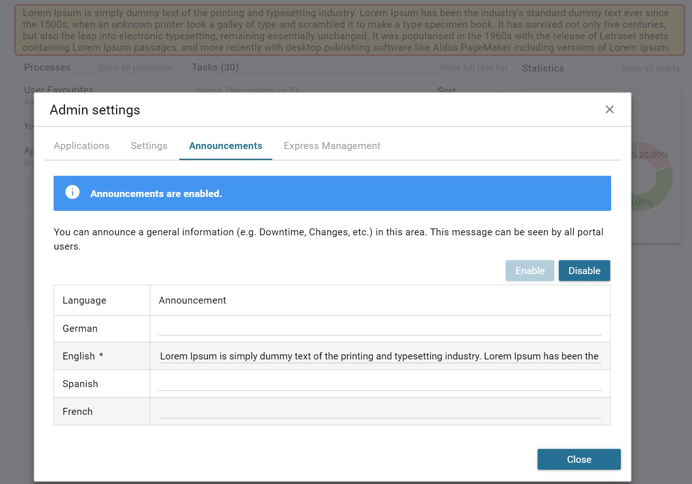

.. _introduction:

Introduction
************

Portal Developer Guide provides information to setup, configure, customize 
Portal so that it could fit customer needs.

.. _introduction-new-and-note-worthy:

New and Noteworthy
------------------

.. _introduction-new-and-note-worthy-portal-group-chat:

Portal Group Chat
^^^^^^^^^^^^^^^^^

|portal-group-chat|

-  Specific Case Related Chat

-  Activate/Deactivate independently

-  Define a Chat Group on runtime

-  Define a Chat Group during design

-  Customize the Group Chat Name

-  Chat information is stored and can be used for reporting

.. _introduction-new-and-note-worthy-data-provider-express:

Data Provider for Express
^^^^^^^^^^^^^^^^^^^^^^^^^

|data-provider-express|

-  Developers can prepare several Data Providers for Express

-  Developers can use these libraries as Data Provider in Express
   Workflow creation

.. _introduction-new-and-note-worthy-announcement-portal:

Announcements in Portal
^^^^^^^^^^^^^^^^^^^^^^^

|announcement-portal|

-  Announce some important information like Downtimes directly in the
   portal

-  Multilanguage support

.. _introduction-new-and-note-worthy-further-improvement:

Further Improvements
^^^^^^^^^^^^^^^^^^^^

-  Enhance Filter Selection in Task and Case List

-  Chart Title in Dashboard

-  Visibility of Done Tasks and Cases

-  Enhanced Process List Navigation

-  Integrated AdHoc Workflows available

.. |portal-group-chat| image:: images/portal-group-chat.png
.. |data-provider-express| image:: images/data-provider-express.png

