.. _settings:

Settings
********

This section covers Portal role, permissions and some settings.

|portal-header|

.. _settings-admin-settings:

Setup Portal settings by configuration file in Designer
=======================================================

To manually configure Portal settings, refer to :ref:`update-portal-settings`.

In development, it is a quite tedious task to configure Portal settings after restarting Designer. Therefore,
Portal supports modification of Portal settings in Designer by configuration file, it could survive after restarting Designer.

Process developer can set up Portal settings of Portal in file ``portal_settings_config.properties`` which put in ``PortalKit``.

   .. code-block:: Python

      # This file is for developer configure values for Portal settings.
      # As developer, you only need to remove comment mark of corresponding settings and modify their values.
      # Portal will apply setting values once you start designer.

      # System tasks visibility
      #HIDE_SYSTEM_TASKS_FROM_HISTORY = true
      #HIDE_SYSTEM_TASKS_FROM_HISTORY_ADMINISTRATOR = false

      #System notes visibility
      #HIDE_SYSTEM_NOTES_FROM_HISTORY = true
      #HIDE_SYSTEM_NOTES_FROM_HISTORY_ADMINISTRATOR = false

      # Portal chat settings
      #ENABLE_GROUP_CHAT = false
      #ENABLE_PRIVATE_CHAT = false
      #CHAT_RESPONSE_TIMEOUT =
      #CHAT_MAX_CONNECTION = 3

      # Documents security settings
      #ENABLE_SCRIPT_CHECKING_FOR_UPLOADED_DOCUMENT = false
      #ENABLE_VIRUS_SCANNER_FOR_UPLOADED_DOCUMENT = false
      #UPLOAD_DOCUMENT_WHITELIST_EXTENSION = doc, docx, xls, xlsx, xlsm, csv, pdf, ppt, pptx, txt, zip, jpg, jpeg, bmp, png

      # Time settings
      #HIDE_TIME = false
      #CLIENT_SIDE_TIMEOUT =
      #REFRESH_TASK_LIST_INTERVAL = 10000

      # Filter Settings
      #DATE_FILTER_WITH_TIME = false

      # Task/case counting functions
      #DISABLE_CASE_COUNT = false
      #DISABLE_TASK_COUNT = false

      # IFrame setting
      #EMBED_IN_FRAME = true

      # Logged in user format, available values: USERNAME, DISPLAY_NAME, DISPLAY_NAME_USERNAME, USERNAME_DISPLAYNAME
      #LOGGED_IN_USER_FORMAT = DISPLAY_NAME

      # Task/case detail document component setting
      #HIDE_TASK_DOCUMENT = false
      #HIDE_CASE_DOCUMENT = false

      # Others
      #HOMEPAGE_URL =
      #SHOW_ENVIRONMENT_INFO = false
      #ENABLE_CASE_OWNER = false
      #EXPRESS_END_PAGE = true
      #HIDE_CHANGE_PASSWORD_BUTTON = false
      #HIDE_LOGOUT_BUTTON = false
      #HIDE_UPLOAD_DOCUMENT_FOR_DONE_CASE = false
      #HIDE_STATISTIC_WIDGET = false
      #ENABLE_USER_FAVORITES = true
      #DISPLAY_MESSAGE_AFTER_FINISH_TASK = true
      #SHOW_GLOBAL_SEARCH = true

This file already contains list of settings with their default values.
These settings will be applied once you start Portal.

If you change configuration file while coding, please stop engine in designer and start engine again to apply changes.

.. _settings-admin-settings-setup-multi-portals:

Setup Portal multi applications
-------------------------------

Portal provides two types of multi applications: ``Multi applications with overview`` and ``Multi applications (without overview)``

Multi applications with overview
""""""""""""""""""""""""""""""""
.. important::

   Used for related applications App1, App2, App3... of which we need to see all
   tasks/cases in one page. Task/Case list of application named ``Portal`` would display all
   tasks/cases of applications App1, App2, App3...

|multi-application-with-portal|

-  Create a new application named ``Portal``. Deploy Portal (Kit,
   Template ..) to this application.

-  Create new applications: App1, App2, App3... Deploy Portal
   (Kit, Template ..) to new applications.

-  Configure multi-apps Portal: login by Portal
   Admin, configure applications: App1,
   App2, App3...

-  Note that, ``do not`` add the application named ``Portal``, it is reserved
   for displaying all tasks/cases... from all configured
   applications.

-  Dashboard menu is only visible when logged-in user exists in
   Portal application.

Multi applications (without overview)
"""""""""""""""""""""""""""""""""""""
.. important::

   Used for independent applications App1, App2, App3... of which we ``do not`` need to see all
   tasks/cases in one page.

|multi-application-without-portal|

-  Create new applications: App1, App2, App3... Deploy Portal (Kit,
   Template ...) to new applications. Note: must not create an
   application named ``Portal``.

-  Configure multi-apps Portal: login by Portal
   Admin, configure applications: App1,
   App2, App3...

.. _settings-language:

Language settings
=================

-  Below is applied language setting precedence:

   |language-precedence|

   If user email language setting is application default, language would
   be applied by application email language setting.

   If user selects a language in email setting, language would be
   appplied by this selection.

-  To configure languages of Portal applications, select
   ``Language Settings`` in ``User Settings``.

-  UI reads current languages settings for all applications.

-  To change language for application, select one in the languages
   dropdown list of application. When the change is saved, the language
   will be set for application (Click on the application in header menu
   to reload application and see the change of language).

   |language-settings|

-  For multiple languages, the CMS key ``/AppInfo/SupportedLanguages``
   must exist in your application. From Portal 7.1, this CMS entry is
   moved to Portal Style. It contains list of all languages supported by
   your application, separated by comma.

   -  Must not contain spaces
   -  Same as display name of Locale
   -  Separated by comma
   -  Process model version, which has this CMS, must active

-  To add new language to Portal, what you have to do is

   -  Open CMS item ``/AppInfo/SupportedLanguages`` in Portal Style, then add new language for example Italian
      |add-new-item-to-cms-language|
   -  Add new language locale to all items, you can input either language code ``it`` or language code with country ``it-CH``. If you use language code with country, refer to `Java supported locales <https://www.oracle.com/java/technologies/javase/jdk11-suported-locales.html>`_ .

      |add-new-item-to-cms-language-after|
   -  Export all CMS entries of Portal Style to excel file then add translation of new language for all CMS entries
      |export-cms|
   -  Import file excel back.
   -  Redeploy Portal Style.

Role configuration
==================

.. table::

   +-----------------------------------+-----------------------------------+
   | PortalKit roles                   | Rights                            |
   +===================================+===================================+
   | AXONIVY_PORTAL_ADMIN              | User belong to this role can      |
   |                                   | handle AdminUI page, configure    |
   |                                   | the internal role properties,     |
   |                                   | create public filters. Users who  |
   |                                   | own this role need some           |
   |                                   | permissions.                      |
   |                                   |                                   |
   +-----------------------------------+-----------------------------------+

.. _settings-permission-settings:

Permission settings
===================

Permissions can be configured in :dev-url:`Cockpit
</doc/8.0.28/engine-guide/tool-reference/engine-cockpit/security.html>`.
In the security area, you will find all these permission in the Group
"PortalPermissions"

Absences
--------

-  READ

   This function will be disabled if session user does not have
   ``IPermission.USER_READ_OWN_ABSENCES`` and
   ``IPermission.USER_READ_ABSENCES``.

-  CREATE/MODIFY

   This function will be disabled if session user does not have
   ``IPermission.USER_CREATE_OWN_ABSENCE`` and
   ``IPermission.USER_CREATE_ABSENCE``.

-  DELETE

   This function will be disabled if session user does not have
   ``IPermission.USER_DELETE_OWN_ABSENCE`` and
   ``IPermission.USER_DELETE_ABSENCE``.

-  MANAGE EVERY USER ABSENCES

   User can read, add, delete absences of all users. This function will
   be disabled if session user does not have all of the following
   permissions: ``IPermission.USER_CREATE_ABSENCE``,
   ``IPermission.USER_DELETE_ABSENCE``,
   ``IPermission.USER_READ_ABSENCES``.

Substitute
----------

-  CREATE OWN SUBSTITUTE

   This function will be disabled if session user does not have
   ``IPermission.USER_CREATE_OWN_SUBSTITUTE`` and
   ``IPermission.USER_CREATE_SUBSTITUTE``.

-  MANAGE EVERY USER SUBSTITUTES

   This function will be disabled if session user does not have
   ``IPermission.USER_CREATE_SUBSTITUTE`` or
   ``IPermission.USER_READ_SUBSTITUTES``.

Personal task permission
------------------------
-  ADD NOTE

   Refer to :ref:`Display add note button<display-add-note-button>`.

-  DELEGATE

   User can delegate his personal or group tasks if he has permission
   ``TaskWriteActivatorOwnTasks`` (This permission belongs to Portal
   permission group and it is not assigned to role Everybody by
   default). User can delegate all the tasks he see in his task list if
   he has permission ``IPermission.TASK_WRITE_ACTIVATOR``.

   .. important::
      Task state cannot be one of the following values:
      CREATED, DONE, DESTROYED, RESUMED, FAILED.

   This function will be hidden if session user does not have permission
   ``PortalPermission.TASK_DISPLAY_DELEGATE_ACTION``.

-  RESET

   This function will be enabled if session user has permission
   ``IPermission.TASK_RESET_OWN_WORKING_TASK`` or
   ``PortalPermission.TASK_RESET_READY_FOR_JOIN`` or
   ``IPermission.TASK_RESET``.

   .. important::
      Task state has to be one of following values: RESUMED, PARKED, READY_FOR_JOIN.

   This function will be hidden if session user does not have permission
   ``PortalPermission.TASK_DISPLAY_RESET_ACTION``.

-  DELETE TASK

   Delete task function will be enabled if session user has
   ``IPermission.TASK_DESTROY``.

   .. important::
      Task state hasn't to be in DESTROYED and DONE.

-  RESERVE

   This function will be enabled if session user has permission
   ``IPermission.TASK_PARK_OWN_WORKING_TASK``.

   .. important::
      Task state has to be one of following values: CREATED, RESUMED, SUSPENDED.

   This function will be hidden if session user does not have permission
   ``PortalPermission.TASK_DISPLAY_RESERVE_ACTION``.

-  CHANGE TASK NAME

   This function will be enabled if session user has
   ``IPermission.TASK_WRITE_NAME``.

   .. important::
      Task state cannot be one of following values:
      DONE, DESTROYED, FAILED.

-  CHANGE TASK DESCRIPTION

   This function will be enabled if session user has
   ``IPermission.TASK_WRITE_DESCRIPTION``.

   .. important::
      Task state cannot be one of following values:
      DONE, DESTROYED, FAILED.

-  CHANGE DEADLINE

   This function will be enabled if session user has
   ``IPermission.TASK_WRITE_EXPIRY_TIMESTAMP``.

   .. important::
      Task state cannot be one of following values:
      DONE, DESTROYED, FAILED.

-  CHANGE PRIORITY

   This function will be disabled if session user does not have
   ``IPermission.TASK_WRITE_ORIGINAL_PRIORITY``.

   .. important::
      Task state cannot be one of following values:
      DONE, DESTROYED, FAILED.

-  DISPLAY ADDITIONAL OPTIONS

   This function will be hidden if session user does not have permission
   ``PortalPermission.TASK_DISPLAY_ADDITIONAL_OPTIONS``.

Personal case permission
------------------------

-  ADD NOTE

   Refer to :ref:`Display add note button<display-add-note-button>`.

-  DELETE CASE

   Delete case function will be enabled if session user has
   ``IPermission.CASE_DESTROY``.

   .. important::
      Case state has to be RUNNING.

-  CHANGE CASE NAME

   Change case name function will be enabled if session user has
   ``IPermission.CASE_WRITE_NAME``.

   .. important::
      Case state cannot be DONE, DESTROYED.

-  CHANGE CASE DESCRIPTION

   Change case description function will be enabled if session user has
   ``IPermission.CASE_WRITE_DESCRIPTION``.

   .. important::
      Case state cannot be DESTROYED.

-  SEE RELATED TASKS OF CASE

   Session user can see all related tasks of case if he has
   ``IPermission.TASK_READ_OWN_CASE_TASKS`` or
   ``IPermission.TASK_READ_ALL``.

   .. important::
      Case state cannot be DESTROYED.

   Link to show all tasks of case will be hidden if session user does
   not have permission ``PortalPermission.SHOW_ALL_TASKS_OF_CASE``.

-  DISPLAY SHOW DETAILS LINK

   This link will be hidden if session user does not have permission
   ``PortalPermission.SHOW_CASE_DETAILS``.
   This permission is not assigned to role Everybody by default.

Upload/delete document permission
---------------------------------

Upload/delete document function will be enabled if session user has
``IPermission.DOCUMENT_WRITE`` or
``IPermission.DOCUMENT_OF_INVOLVED_CASE_WRITE``.

Express Workflow permission
---------------------------

-  CREATE EXPRESS WORKFLOW

   Create Express Workflow function will be enabled if session user has
   ``PortalPermission.EXPRESS_CREATE_WORKFLOW`` (This permission belongs
   to Portal permission group, assigned to role Everybody by default).

Statistics permission
---------------------

-  ADD DASHBOARD CHART

   Add new charts function will be enabled if session user has
   ``PortalPermission.STATISTIC_ADD_DASHBOARD_CHART`` (This permission
   belongs to Portal permission group, assigned to role Everybody by
   default).

-  ANALYZE TASK

   Filter tasks and export data to excel for advanced analysis. This
   function will be enabled if session user has
   ``PortalPermission.STATISTIC_ANALYZE_TASK`` (This permission belongs
   to Portal permission group and it is not assigned to role Everybody
   by default).

Portal general permission
-------------------------

-  ACCESS TO FULL PROCESS LIST

   User cannot see "Processes" on the left menu and link "Show all
   processes" (on Dashboard) if he does not have permission
   ``PortalPermission.ACCESS_FULL_PROCESS_LIST``.

-  ACCESS TO FULL TASK LIST

   User cannot see "Tasks" on the left menu and link "Show full task
   list" (on Dashboard) if he does not have permission
   ``PortalPermission.ACCESS_FULL_TASK_LIST``.

-  ACCESS TO FULL CASE LIST

   User cannot see "Cases" on the left menu if he does not have
   permission ``PortalPermission.ACCESS_FULL_CASE_LIST``.

-  ACCESS TO FULL STATISTIC LIST

   User cannot see "Statistics" on the left menu and link "Show all
   charts" (on Dashboard) if he does not have permission
   ``PortalPermission.ACCESS_FULL_STATISTICS_LIST``.

   .. _display-add-note-button:
-  DISPLAY ADD NOTE BUTTON

   "Add note" button will be hidden in Task/Case detail if session user does not have permission
   ``PortalPermission.TASK_CASE_ADD_NOTE``.

-  DISPLAY SHOW MORE NOTE BUTTON

   This button will be hidden if session user does not have permission
   ``PortalPermission.TASK_CASE_SHOW_MORE_NOTE``.

-  CREATE PUBLIC EXTERNAL LINK FOR ALL USERS

   Everyone can add a new external link privately by default.
   If a user is granted ``PortalPermission.CREATE_PUBLIC_EXTERNAL_LINK``,
   he can set an external link as public so that all other users can see this link in full process list
   and other users can also add it to User Favorites.

Administrator permission can see all tasks/cases in the application
-------------------------------------------------------------------

Normal users can only see their tasks/cases they can work on.

Administrator can see all tasks/cases in the application.

Permissions needed: ``IPermission.TASK_READ_ALL``,
``IPermission.CASE_READ_ALL``.

Administrator permission can interact with all workflows in the application
---------------------------------------------------------------------------

Normal users can updates and deletes workflows which created by him and
can interact with workflow's task which assigned to him.

Administrator can creates, updates and deletes all workflows in the
application.

.. _virus_scanning_setting:

Virus Scanning Setting
======================

PrimeFaces is delivered with one implementation of that interface that uses
`VirusTotal <https://www.virustotal.com/>`_. To enable `VirusTotal
<https://www.virustotal.com/>`_ you need to create a community account at the
`VirusTotal website <https://www.virustotal.com/>`_. You receive an API key once
you have an account. To configure the API key add the following snippet to the
webapps/ivy/WEB-INF/web.xml file:

   .. code-block:: xml

      <context-param>
      <param-name>primefaces.virusscan.VIRUSTOTAL_KEY</param-name>
      <param-value>PUT YOUR API KEY HERE</param-value>
      </context-param>

   ..

By default after configured context-param in the web XML file, the Virus
Scanning is disabled. You could update the value of the variable
``ENABLE_VIRUS_SCANNER_FOR_UPLOADED_DOCUMENT`` to ``true`` in
``portal_settings_config.properties`` that you want to enable.

Reference: `How to check if uploaded files contain a virus
<https://community.axonivy.com/d/144-how-to-check-if-a-uploaded-files-contain-a-virus/>`_.

Global variables
================

.. table::

   +---------------------------------------------+-----------------------------+---------------------------+
   | Variable                                    | Default                     | Description               |
   |                                             | value                       |                           |
   +=============================================+=============================+===========================+
   | PortalStartTimeCleanObsoletedDataExpression | 0 0 6 \* \*                 | Cron expression define    |
   |                                             | ?                           | the time to clean up data |
   |                                             |                             | of obsoleted users. E.g.: |
   |                                             |                             | expression for at 6AM     |
   |                                             |                             | every day is              |
   |                                             |                             | ``0 0 6 * * ?``. Refer    |
   |                                             |                             | to                        |
   |                                             |                             | `crontrigger <http://quar |
   |                                             |                             | tz-scheduler.org/document |
   |                                             |                             | ation/quartz-2.1.7/tutori |
   |                                             |                             | als/tutorial-lesson-06.htm|
   |                                             |                             | l>`__.                    |
   |                                             |                             | Restart Axon Ivy Engine   |
   |                                             |                             | after changing this       |
   |                                             |                             | variable.                 |
   +---------------------------------------------+-----------------------------+---------------------------+
   | PortalDeleteAllFinishedHiddenCases          | false                       | If set to ``true``, the   |
   |                                             |                             | cron job runs daily (at   |
   |                                             |                             | 6.AM as default) will     |
   |                                             |                             | clean all finished hidden |
   |                                             |                             | cases in engine.          |
   |                                             |                             | Otherwise, just hidden    |
   |                                             |                             | cases which were          |
   |                                             |                             | generated by Portal will  |
   |                                             |                             | be deleted.               |
   +---------------------------------------------+-----------------------------+---------------------------+
   | PortalHiddenTaskCaseExcluded                | true                        | By default, Portal will   |
   |                                             |                             | query tasks and cases     |
   |                                             |                             | which don't have hide     |
   |                                             |                             | information. Set it to    |
   |                                             |                             | ``false``, portal will    |
   |                                             |                             | ignore this additional    |
   |                                             |                             | property.                 |
   +---------------------------------------------+-----------------------------+---------------------------+

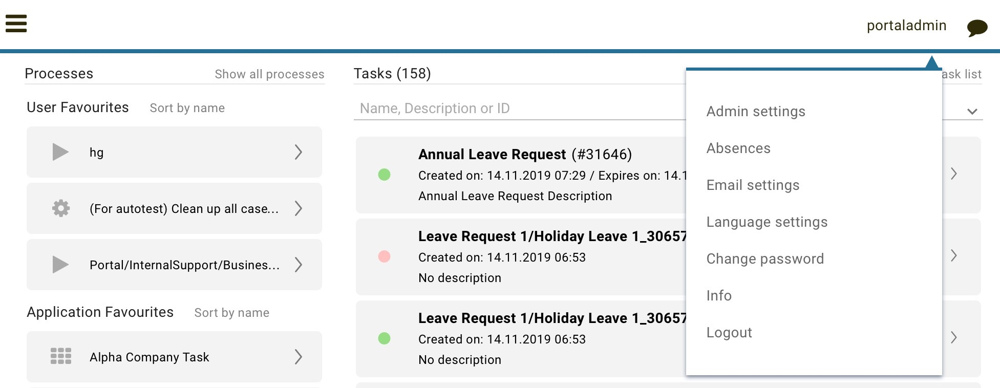
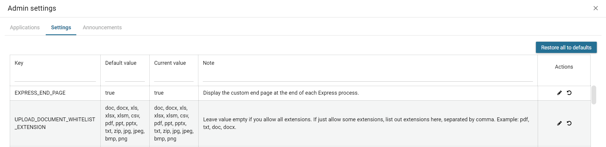
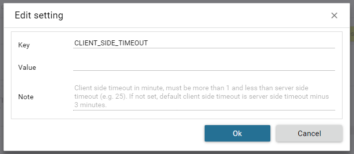
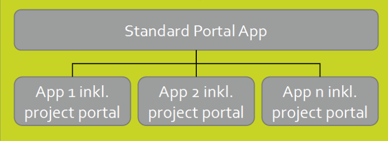
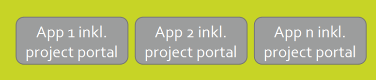
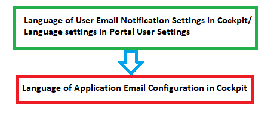
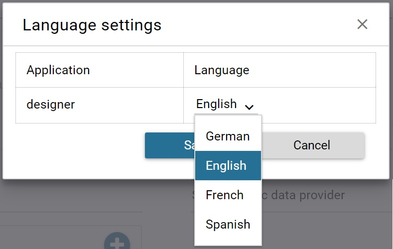
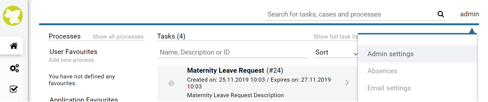
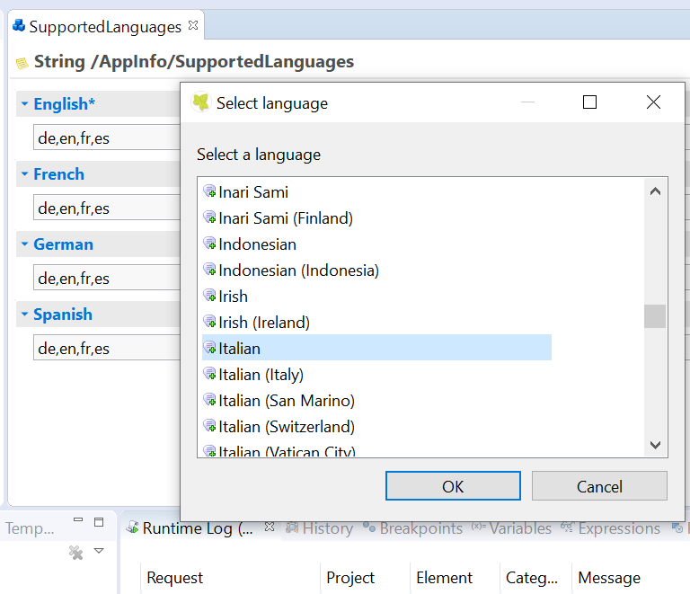
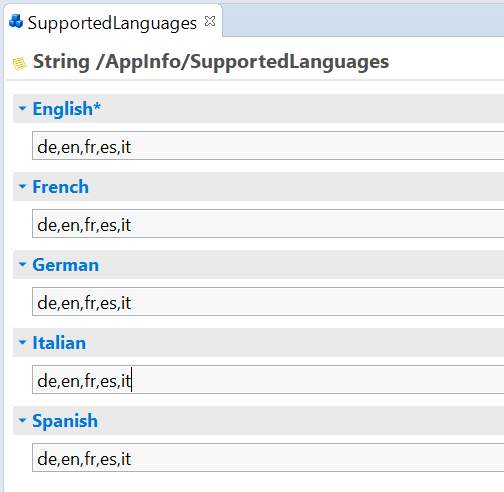
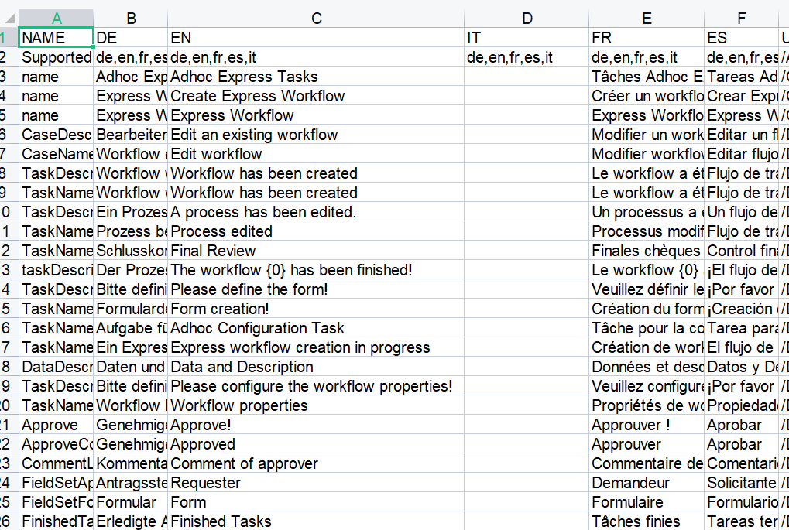
