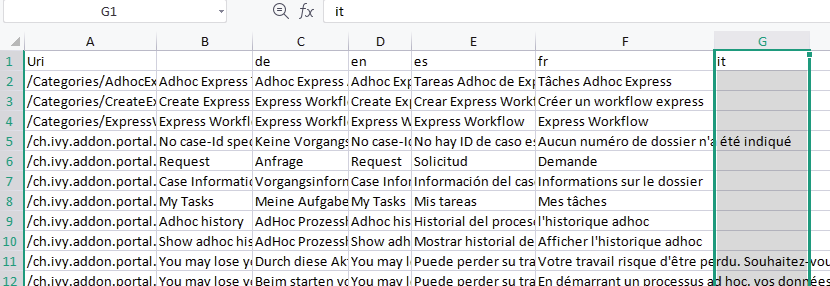
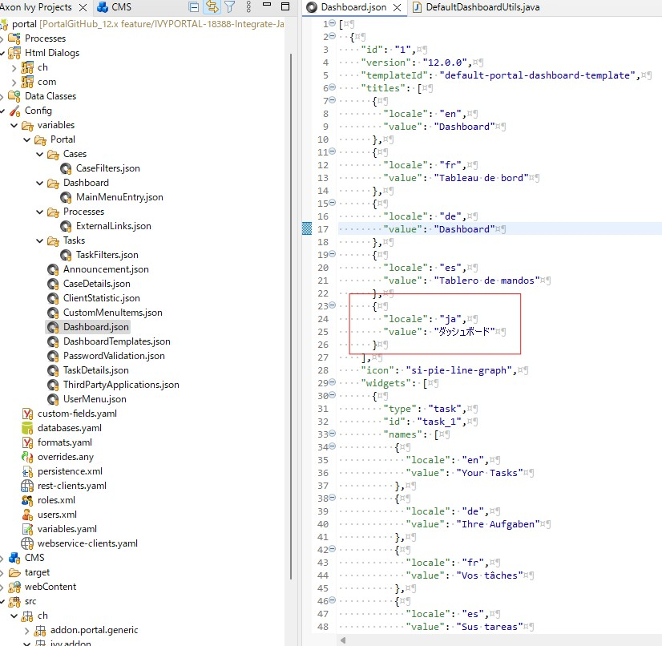
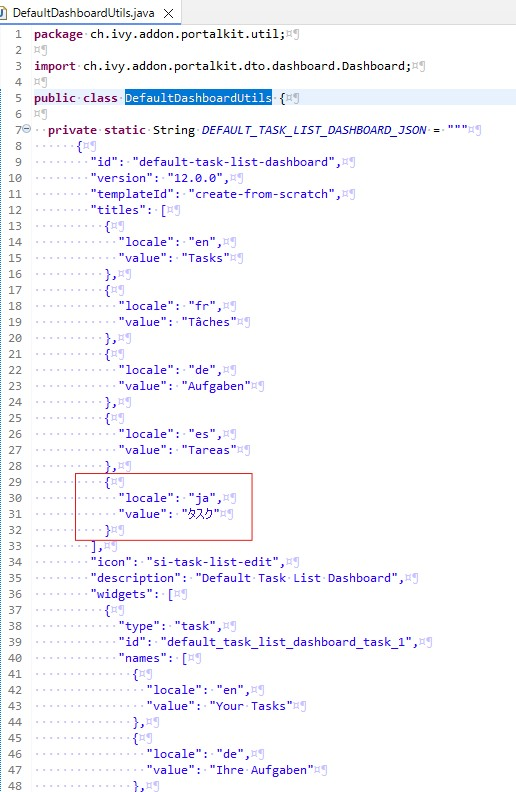

.. _settings:

.. raw:: html

    

Settings
********

This section covers Portal roles, permissions and other settings.

|portal-header|

.. _settings-admin-settings:

Configure Portal Settings
=========================

To manually configure Portal settings, refer to :ref:`update-portal-settings`.

Portal settings are stored as :dev-url:`Variables </doc/|version|/designer-guide/configuration/variables.html>`.

In development, it is a quite tedious task to configure Portal settings after
restarting Designer. Therefore, update your variables in
``portal/config/variables.yaml`` for the settings that you want to configure.
This survives restarting Designer.

.. _settings-language:

Language Settings
=================

To add a new language to the Portal, what you have to do is:

-  Export all CMS entries of the Portal to an Excel file.
-  Add one new column to the end of this file, then add the new language locale for example ``it`` for the Italian language to the first cell of this new column. Refer to `Java supported locales <https://www.oracle.com/java/technologies/javase/jdk11-suported-locales.html>`_ for the supported locales.

   |export-cms|

-  Add the translations for the new language for all CMS entries.
-  Add the translations for the new language for all json files in the Portal located at Config/variables by adding new locale/value item.

   |translate-json|

-  Add the translations for the new language to DefaultDashboardUtils.java by adding new locale/value item.

   |translate-java|

-  Import the Excel file.
-  Redeploy the Portal.

Role Configuration
==================

.. table::

   +-----------------------------------+-----------------------------------+
   | Portal roles                      | Rights                            |
   +===================================+===================================+
   | AXONIVY_PORTAL_ADMIN              | User with this role can access    |
   |                                   | the Portal Admin page,            |
   |                                   | configure internal role           |
   |                                   | properties, and create public     |
   |                                   | filters. Those who hold this role |
   |                                   | require some permissions.         |
   |                                   |                                   |
   +-----------------------------------+-----------------------------------+

.. _settings-permission-settings:

Permission Settings
===================

Configure permissions in the :dev-url:`Engine Cockpit
</doc/|version|/engine-guide/reference/engine-cockpit/security.html>`. In the
security area, you will find all these permission in group "PortalPermissions".

Task Permissions
----------------
- Add note

   User needs permission: :bdg-ref-warning:`🔑TaskCaseAddNote <TaskCaseAddNote>`.

- Delegate

   To be able to delegate, the user needs permission
   :bdg-ref-warning:`🔑TaskDisplayDelegateAction <TaskDisplayDelegateAction>` and :bdg-ref-warning:`🔑TaskWriteActivator <TaskWriteActivator>`.

   To delegate personal or group tasks, the user needs permission
   :bdg-ref-warning:`🔑TaskWriteActivatorOwnTasks <TaskWriteActivatorOwnTasks>`. This permission belongs to the
   PortalPermissions group. It is not assigned to role Everybody by default.

   A case owner is able to delegate all related tasks within their case with permission :bdg-ref-warning:`🔑CaseOwnerTaskDelegate <CaseOwnerTaskDelegate>`. This permission belongs to the
   PortalPermissions group.

   .. important::
      - Only tasks ready for user processing can be delegated. Therefore, the task state cannot be one of the following: CREATED, DONE, DESTROYED, RESUMED, FAILED.

- Reset

   To see the reset action, the user needs permission
   :bdg-ref-warning:`🔑TaskDisplayResetAction <TaskDisplayResetAction>`.

   To reset tasks, the user needs permission:
   :bdg-ref-warning:`🔑TaskResetOwnWorkingTask <TaskResetOwnWorkingTask>` or
   :bdg-ref-warning:`🔑TaskResetReadyForJoin <TaskResetReadyForJoin>` or
   :bdg-ref-warning:`🔑TaskReset <TaskReset>`.

   .. important::
      This only works for tasks in one of following states: RESUMED,
      PARKED, READY_FOR_JOIN, FAILED.

- Delete

   To see the Delete Task action, the user needs permission
   :bdg-ref-warning:`🔑TaskDestroy <TaskDestroy>`.

   .. important::
      Delete Task only works if the task state is not already DESTROYED
      or DONE.

- Reserve

   To see the Reserve action, the user needs permission
   :bdg-ref-warning:`🔑TaskDisplayReserveAction <TaskDisplayReserveAction>`.

   To reserve a task, the user needs permission
   :bdg-ref-warning:`🔑TaskParkOwnWorkingTask <TaskParkOwnWorkingTask>`.

   .. important::
      Reservation is only possible if the task is in one of the following
      states: CREATED, RESUMED, SUSPENDED.

- Change description

   User needs permission:
   :bdg-ref-warning:`🔑TaskWriteDescription <TaskWriteDescription>`.

   .. important::
      A terminated task cannot be changed. Therefore, the task state cannot be one of the following values:
      DONE, DESTROYED, FAILED.

- Change deadline

   User needs permission
   :bdg-ref-warning:`🔑TaskWriteExpiryTimestamp <TaskWriteExpiryTimestamp>`.

   .. important::
      To change an expiry date, the task cannot be in one of the following states:
      DONE, DESTROYED, FAILED.

- Change priority

   User needs permission
   :bdg-ref-warning:`🔑TaskWriteOriginalPriority <TaskWriteOriginalPriority>`.

   .. important::
      To change task priority, the task cannot be in the following states:
      DONE, DESTROYED, FAILED.

- Display additional options

   To see additional actions, the user needs permission
   :bdg-ref-warning:`🔑TaskDisplayAdditionalOptions <TaskDisplayAdditionalOptions>`.

Case Permissions
----------------

- Add note

   User needs permission :bdg-ref-warning:`🔑TaskCaseAddNote <TaskCaseAddNote>`.

- Delete

   User needs permission :bdg-ref-warning:`🔑CaseDestroy <CaseDestroy>`.

   .. important::
      Case state has to be RUNNING.

- Change description

   User needs permission :bdg-ref-warning:`🔑CaseWriteDescription <CaseWriteDescription>`.

   .. important::
      Case state cannot be DESTROYED.

- See related tasks of case

   To see the related tasks action, the user needs permission
   :bdg-ref-warning:`🔑ShowAllTasksOfCase <ShowAllTasksOfCase>`.

   To see related tasks, user needs permission
   :bdg-ref-warning:`🔑TaskReadOwnCaseTasks <TaskReadOwnCaseTasks>` or :bdg-ref-warning:`🔑TaskReadAll <TaskReadAll>`.

   .. important::
      Case state cannot be DESTROYED.

- Display show detail link

   User needs permission :bdg-ref-warning:`🔑ShowCaseDetails <ShowCaseDetails>`. By default, this permission
   is not assigned to role Everybody.

.. note::
      Normal users can only see the tasks and cases that they can work on.

      Administrators can see all tasks/cases in the application. The required
      permissions :bdg-ref-warning:`🔑TaskReadAll <TaskReadAll>`, :bdg-ref-warning:`🔑CaseReadAll <CaseReadAll>`.

      Administrators can interact with all workflows in the application.

      Administrators can create, update, and delete all workflows in the application.

      Normal users can update and delete workflows that they have created and
      can interact with tasks that have been assigned to them.

.. _settings-permission-settings-others:

Other Permissions
-----------------

.. table::

 +-----------+---------------------------------+---------------------------------------------------------------------------------------+
 |           | Action                          | Permission required                                                                   |
 +===========+=================================+=======================================================================================+
 | Absence   | Read                            | :bdg-ref-warning:`🔑UserReadOwnAbsences <UserReadOwnAbsences>`  or                    |
 |           |                                 | :bdg-ref-warning:`🔑UserReadAbsences <UserReadAbsences>`                              |
 |           +---------------------------------+---------------------------------------------------------------------------------------+
 |           | Create, edit                    | :bdg-ref-warning:`🔑UserCreateOwnAbsence <UserCreateOwnAbsence>` or                   |
 |           |                                 | :bdg-ref-warning:`🔑UserCreateAbsence <UserCreateAbsence>`                            |
 |           +---------------------------------+---------------------------------------------------------------------------------------+
 |           | Delete                          | :bdg-ref-warning:`🔑UserDeleteOwnAbsence <UserDeleteOwnAbsence>` or                   |
 |           |                                 | :bdg-ref-warning:`🔑UserDeleteAbsence <UserDeleteAbsence>`                            |
 |           +---------------------------------+---------------------------------------------------------------------------------------+
 |           | Read absences of all users      | :bdg-ref-warning:`🔑UserReadAbsences <UserReadAbsences>`                              |
 |           +---------------------------------+---------------------------------------------------------------------------------------+
 |           | Delete absences of all users    | :bdg-ref-warning:`🔑UserDeleteAbsence <UserDeleteAbsence>`                            |
 |           +---------------------------------+---------------------------------------------------------------------------------------+
 |           | Create new absence for all users| :bdg-ref-warning:`🔑UserCreateAbsence <UserCreateAbsence>`                            |
 +-----------+---------------------------------+---------------------------------------------------------------------------------------+
 | Substitute| Manage substitute               | :bdg-ref-warning:`🔑UserCreateSubstitute <UserCreateSubstitute>` and                  |
 |           |                                 | :bdg-ref-warning:`🔑UserReadSubstitutes <UserReadSubstitutes>`                        |
 +-----------+---------------------------------+---------------------------------------------------------------------------------------+
 | Document  | Upload, delete                  | :bdg-ref-warning:`🔑DocumentWrite <DocumentWrite>`                                    |
 |           |                                 | :bdg-ref-warning:`🔑DocumentOfInvolvedCaseWrite <DocumentOfInvolvedCaseWrite>`        |
 +-----------+---------------------------------+---------------------------------------------------------------------------------------+
 | Portal    | Access to full process          | :bdg-ref-warning:`🔑AccessFullProcessList <AccessFullProcessList>`                    |
 | permission| list, it's "Processes" on the   |                                                                                       |
 |           | left menu and link "Show all    |                                                                                       |
 |           | processes" on Dashboard         |                                                                                       |
 |           +---------------------------------+---------------------------------------------------------------------------------------+
 |           | Access to full task list, it's  | :bdg-ref-warning:`🔑AccessFullTaskList <AccessFullTaskList>`                          |
 |           | "Tasks" on the left menu and    |                                                                                       |
 |           | link "Show full task list" on   |                                                                                       |
 |           | Dashboard                       |                                                                                       |
 |           +---------------------------------+---------------------------------------------------------------------------------------+
 |           | Access to full case list, it's  | :bdg-ref-warning:`🔑AccessFullCaseList <AccessFullCaseList>`                          |
 |           | "Cases" on the left menu        |                                                                                       |
 |           +---------------------------------+---------------------------------------------------------------------------------------+
 |           | Add note to task/case           | :bdg-ref-warning:`🔑TaskCaseAddNote <TaskCaseAddNote>`                                |
 |           +---------------------------------+---------------------------------------------------------------------------------------+
 |           | Display show more note          | :bdg-ref-warning:`🔑TaskCaseShowMoreNote <TaskCaseShowMoreNote>`                      |
 |           +---------------------------------+---------------------------------------------------------------------------------------+
 |           | Create public external link, all| :bdg-ref-warning:`🔑CreatePublicExternalLink <CreatePublicExternalLink>`              |
 |           | other users can see that link in|                                                                                       |
 |           | the full process list           |                                                                                       |
 |           +---------------------------------+---------------------------------------------------------------------------------------+
 |           | Dashboard sharing               | :bdg-ref-warning:`🔑ShareDashboardLink <ShareDashboardLink>`                          |
 +-----------+---------------------------------+---------------------------------------------------------------------------------------+

.. _settings-virus-scanning-setting:

Virus Scanning Settings
=======================

PrimeFaces is delivered with one implementation of the interface that uses
`VirusTotal <https://www.virustotal.com/>`_. To enable `VirusTotal
<https://www.virustotal.com/>`_ you need to create a community account at the
`VirusTotal website <https://www.virustotal.com/>`_. You receive an API key once
you have an account. To configure the API key add the following snippet to the
configuration/web.xml file:

   .. code-block:: xml

      <context-param>
      <param-name>primefaces.virusscan.VIRUSTOTAL_KEY</param-name>
      <param-value>PUT YOUR API KEY HERE</param-value>
      </context-param>

   ..

By default, after you configured the context-param in the web XML file, the
Virus Scanning is enabled. You can change the variable ``EnableVirusScanner`` to
``false`` in ``portal/config/variables.yaml`` if you want to disable virus scanning.

Reference: `How to check if uploaded files contain a virus
<https://community.axonivy.com/d/144-how-to-check-if-a-uploaded-files-contain-a-virus/>`_.

.. warning::
   Files that are checked for viruses are uploaded to VirusTotal. If you may
   not store the data of your application on servers outside the internal
   network or a given country, you might want to refrain from using this solution.

Variables
=========

These variables are stored as key-value pairs. They have to be edited in the Engine Cockpit.

.. table::

   +---------------------------------------------+-------------------------------+-----------------------------+
   | Variable                                    | Default                       | Description                 |
   |                                             | value                         |                             |
   +=============================================+===============================+=============================+
   | PortalStartTimeCleanObsoletedDataExpression | 0 6 \* \* \*                  | Cron expression defines     |
   |                                             |                               | the time to clean up data   |
   |                                             |                               | of obsolete users. E.g.:    |
   |                                             |                               | expression for at 6AM       |
   |                                             |                               | every day is                |
   |                                             |                               | ``0 6 * * *``. Refer to     |
   |                                             |                               | `CRON Expression <https://  |
   |                                             |                               | developer.axonivy.com/doc/  |
   |                                             |                               | 11.2/engine-guide/configur  |
   |                                             |                               | ation/advanced-configurati  |
   |                                             |                               | on.html#cron-expression>`_. |
   |                                             |                               | Restart Ivy engine after    |
   |                                             |                               | changing this variable.     |
   +---------------------------------------------+-------------------------------+-----------------------------+
   | PortalDeleteAllFinishedHiddenCases          | false                         | If set to ``true``, the     |
   |                                             |                               | above cron job runs daily   |
   |                                             |                               | and removes all finished    |
   |                                             |                               | hidden cases on the engine. |
   |                                             |                               |                             |
   |                                             |                               | Otherwise, just cases which |
   |                                             |                               | were generated by this      |
   |                                             |                               | Portal will be deleted.     |
   +---------------------------------------------+-------------------------------+-----------------------------+
   | PortalHiddenTaskCaseExcluded                | true                          | By default, Portal will     |
   |                                             |                               | query tasks and cases       |
   |                                             |                               | which are not hidden. If    |
   |                                             |                               | set to ``false``, Portal    |
   |                                             |                               | will ignore this property.  |
   +---------------------------------------------+-------------------------------+-----------------------------+
   | PortalLoginPageDisplay                      | true                          |By default, Portal will      |
   |                                             |                               |redirect to Login Page if    |
   |                                             |                               |login is required and the    |
   |                                             |                               |user is unknown.             |
   |                                             |                               |Set to ``false`` to          |
   |                                             |                               |redirect to the login error  |
   |                                             |                               |page and hide Logout in the  |
   |                                             |                               |User menu (when you use      |
   |                                             |                               |external authentication and  |
   |                                             |                               |the user is not present in   |
   |                                             |                               |your application user list.) |
   +---------------------------------------------+-------------------------------+-----------------------------+

Configuration
-------------

These variables are stored in JSON format. You can edit them in the cockpit, or
use the UI on the Portal Admin settings.

Portal Announcement
^^^^^^^^^^^^^^^^^^^
The standard announcement for Portal is intended to be used for general
information (e.g. Downtime, Changes, etc.). This message can be seen by all
Portal users.

Filename: ``variables.Portal.Announcement.json``

Data model:

.. code-block:: javascript

   {
       "contents": [
           {
               "language": "en",
               "value": "The announcement content in English"
           }
       ],
       "enabled": false
   }

-  ``contents``: list of supported languages and content for each language.

   -  ``language``: the language code such as ``en``, ``de``, ``es``, and ``fr``
   -  ``value``: the announcement content of that language

-  ``enabled``: the status of the announcement, true shows the announcement

Third Party Applications Linked Into Portal
^^^^^^^^^^^^^^^^^^^^^^^^^^^^^^^^^^^^^^^^^^^
You can define your custom menu item in the following JSON file. It will be included in
the left menu.

Filename: ``variables.Portal.ThirdPartyApplications.json``

Data model:

.. code-block:: javascript

   [
      {
         "id": "284352a58c7a48a2b64be8a946857c7a",
         "displayName": "{\"de\":\"AxonIvy ger\",\"en\":\"AxonIvy\"}",
         "menuIcon": "fa-group",
         "menuOrdinal": 1,
         "name": "{\"de\":\"AxonIvy ger\",\"en\":\"AxonIvy\"}",
         "link": "https://developer.axonivy.com/download"
      }
   ]

- ``id``: the identification number of a third-party application. It is an
  auto-generated UUID.
- ``displayName``: the display name of the app that is shown in the left menu.
  Supports multi-language.
- ``menuIcon``: the style class of the app icon that shows in the left menu.
- ``menuOrdinal``: index of the app. Used to sort menu items in the left menu.
- ``name``: the name of third-party app.
- ``link``: the URL of third-party app.

.. _portal-statistic-charts:

Portal Statistic Charts
^^^^^^^^^^^^^^^^^^^^^^^
You can define filter logic, appearance, and other settings for all statistic
charts that can be used by the :ref:`Statistic widget <portal-statistic-widget>` of Portal dashboard.

Filename: ``variables.Portal.Statistic.json``

Data model:

.. code-block:: javascript

   [
      {
         "id": "1",
         "aggregates": "priority",
         "filter": "businessState:OPEN IN_PROGRESS,canWorkOn",
         "chartTarget": "TASK",
         "chartType": "pie",
         "names": [
               {
                  "locale": "de",
                  "value": "Aufgaben nach Prioritäten"
               },
               {
                  "locale": "en",
                  "value": "Tasks by Priority"
               },
               {
                  "locale": "fr",
                  "value": "Tâches par Priorité"
               },
               {
                  "locale": "es",
                  "value": "Tareas por Prioridad"
               }
         ],
         "descriptions": [
               {
                  "locale": "de",
                  "value": "Dieses Kreisdiagramm zeigt alle Aufgaben nach Priorität an."
               },
               {
                  "locale": "en",
                  "value": "This pie chart displays all tasks by priority."
               },
               {
                  "locale": "fr",
                  "value": "Ce diagramme à secteurs affiche toutes les tâches par priorité."
               },
               {
                  "locale": "es",
                  "value": "Este gráfico circular muestra todas las tareas por prioridad."
               }
         ],
         "icon": "si si-analytics-pie-2",
         "refreshInterval": 300
      }
   ]

- ``id``: ID of the statistic chart
- ``aggregates``: the aggregation query to make bucket (grouping) or metric aggregations. Please visit `Task Aggregation and Filter`_ and `Case Aggregation and Filter`_ for more details
- ``filter``: filter conditions for the statistic chart. Multiple conditions are
  supported. Please note that some filters are incompatible with certain
  chart types. Please visit `Task Aggregation and Filter`_ and `Case Aggregation
  and Filter`_ for more details
- ``chartTarget``: the entity type that you want to use as the target  of the chart. We are supporting the main entity types of the ivy workflow:
   
   ``TASK``: Ivy Task

   ``CASE``: Ivy Case

- ``names``: the multilingual display name of the chart
- ``descriptions``: the multilingual description of the chart
- ``icon``: the icon of each widget. Portal supports both Streamline and FontAwesome icons
- ``refreshInterval``: statistic chart refresh interval in seconds
- ``chartType``: chart type that you want to show on the UI. There are 4 chart types:
   
   ``pie``: Pie chart

   |pie-chart|

   ``bar``: Bar chart

   |bar-chart|

   ``line``: Line chart

   |line-chart|

   ``number``: Labelled number chart
   
   |number-chart|

For some specific charts such as ``Bar``, ``Line`` or ``Number``, there are additional and required fields:

- ``barChartConfig``: required fields for configuring the ``Bar`` chart, please add them if chart type is ``bar`` 

   - ``xTitles``: the multilingual display title for the x-axis
   - ``yTitles``: the multilingual display title for the y-axis
   - ``yValue``: add this field with **time** value when you want to show the amount of time on the y-axis

- ``lineChartConfig``: required fields for configuring the ``Line`` chart, please add them if chart type is ``line``

   - ``xTitles``: the multilingual display title for the x-axis
   - ``yTitles``: the multilingual display title for the y-axis

- ``numberChartConfig``: additional fields for configuring the ``Number`` chart, you can add if chart type is ``number``

   - ``suffixSymbol``: icon next to the number. Portal supports both Streamline and FontAwesome icons
   
.. _portal-process-external-link:

Portal Processes External Links
^^^^^^^^^^^^^^^^^^^^^^^^^^^^^^^
The standard external links of the Portal are defined in the following file:

Filename: ``variables.Portal.Processes.ExternalLinks.json``

Data model:

.. code-block:: javascript

   [
      {
         "id": "01322912db224658a222804802844a7b",
         "version": "10.0.9",
         "name": "Download latest |ivy|",
         "link": "https://developer.axonivy.com/download",
         "creatorId": 2,
         "icon": "fa-paperclip",
         "description": "https://developer.axonivy.com/download",
         "imageContent": "<your-image-data-as-base64>",
         "imageLocation": "/com/axonivy/portal/ExternalLink/dd91ec84-c5aa-4202-aeea-4500fbd394ef",
         "imageType": "jpeg",
         "permissions": [
            "Everybody"
         ]
      }
   ]

- ``id``: the identification of a link, auto-generated by UUID
- ``version``: the version of the json
- ``name``: the display name of a link
- ``link``: the URL of the link
- ``creatorId``: the user id who create the link. This user can see and start the external link in any case
- ``icon``: the style class of the link icon
- ``description``: the description of a link
- ``imageContent``: the base64 data format of the process image. If this value is valid then it will be converted to a physical file. If you want to configure external link images when deploying, you just need to define ``imageContent``
- ``imageLocation``: the location of the process image. This image is stored in Application CMS. Basically, this should be handled by the engine
- ``imageType``: the extension of the process image. Basically, this should be handled by the engine
- ``permissions``: users have these roles can see and start the external link. If you don't define it, default role is Everybody

.. |portal-header| image:: ../../screenshots/settings/user-settings.png
.. |global-settings| image:: ../../screenshots/settings/global-settings.png
.. |global-setting-edit| image:: ../../screenshots/settings/edit-global-settings.png
.. |select-admin-settings| image:: ../../screenshots/settings/select-admin-settings.png

.. _Task Aggregation and Filter: https://developer.axonivy.com/api-browser?configUrl=https%3A%2F%2Fdeveloper.axonivy.com%2Fdoc%2F11.3%2Fopenapi%2Fconfig.json&urls.primaryName=default#/workflow/stats_1 
.. _Case Aggregation and Filter: https://developer.axonivy.com/api-browser?configUrl=https%3A%2F%2Fdeveloper.axonivy.com%2Fdoc%2F11.3%2Fopenapi%2Fconfig.json&urls.primaryName=default#/workflow/stats
   
.. |pie-chart| image:: ../../screenshots/statistic/tasks-by-prior-pie-chart.png
.. |bar-chart| image:: ../../screenshots/statistic/tasks-by-prior-bar-chart.png
.. |number-chart| image:: ../../screenshots/statistic/tasks-by-prior-number-chart.png
.. |line-chart| image:: ../../screenshots/statistic/completed-cases-chart.png

