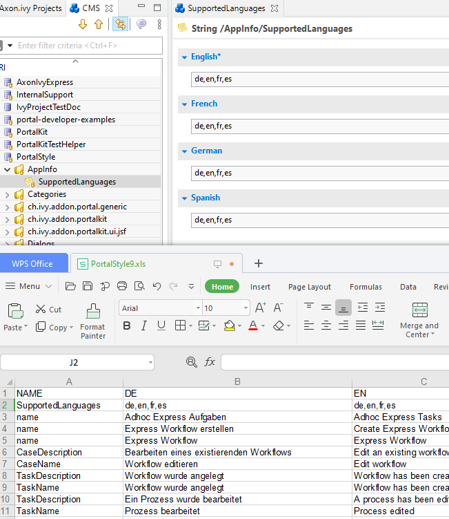

.. _settings:

Settings
********

This section covers Portal role, permissions and some settings in User menu

|portal-header|

.. _settings-admin-settings:

Admin settings
==============

User needs to have role ``AXONIVY_PORTAL_ADMIN`` to see this menu.

How to open Admin Settings
--------------------------

Open ``Admin Settings`` by selecting the item in ``UserMenu`` on the
topbar, if your page using layout of ``PortalTemplate`` .

|select-admin-settings|

.. important:: 
   If your application does not use templates of PortalTemplate project, you
   have to create a page and use AdminSettings component inside.

.. _settings-admin-settings-global-settings:

Global settings
---------------

Global settings for Portal can be set in Settings tab. All available
settings with their default value and description are listed in this
place.

|global-settings|

You can edit value for a specific setting

|global-setting-edit|

You can also get back the default value for each setting by clicking
reset button on each row, or reset all values of all settings by
clicking ``Restore All To Defaults`` button.

Setup Global settings by configuration file
"""""""""""""""""""""""""""""""""""""""""""
.. important:: 
   This feature only supports modification of Portal settings in Designer.

Process developer can set up global settings of Portal in file ``portal_settings_config.properties`` which put in ``PortalKit``.

   .. code-block:: Python

      # This file is for developer configure values for Portal settings.
      # As developer, you only need to remove comment mark of corresponding settings and modify their values.
      # Portal will apply setting values once you start designer.

      # System tasks visibility
      #HIDE_SYSTEM_TASKS_FROM_HISTORY = true
      #HIDE_SYSTEM_TASKS_FROM_HISTORY_ADMINISTRATOR = false

      #System notes visibility
      #HIDE_SYSTEM_NOTES_FROM_HISTORY = true
      #HIDE_SYSTEM_NOTES_FROM_HISTORY_ADMINISTRATOR = false

      # Portal chat settings
      #ENABLE_GROUP_CHAT = false
      #ENABLE_PRIVATE_CHAT = false
      #CHAT_RESPONSE_TIMEOUT =
      #CHAT_MAX_CONNECTION = 3

      # Documents security settings
      #ENABLE_SCRIPT_CHECKING_FOR_UPLOADED_DOCUMENT = false
      #UPLOAD_DOCUMENT_WHITELIST_EXTENSION = doc, docx, xls, xlsx, xlsm, csv, pdf, ppt, pptx, txt, zip, jpg, jpeg, bmp, png

      # Time settings
      #HIDE_TIME = false
      #CLIENT_SIDE_TIMEOUT =
      #REFRESH_TASK_LIST_INTERVAL = 10000

      # Task/case counting functions
      #DISABLE_CASE_COUNT = false
      #DISABLE_TASK_COUNT = false

      # IFrame setting
      #EMBED_IN_FRAME = true
      
      # Logged in user format, available values: USERNAME, DISPLAY_NAME, DISPLAY_NAME_USERNAME, USERNAME_DISPLAYNAME
      #LOGGED_IN_USER_FORMAT = DISPLAY_NAME

      # Task/case detail document component setting
      #HIDE_TASK_DOCUMENT = false
      #HIDE_CASE_DOCUMENT = false

      # Others
      #SHOW_ENVIRONMENT_INFO = false
      #ENABLE_CASE_OWNER = false
      #EXPRESS_END_PAGE = true
      #HIDE_CHANGE_PASSWORD_BUTTON = false
      #HIDE_LOGOUT_BUTTON = false
      #HIDE_UPLOAD_DOCUMENT_FOR_DONE_CASE = false
      #HIDE_STATISTIC_WIDGET = false
      #ENABLE_USER_FAVORITES = true
      #DISPLAY_MESSAGE_AFTER_FINISH_TASK = true
      #SHOW_USER_GUIDE = true
      #SHOW_GLOBAL_SEARCH = true
      #SHOW_BUTTON_ICON = true

This file already contains list of settings with their default values.
These settings will be applied once you start Portal.

If you change configuration file while coding, please stop engine in designer and start engine again to apply changes.

.. _settings-language:

Language settings
=================

-  Below is applied language setting precedence:

   |language-precedence|

If user email language setting is application default, language would be applied by application email language setting.

If user selects a language in email setting, language would be appplied by this selection.

To configure languages of Portal applications, select ``My profile`` . 

Select one in dropdown list of ``Selected language``. After the change is saved, new language will be set for whole application.

   |language-settings|

-  For multiple languages, the CMS key ``/AppInfo/SupportedLanguages``
   must exist in your application. This CMS entry is
   in Portal Style. It contains list of all languages supported by
   your application, separated by comma.

   -  Must not contain spaces
   -  Same as display name of Locale
   -  Separated by comma
   -  Process model version, which has this CMS, must active

-  To add new language to Portal, what you have to do is

   -  Add new language locale to cms entry of Portal Style ``/AppInfo/SupportedLanguages`` 
   -  Export all CMS entries of Portal Style to excel file
   -  Add translation of new language for all CMS entries
   -  Import file excel back, then redeploy Portal Style
   -  This is sample how to add new Spanish to portal

      |add-new-language|

Role configuration
==================

.. table:: 

   +-----------------------------------+-----------------------------------+
   | PortalKit roles                   | Rights                            |
   +===================================+===================================+
   | AXONIVY_PORTAL_ADMIN              | User belong to this role can      |
   |                                   | handle AdminUI page, configure    |
   |                                   | the internal role properties,     |
   |                                   | create public filters. Users who  |
   |                                   | own this role need some           |
   |                                   | permissions.                      |
   |                                   |                                   |   
   +-----------------------------------+-----------------------------------+

.. _settings-permission-settings:

Permission settings
===================

Permissions can be configured in `Cockpit
<http://developer.axonivy.com/doc/latest/engine-guide/tool-reference/engine-cockpit.html#security>`_.
In the security area, you will find all these permission in the Group
"PortalPermissions"

Absences
--------

-  READ

   User needs permission :
   ``IPermission.USER_READ_OWN_ABSENCES`` or
   ``IPermission.USER_READ_ABSENCES``.

-  CREATE/MODIFY

   User needs permission :
   ``IPermission.USER_CREATE_OWN_ABSENCE`` or
   ``IPermission.USER_CREATE_ABSENCE``.

-  DELETE

   User needs permission :
   ``IPermission.USER_DELETE_OWN_ABSENCE`` or
   ``IPermission.USER_DELETE_ABSENCE``.

-  MANAGE EVERY USER ABSENCES

   User can read, add, delete absences of all users. User needs all permissions :
   ``IPermission.USER_CREATE_ABSENCE``,  
   ``IPermission.USER_DELETE_ABSENCE`` and 
   ``IPermission.USER_READ_ABSENCES``.

Substitute
----------

-  MANAGE EVERY USER SUBSTITUTES

   User needs all permissions :
   ``IPermission.USER_CREATE_SUBSTITUTE`` and
   ``IPermission.USER_READ_SUBSTITUTES``.

Personal task permission
------------------------
-  ADD NOTE

   Refer to :ref:`Display add note button<display-add-note-button>`.

-  DELEGATE

   To show delegate action, user needs permission:
   ``PortalPermission.TASK_DISPLAY_DELEGATE_ACTION``.

   To delegate personal or group tasks, user needs permission:
   ``TaskWriteActivatorOwnTasks`` (This permission belongs to Portal
   permission group and it is not assigned to role Everybody by
   default). 
   
   To delegate all tasks in task list, user needs permission:
   ``IPermission.TASK_WRITE_ACTIVATOR``.

   .. important::
      Task state cannot be one of the following values:
      CREATED, DONE, DESTROYED, RESUMED, FAILED.

-  RESET

   To show reset action, user needs permission:
   ``PortalPermission.TASK_DISPLAY_RESET_ACTION``.

   To reset task, user needs permission:
   ``IPermission.TASK_RESET_OWN_WORKING_TASK`` or
   ``PortalPermission.TASK_RESET_READY_FOR_JOIN`` or
   ``IPermission.TASK_RESET``.

   .. important::
      Task state has to be one of following values: RESUMED, PARKED, READY_FOR_JOIN.

   
-  DELETE TASK

   User needs permission:
   ``IPermission.TASK_DESTROY``.

   .. important::
      Task state isn't DESTROYED or DONE.

-  RESERVE

   To show reserve action, user needs permission: 
   ``PortalPermission.TASK_DISPLAY_RESERVE_ACTION``.

   To reserve task, user needs permission: 
   ``IPermission.TASK_PARK_OWN_WORKING_TASK``.

   .. important::
      Task state has to be one of following values: CREATED, RESUMED, SUSPENDED.

-  CHANGE TASK DESCRIPTION

   User needs permission: 
   ``IPermission.TASK_WRITE_DESCRIPTION``.

   .. important::
      Task state cannot be one of following values:
      DONE, DESTROYED, FAILED.

-  CHANGE DEADLINE

   User needs permission: 
   ``IPermission.TASK_WRITE_EXPIRY_TIMESTAMP``.

   .. important::
      Task state cannot be one of following values:
      DONE, DESTROYED, FAILED.

-  CHANGE PRIORITY

   User needs permission: 
   ``IPermission.TASK_WRITE_ORIGINAL_PRIORITY``.

   .. important::
      Task state cannot be one of following values:
      DONE, DESTROYED, FAILED.

-  DISPLAY ADDITIONAL OPTIONS

   To show additional action, user needs permission: 
   ``PortalPermission.TASK_DISPLAY_ADDITIONAL_OPTIONS``.

Personal case permission
------------------------

-  ADD NOTE

   Refer to :ref:`Display add note button<display-add-note-button>`.

-  DELETE CASE

   User needs permission: 
   ``IPermission.CASE_DESTROY``.

   .. important::
      Case state must be RUNNING.

-  CHANGE CASE DESCRIPTION

   User needs permission: 
   ``IPermission.CASE_WRITE_DESCRIPTION``.

   .. important::
      Case state cannot be DESTROYED.

-  SEE RELATED TASKS OF CASE

   To show related tasks action, user needs permission: 
   ``PortalPermission.SHOW_ALL_TASKS_OF_CASE`` .

   To see related tasks, user needs permission: 
   ``IPermission.TASK_READ_OWN_CASE_TASKS`` or
   ``IPermission.TASK_READ_ALL``.

   .. important::
      Case state cannot be DESTROYED.

-  DISPLAY SHOW DETAILS LINK

   User needs permission: 
   ``PortalPermission.SHOW_CASE_DETAILS``.
   This permission is not assigned to role Everybody by default.

Upload/delete document permission
---------------------------------

User needs permission: 
``IPermission.DOCUMENT_WRITE`` or
``IPermission.DOCUMENT_OF_INVOLVED_CASE_WRITE``.

Express Workflow permission
---------------------------

-  CREATE EXPRESS WORKFLOW

   User needs permission: 
   ``PortalPermission.EXPRESS_CREATE_WORKFLOW`` (This permission belongs
   to Portal permission group, assigned to role Everybody by default).

Statistics permission
---------------------

-  ADD DASHBOARD CHART

   User needs permission: 
   ``PortalPermission.STATISTIC_ADD_DASHBOARD_CHART`` (This permission
   belongs to Portal permission group, assigned to role Everybody by
   default).

-  ANALYZE TASK

   Filter tasks and export data to excel for advanced analysis. User needs permission: 
   ``PortalPermission.STATISTIC_ANALYZE_TASK`` (This permission belongs
   to Portal permission group and it is not assigned to role Everybody
   by default).

Portal general permission
-------------------------

-  ACCESS TO FULL PROCESS LIST

   User cannot see "Processes" on the left menu and link "Show all
   processes" (on Dashboard) if he does not have permission
   ``PortalPermission.ACCESS_FULL_PROCESS_LIST``.

-  ACCESS TO FULL TASK LIST

   User cannot see "Tasks" on the left menu and link "Show full task
   list" (on Dashboard) if he does not have permission
   ``PortalPermission.ACCESS_FULL_TASK_LIST``.

-  ACCESS TO FULL CASE LIST

   User cannot see "Cases" on the left menu if he does not have
   permission ``PortalPermission.ACCESS_FULL_CASE_LIST``.

-  ACCESS TO FULL STATISTIC LIST

   User cannot see "Statistics" on the left menu and link "Show all
   charts" (on Dashboard) if he does not have permission
   ``PortalPermission.ACCESS_FULL_STATISTICS_LIST``.

   .. _display-add-note-button:
-  DISPLAY ADD NOTE BUTTON

   "Add note" button will be hidden in Task/Case detail if session user does not have permission
   ``PortalPermission.TASK_CASE_ADD_NOTE``.

-  DISPLAY SHOW MORE NOTE BUTTON

   This button will be hidden if session user does not have permission
   ``PortalPermission.TASK_CASE_SHOW_MORE_NOTE``.

-  CREATE PUBLIC EXTERNAL LINK FOR ALL USERS

   Everyone can add a new external link privately by default.
   If a user is granted ``PortalPermission.CREATE_PUBLIC_EXTERNAL_LINK``, 
   he can set an external link as public so that all other users can see this link in full process list
   and other users can also add it to User Favorites.

Administrator permission can see all tasks/cases in the application

Normal users can only see their tasks/cases they can work on.

Administrator can see all tasks/cases in the application.

Permissions needed: ``IPermission.TASK_READ_ALL`` ,
``IPermission.CASE_READ_ALL`` .

Administrator permission can interact with all workflows in the application

Normal user can update and delete workflow which created by him and
can interact with workflow's task which assigned to him.

Administrator can create, update and deletes all workflows in the
application.

Global variables
================

.. table:: 

   +---------------------------------------------+-------------+---------------------------+
   | Variable                                    | Default     | Description               |
   |                                             | value       |                           |
   +=============================================+=============+===========================+
   | PortalStartTimeCleanObsoletedDataExpression | 0 0 6 \* \* | Cron expression define    |
   |                                             | ?           | the time to clean up data |
   |                                             |             | of obsoleted users. E.g.: |
   |                                             |             | expression for at 6AM     |
   |                                             |             | every day is              |
   |                                             |             | ``0 0 6 * * ?`` . Refer   |
   |                                             |             | to                        |
   |                                             |             | `crontrigger <http://quar |
   |                                             |             | tz-scheduler.org/document |
   |                                             |             | ation/quartz-2.1.x/tutori |
   |                                             |             | als/crontrigger>`__       |
   |                                             |             | . Restart Ivy engine      |
   |                                             |             | after changing this       |
   |                                             |             | variable.                 |
   +---------------------------------------------+-------------+---------------------------+
   | PortalDeleteAllFinishedHiddenCases          | false       | If set to ``true``, the   |
   |                                             |             | cron job runs daily (at   |
   |                                             |             | 6.AM as default) will     |
   |                                             |             | clean all finished hidden |
   |                                             |             | cases in engine.          |
   |                                             |             | Otherwise, just hidden    |
   |                                             |             | cases which were          |
   |                                             |             | generated by Portal will  |
   |                                             |             | be deleted.               |
   +---------------------------------------------+-------------+---------------------------+
   | PortalGroupId                               | ch.ivyteam. | Maven group id of Portal. |
   |                                             | ivy.project |                           |
   |                                             | .portal     |                           |
   +---------------------------------------------+-------------+---------------------------+
   | PortalHiddenTaskCaseExcluded                | true        | By default, Portal will   |
   |                                             |             | query tasks and cases     |
   |                                             |             | which don't have hide     |
   |                                             |             | information. Set it to    |
   |                                             |             | ``false``, portal will    |
   |                                             |             | ignore this additional    |
   |                                             |             | property.                 |
   +---------------------------------------------+-------------+---------------------------+

.. |portal-header| image:: ../../screenshots/settings/user-settings.png
.. |global-settings| image:: ../../screenshots/settings/global-settings.png
.. |global-setting-edit| image:: ../../screenshots/settings/edit-global-settings.png
.. |language-precedence| image:: images/settings/language-precedence.png
.. |language-settings| image:: ../../screenshots/my-profile/my-profile.png

.. |select-admin-settings| image:: ../../screenshots/settings/select-admin-settings.png

