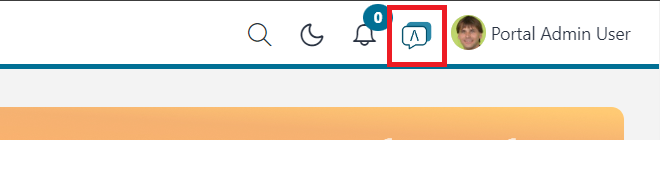

.. _ai-assistant-ja:

AI アシスタント
****************************

ポータルには、AI アシスタントを管理、利用できるアプリケーション ``AI アシスタント`` が完全統合されています。
``AI アシスタント`` は、 ``ポータルサポート`` AI 機能を利用して、ユーザーがポータルについてより多くの知識を得られるよう手助けします。

AI アシスタントを使用するには、 ``ai-assistant`` プロジェクトをポータルと同じアプリケーションに展開します。
展開後は、ポータルのトップバーにある AI アイコンをクリックして、AI アシスタントにアクセスできます。

|ai-assistant-menu-item|

