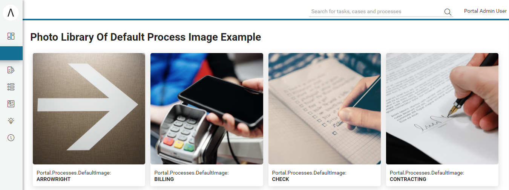

.. _full-process-list-ja:

全プロセスリスト
****************************************

**全プロセスリスト** ページには、利用可能なアプリケーションのすべてのプロセスの概要が表示されます。
ページを開くには、|ivy| Portal メニューの :guilabel:`プロセス` をクリックします。

.. note::

   ユーザーが |ivy| Portal メニューで全プロセスリスト（:guilabel:`プロセス` ）を表示できるようにするには、:bdg-ref-warning:`🔑AccessFullProcessList <AccessFullProcessList>` 権限を付与してください。

|navigate-to-full-process-list|

**全プロセスリスト** ページには、すべてのプロセスのリストが表示されます。プロセスはアルファベット順に頭文字ごとに分けて表示されます。
 

|portal-full-process-list-page|

   #. ここにキーワードを入力して、プロセスを検索します。
   #. プロセスアイコン（画像）
   #. 表示モードの変更
   #. プロセスのその他のメニュー項目のアイコン

プロセスの表示モード
----------------------------------

**全プロセスリスト** は、3 つのモードでプロセスリストを表示します。 **イメージモード** が自動的にアクティブになります。
デフォルトのプロセスの表示モードを変更するには、 ``マイプロフィール`` の :ref:`process-list-configuration-ja` にアクセスします。

イメージモード
^^^^^^^^^^^^^^^^^^^^^^^^^^^^^^

|portal-process-image-view-page|

.. hint:: 
   プロセスのデフォルトの画像を変更するには、 **Portal.Processes.DefaultImage** ポータル設定を変更します。
   
   
   :ref:`values_of_default_image-ja` を参照してください。

グリッドモード
^^^^^^^^^^^^^^^^^^^^^^^^^^^^

|portal-process-grid-view-page|

コンパクトモード
^^^^^^^^^^^^^^^^^^^^^^^^^^^^^^^^^^^^

|portal-process-list-view-page|

特定のプロセスを検索するには、検索フィールド（上の画像の左上にあるホームアイコンの下）にキーワードを入力して検索します。
検索では、プロセス名、プロセスの説明、プロセスのカテゴリーを検索し、キーワードに従ってプロセスリストをフィルターします。

.. warning:: 
   プロセスの検索と、ポータルのヘッダー領域を検索する |ivy| Portal のグローバル検索を混同しないでください。 
   

プロセスの新しいインスタンスを開始するには、リストでプロセスを選択します。このインスタンスを **ケース** といいます。
ケースで活動を終了すると、:guilabel:`全プロセスリスト` ではなく、 **ダッシュボード** にリダイレクトされます。

.. _values_of_default_image-ja:

**Portal.Processes.DefaultImage** ポータル設定の値
--------------------------------------------------
#. 例については、 ``portal-developer-examples`` プロジェクトを参照してください。
#. ``PhotoLibraryOfDefaultProcessImageExample`` プロセスを開始します。

|process-default-image-values|

ハウツー：外部リンクを追加する
-------------------------------------------------------

#. ページ上の検索テキストボックスの隣にある :guilabel:`外部リンクを追加` をクリックします。

#. :guilabel:`外部リンクを追加` ダイアログが開きます。

#. :guilabel:`プロセス名` でプロセスに最適な名前を定義します。

#. :guilabel:`プロセス名` の入力後、翻訳アイコンが表示されます。
   アイコンをクリックして、 ``複数言語の設定`` ダイアログを開きます。言語フィールドに名前を入力して、複数の言語で名前を指定できます。
   
   言語フィールドに名前を入力しない場合は、デフォルトの言語の名前が使用されます。
   

#. :guilabel:`開始リンク` に外部リンクの URL を追加します。

#. :guilabel:`説明` に外部リンクの説明を追加します。

#. :guilabel:`説明` の入力後、翻訳アイコンが表示されます。
   アイコンをクリックして、 ``複数言語の設定`` ダイアログを開きます。言語フィールドに説明を入力して、複数の言語で説明を指定できます。
   
   言語フィールドに説明を入力しない場合は、デフォルトの言語の説明が使用されます。
   

#. ユーザーが外部サイトへの公開用リンクを作成できるようにするには、:bdg-ref-warning:`🔑CreatePublicExternalLink <CreatePublicExternalLink>` 権限を付与してください。 
   権限を付与されたユーザーは、:guilabel:`すべてのユーザー` を選択して、そのリンクを公開用リンクとして設定できます。
   :guilabel:`表示設定` フィールドは自動的に表示されません。新しい外部リンクは個人用リンクになります。

#. :guilabel:`アイコン` でアイコンを変更します。

#. :guilabel:`画像` に画像をドラッグ＆ドロップするか、または ``ここにアップロード`` をクリックして、プロセスの画像をアップロードします。

#. :guilabel:`追加` ボタンをクリックして、設定を確定します。

|how-to-add-a-new-external-link|

|add-external-link-dialog|

.. hint:: 
   このプロセスをほとんど必要としない場合は、全プロセスリストページからプロセスを開始してもよいでしょう。
   定期的に使用するプロセスについては、個人用ダッシュボードに設定することを強く推奨します。
   
   

.. include:: ../includes/_common-icon.rst

ハウツー：イメージモードの外部リンクのプロセスアイコンの編集
-----------------------------------------------------------------------------------------------
#. プロセスカード項目の ``その他のメニュー項目`` アイコンをクリックします。
#. |edit-icon| :guilabel:`編集` メニュー項目をクリックします。
#. **プロセス情報を編集** ダイアログが開きます。
#. 利用可能なアイコンのリストを使用して現在のアイコンを変更するか、:guilabel:`アイコンの選択ダイアログ` を開いて、その他の新しいアイコンを表示します。
#. :guilabel:`保存` ボタンを押します。プロセスアイコンが変更されます。

   |edit-process-menu-item|
   |edit-process-icon-dialog|

プロセス情報
------------------------------

**プロセス情報** ページには、選択されたプロセスに関する情報が表示されます。
プロセス名、説明などの基本情報のほかに、プロセスステップなどの詳細情報が表示されます。

プロセスステップは、プロセスの開始後に実行するステップのリストです。
これらのプロセスステップは、プロセスの作成者によって定義されます。

基本情報
^^^^^^^^^^^^^^^^^^^^^^^^^^^^

**プロセス情報** ページには、プロセス名、説明など、選択されたプロセスの基本情報だけでなく、詳細情報がプロセスステップの形で表示されます。

このページにアクセスするには、

- イメージモードまたはグリッドモードでプロセスの ``その他のアクション項目`` アイコンをクリックし、 ``詳細情報`` を選択します。

|more-information-link|

- このプロセスで開始されるケースのケースの詳細ページにある ``プロセスの概要を表示`` リンクをクリックします。
  

|process-overview-link|

プロセスステップ
^^^^^^^^^^^^^^^^^^^^^^^^^^^^^^^^

|process-information|

**プロセス情報** ページの一番上に、名前、説明などのプロセスの基本情報が表示されます。

プロセスによって、作成者が定義したプロセスステップが表示されます。
これらのプロセスステップにより、プロセスの流れが明確になり、より効率的な作業が可能になります。

.. |navigate-to-full-process-list| image:: ../../screenshots/process/navigate-to-full-process-list.png
   :alt: Full process list menu
.. |portal-full-process-list-page| image:: ../../screenshots/process/portal-full-process-list-page.png
   :alt: 全プロセスリストページ
.. |how-to-add-a-new-external-link| image:: ../../screenshots/process/how-to-add-a-new-external-link.png
   :alt: 新しい外部リンクの追加方法
.. |add-external-link-dialog| image:: ../../screenshots/process/add-external-link-dialog.png
   :alt: 新しい外部リンクの追加ダイアログ
.. |portal-process-image-view-page| image:: ../../screenshots/process/portal-process-image-view-page.png
   :alt: 全プロセスリスト（イメージモード）
.. |portal-process-grid-view-page| image:: ../../screenshots/process/portal-process-grid-view-page.png
   :alt: 全プロセスリスト（グリッドモード）
.. |portal-process-list-view-page| image:: ../../screenshots/process/portal-process-list-view-page.png
   :alt: 全プロセスリスト（コンパクトモード）
.. |edit-process-menu-item| image:: ../../screenshots/process/edit-process-menu-item.png
   :alt: プロセスの編集メニュー項目
.. |edit-process-icon-dialog| image:: ../../screenshots/process/edit-process-dialog.png
   :alt: プロセスの編集ダイアログ

.. |more-information-link| image:: ../../screenshots/process/information/more-information-link.png
   :alt: プロセスの詳細情報のリンク
.. |process-overview-link| image:: ../../screenshots/process/information/process-overview-link.png
   :alt: プロセスの概要のリンク
.. |process-information| image:: ../../screenshots/process/information/process-information.png
   :alt: プロセス情報ページ
