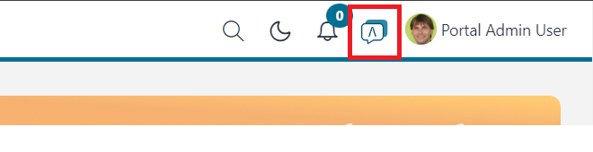

.. _ai-assistant:

AI Assistant
************

The Portal is fully integrated with the ``AI Assistant``, an application capable of managing and utilizing AI-powered virtual assistants.
The ``AI Assistant`` can help you get more knowledge about the Portal by using its AI function ``Portal Support``.

To use AI Assistant, simply deploy the ``ai-assistant`` project in the same application as Portal.
Once deployed, you can access the AI Assistant by clicking on the AI icon in the top bar of Portal.

|ai-assistant-menu-item|

