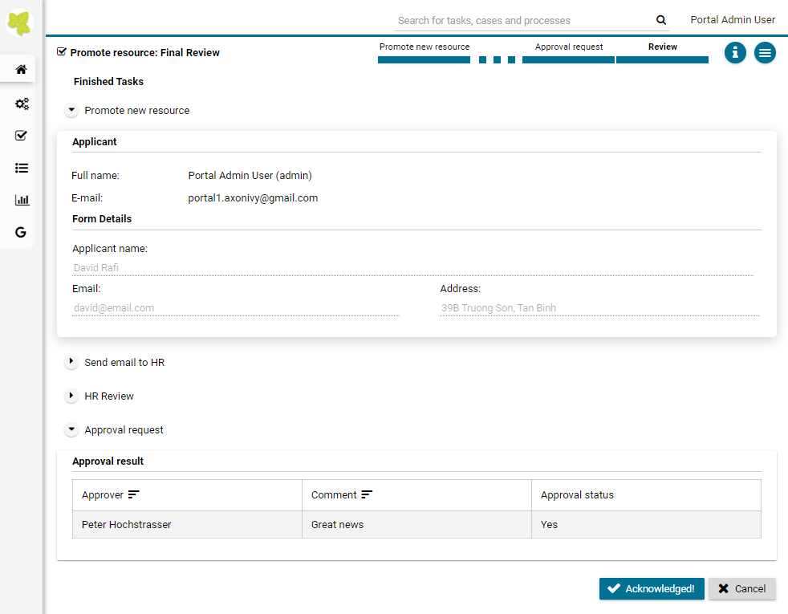
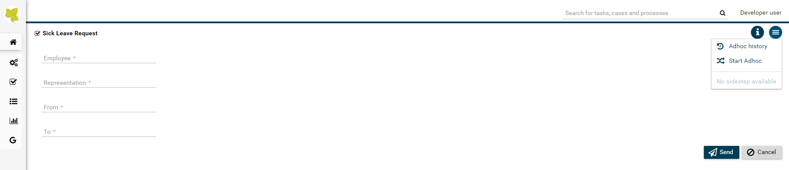
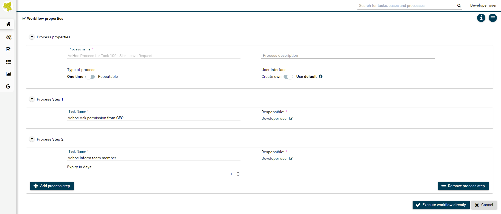
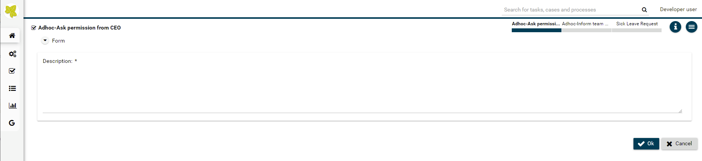
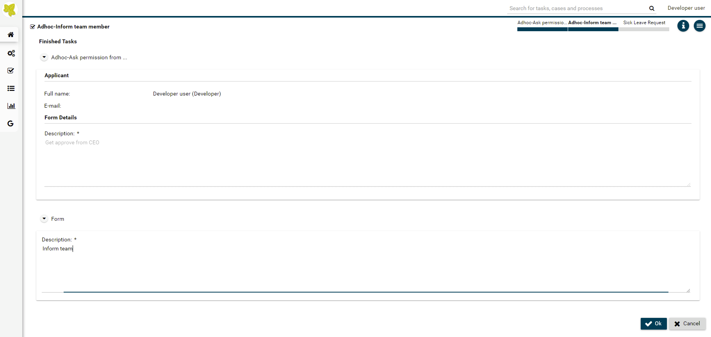
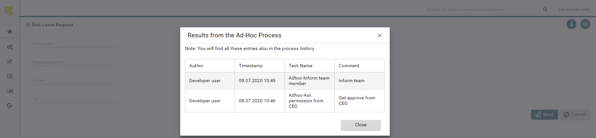

.. _axon-ivy-express:

Axon Ivy Express
****************

So far, this document familiarized you with the Axon Ivy Portal and
explained how you can use processes provided to you by your IT
department. The following chapter takes you to the next level.

**Axon Ivy Express**  is a module of the Axon Ivy
platform which is provided to you with the Axon Ivy Portal as well. It
enables you - as a business user - to create your own process
applications and share them with your colleagues. These capabilities are
also known as No-Code Application Platforms or Citizen Developer
Platforms.Therefore, it is the perfect tool for you to digitize your
processes and create standardization, reliability and traceability. Some
of the key features of Axon Ivy Express are:

-  It is a **No Coding Toolset**, allowing business users to create
   processes without IT background.

-  The **Axon Ivy Portal Integration**, allows business users to
   implement processes without IT department involvement.

-  The **Seamless Integration** into the Axon Ivy
   platform allows you to make use of standard features like email
   notifications, task delegation, etc.

-  The **Powerful Toolset** allows you to create processes, define
   different task types, set responsibilities and due dates and define
   user dialogs for each task.

You can reach the page by either using the :guilabel:`Processes` link
in the Axon Ivy Portal menu or the quick link :guilabel:`Show all processes` in
your dashboard.

.. figure:: images/navigate-to-axon-ivy-express.png

Next to the heading :guilabel:`Processes`, you see the link :guilabel:`Create express
workflow`. This feature is explained in detail in `Axon Ivy Express`_. Below
you find the process category **Express Workflows** with a list of
already defined processes.

.. figure:: images/start-link-for-axon-ivy-express.png

HowTo: Create an Express Workflow
---------------------------------

#. Click on the link :guilabel:`Create new Express Workflow`

#. The :guilabel:`Express Workflow` editor is opened

#. Define the :guilabel:`Type of process`:

   -  Use the option *One time* if you want to execute the
      process only one time

   -  Use the option *Repeatable* if you want to save the
      process for repetitive use. The process will automatically be
      deployed and added to the Full Process List page.

#. Define your :guilabel:`User Interface`:

   -  With the option *Create own* you can create your own user dialogs
      for each process step

   -  With the option *Use default,* the user dialogs will be
      automatically generated by Axon Ivy Express

#. Provide a speaking name under :guilabel:`Process name`

#. You may add a description under :guilabel:`Process description`. We strongly
   encourage you to use the description to provide details about your
   process.

   .. figure:: images/express-workflow-process-properties.png

#.  The first process step is already available for your configuration

#.  You may add further process steps using the button :guilabel:`Add process step`

#.  You may delete unnecessary process steps using the button :guilabel:`Remove process step`

#. For each process step, select the :guilabel:`Task Type` (see `Express Workflow task types`_).

#. For each process step provide a speaking name under :guilabel:`Task Name`

#. For each process step you may provide a description under :guilabel:`Task description`.

#. For *One time* process type, the first process step define the users or roles under :guilabel:`Able to start` who can start the process

   .. figure:: images/express-able-to-start.png

#. For all other process steps define under :guilabel:`Responsible` the user or roles who are responsible to execute the task.

   .. figure:: images/express-task-responsible.png

#. For each process step except the first define under :guilabel:`Expiry in days` the time before the task expires

#. End the configuration of your process steps with the button :guilabel:`Next`

   .. figure:: images/define-express-workflow-process-steps.png

   .. centered:: _`Express Workflow task types`

   +-----------------------------------+-----------------------------------+
   | Task type                         | Description                       |
   +===================================+===================================+
   | **User Task**                     | For this task the user can define |
   |                                   | an UI                             |
   +-----------------------------------+-----------------------------------+
   | **User Task with Email**          | In addition to the normal User    |
   |                                   | Task, the user can send an Email  |
   |                                   | directly from the Axon Ivy        |
   |                                   | Portal, without the need to       |
   |                                   | change to another system          |
   +-----------------------------------+-----------------------------------+
   | **Information Email**             | This email can be defined by the  |
   |                                   | creator of the Express Workflow   |
   |                                   | and will be sent automatically    |
   |                                   | without user action               |
   +-----------------------------------+-----------------------------------+
   | **Approval**                      | This task type creates an         |
   |                                   | approval task                     |
   +-----------------------------------+-----------------------------------+

#. Depending on the task type of the first process step a different editor is opened. For user task / task with email the dialog editor is opened.

#. For each date you need in your process select an input element

#. Provide a speaking name for the input under :guilabel:`Label`

#. You may adjust the input under :guilabel:`Input type`

#. Select if the input of this date is required or not

#. Use the button |arrow-down-icon| :guilabel:`Create` to create the input element

#. The created element appears in the list :guilabel:`Available form elements`

#. You may delete input elements you don't need using the |trash-icon| :guilabel:`Delete` button

#. Drag and Drop the input elements into one of the areas of the dialog editor

#. You may remove the input element from the dialog using the |trash-icon| :guilabel:`Delete` button

#. You may preview your dialog using the |search-icon| :guilabel:`Preview` button

#. Use the button |arrow-right-icon| :guilabel:`Next` to define the next process step

   .. figure:: images/express-workflow-dialog-editor.png

   .. hint:: 
      The results of all previous tasks are included in follow-on tasks in a
      read-only view, so that the user sees the whole history.     

   .. centered:: Express Workflow input elements

   +-----------------------------------+-----------------------------------+
   | Input element                     | Description and options           |
   +===================================+===================================+
   | **Input field**                   | Input field for text, numbers or  |
   |                                   | dates                             |
   |                                   |                                   |
   |                                   | -  Text field                     |
   |                                   |                                   |
   |                                   | -  Number field                   |
   |                                   |                                   |
   |                                   | -  Date picker                    |
   +-----------------------------------+-----------------------------------+
   | **Input area**                    | Text input field between 1 and 10 |
   |                                   | rows                              |
   +-----------------------------------+-----------------------------------+
   | **Checkbox**                      | List of elements which allows the |
   |                                   | user a multiple selection         |
   +-----------------------------------+-----------------------------------+
   | **Radio button**                  | List of elements which allows the |
   |                                   | user a single selection           |
   +-----------------------------------+-----------------------------------+
   | **File Upload**                   | Provides a file upload dialog to  |
   |                                   | the user. You may define:         |
   |                                   |                                   |
   |                                   | -  Allowed file types             |
   |                                   |                                   |
   |                                   | -  Number of allowed attachments  |
   +-----------------------------------+-----------------------------------+

#. For process steps with the task type user task with email / information email the email editor is opened.

#. Specify the addresses of the email recipients separating them by comma.

#. You may specify a response email address

#. Specify the subject of the email

#. Specify the email text.

#. You may specify attachments to the email

#. Use the button |arrow-right-icon| :guilabel:`Next` to define the next process step

Define an information email
---------------------------

For the information email, the user sees an Email client UI, where
several information related to the process can be added. Furthermore,
the user must define a comma separated list of addresses. In
addition, the user can define a "response to" email.

.. figure:: images/express-workflow-email-editor.png

.. include:: ../includes/_common-icon.rst

Express Business Summary
------------------------

For express case, after you had done a workflow, you can recheck the summary data of the process by accessing to ``Business Details`` page of Express case.

HowTo: Show Business summary
""""""""""""""""""""""""""""
    1. Firstly, you should go to the :ref:`Case List <full-case-list>` page and open ``Action`` link of your case.

    2. Find the ``Show Business details`` link and click on it.

    .. figure:: images/express-case.png

    3. Then the ``Express form`` will be shown up via read-only mode.

    .. figure:: images/express-business-summary.png

.. note:: In case, your process is running, you will only see the data of what express task had done on the ``Summary`` page

Axon Express Management
-----------------------

With Axon Express Management, administrator can import/export Express workflows in JSON format.
This feature is put in :ref:`Admin Settings <settings-admin-settings>`.

.. figure:: images/express-management-tab.png

.. note:: 
  To use this feature, user needs to have role **AXONIVY_PORTAL_ADMIN**.
  

HowTo: Export Express process
"""""""""""""""""""""""""""""

First, you need to choose workflows in Express workflows table, selected workflows will be export to the JSON file.
You can select multi workflows by click checkbox :guilabel:`ALL`.

.. figure:: images/express-export-tab.png

After selected workflows, click :guilabel:`Export Express` button, export dialog will display and you can see workflows list will be exported.

.. figure:: images/export-list-summary.png

After reviewed and make sure workflows are collected, press :guilabel:`Download` button to download these workflows.

.. important:: 

  The export file is a JSON file, it contains a version of express and express process data. Don't edit this file manually.
..

HowTo: Import Express process
"""""""""""""""""""""""""""""

Import Express is a function to help Administrator can import the Express process into the Portal system from a backup file.

Press :guilabel:`Import Express` button, the :guilabel:`Import Express Processes` dialog will display.
Once :guilabel:`Import Express` dialog is open, press :guilabel:`Select` button and choose the Express JSON file which store workflows you want to import.

.. figure:: images/import-selection.png

Then press the :guilabel:`Deploy` button and wait for the deployment process.

.. figure:: images/import-deployment.png

After the deploy process is finished, an output log panel will be displayed, you can see all information which collected during the deployment process.

Now, if the deployment process is success, your workflows are imported and administrator can check, edit them before they are ready to use by user.

.. figure:: images/deployment-result.png

AdHoc Process
-------------

Axon Ivy Express also provides an AdHoc process feature. When Express is deployed, user can start an AdHoc process from any task. 
Adhoc allows user to define more process steps and will be executed before current task.

Start Adhoc by clicking on top right menu icon in your task then select :guilabel:`Start Adhoc`

.. important:: 

  Save your data on working task before start Adhoc
..

Then define your Adhoc process

After start process, Adhoc tasks will be executed before for your current task

Finish all created Adhoc tasks to return to original task

When start your original task, you will see summary about the Adhoc process for your task. 
You can also view it again by clicking menu icon then select :guilabel:`Adhoc history`.

