.. _axon-ivy-express:

Axon.ivy Express
****************

So far, this document familiarized you with the Axon.ivy Portal and
explained how you can use processes provided to you by your IT
department. The following chapter takes you to the next level.

:guilabel:`Axon.ivy Express`  is a module of the Axon.iy Digital Business
Platform which is provided to you with the Axon.ivy Portal as well. It
enables you – as a business user – to create your own process
applications and share them with your colleagues. These capabilities are
also known as No-Code Application Platforms or Citizen Developer
Platforms.Therefore, it is the perfect tool for you to digitize your
processes and create standardization, reliability and traceability. Some
of the key features of Axon.ivy Express are:

-  It is a **No Coding Toolset**, allowing business users to create
   processes without IT background.

-  The **Axon.ivy Portal Integration**, allows business users to
   implement processes without IT department involvement.

-  The **Seamless Integration** into the Axon.ivy Digital Business
   Platform allows you to make use of standard features like email
   notifications, task delegation, etc.

-  The **Powerful Toolset** allows you to create processes, define
   different task types, set responsibilities and due dates and define
   user dialogs for each task.

You can reach the page by either using the **Processes** link
in the Axon.ivy Portal menu or the quick link **Show all processes** in
your dashboard.

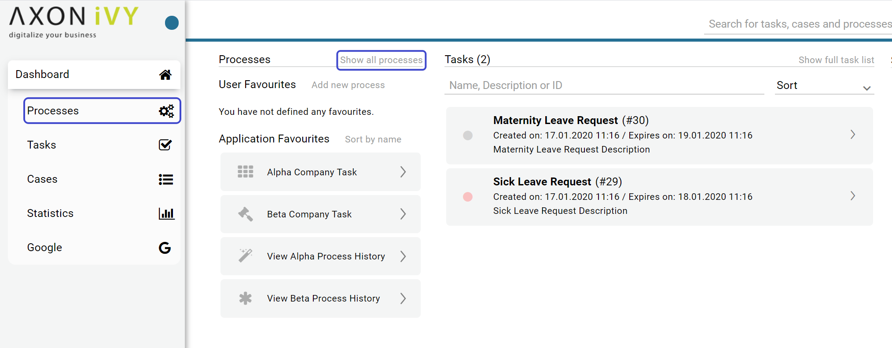

Below the heading **Processes**, you see the link **Create express
workflow**. This feature is explained in detail in `Axon.ivy Express`_. Below
you find the process category :guilabel:`Express Workflows` with a list of
already defined processes.

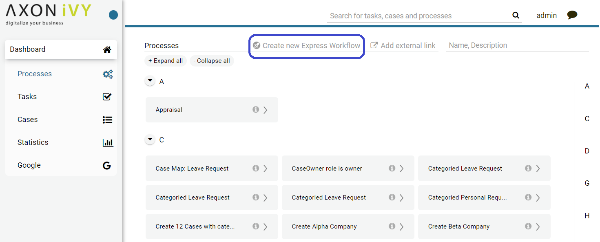

HowTo: Create an Express Workflow
---------------------------------

1. Click on the link **Create new Express Workflow**

2. The :guilabel:`Express Workflow` editor is opened

3. Define the **Type of process**:

   -  Use the option *One time* if you want to execute the
      process only one time

   -  Use the option *Repeatable* if you want to save the
      process for repetitive use. The process will automatically be
      deployed and added to the Full Process List page.

4. Define your **User Interface**:

   -  With the option *Create own* you can create your own user dialogs
      for each process step

   -  With the option *Use default,* the user dialogs will be
      automatically generated by Axon.ivy Express

5. Provide a speaking name und **Process name**

6. You may add a description under **Process description**. We strongly
   encourage you to use the description to provide details about your
   process.

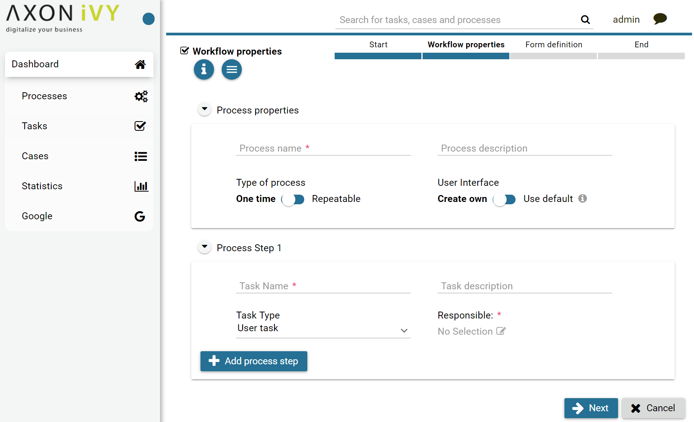

7.  The first process step is already available for your configuration

8.  You may add further process steps using the button **Add process
    step**

9.  You may delete unnecessary process steps using the button **Remove
    process step**

10. For each process step, select the **Task Type** (see `Express Workflow task types`_).

11. For each process step provide a speaking name under **Task Name**

12. For each process step you may provide a description under **Task
    description**.

13. For *One time* process type, the first process step define the users or roles under
    **Able to start** who can start the process

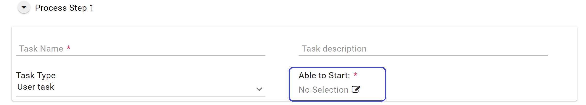

14. For all other process steps define under **Responsible** the user or roles who are responsible to execute the task.

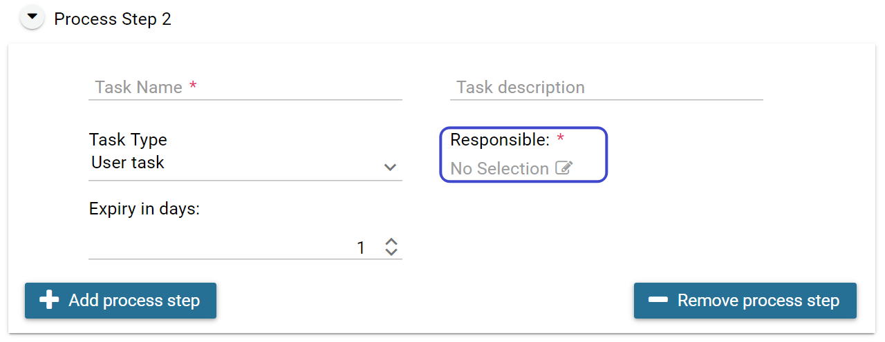

15. For each process step except the first define under **Expiry in
    days** the time before the task expires

16. End the configuration of your process steps with the button **Next**

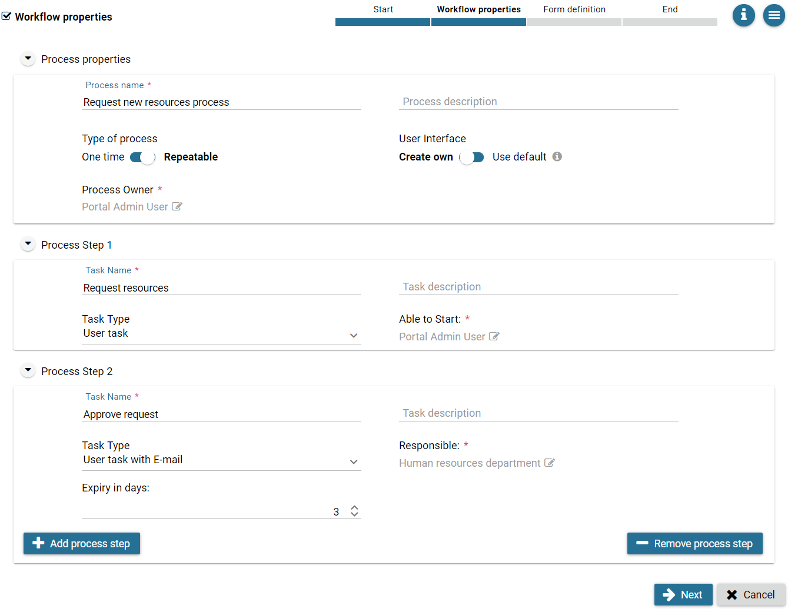

+-----------------------------------+-----------------------------------+
| Task type                         | Description                       |
+===================================+===================================+
| **User Task**                     | For this task the user can define |
|                                   | an UI                             |
+-----------------------------------+-----------------------------------+
| **User Task with Email**          | In addition to the normal User    |
|                                   | Task, the user can send an Email  |
|                                   | directly from the Axon.ivy        |
|                                   | Portal, without the need to       |
|                                   | change to another system          |
+-----------------------------------+-----------------------------------+
| **Information Email**             | This email can be defined by the  |
|                                   | creator of the Express Workflow   |
|                                   | and will be sent automatically    |
|                                   | without user action               |
+-----------------------------------+-----------------------------------+
| **Approval**                      | This task type creates an         |
|                                   | approval task                     |
+-----------------------------------+-----------------------------------+

.. centered:: _`Express Workflow task types`

17. Depending on the task type of the first process step a different
    editor is opened. For user task / task with email the dialog editor
    is opened.

18. For each date you need in your process select an input element

19. Provide a speaking name for the input under **Label**

20. You may adjust the input under **Input type**

21. Select if the input of this date is required or not

22. Use the button |arrow-down-icon| **Create** to create the input element

23. The created element appears in the list **Available form elements**

24. You may delete input elements you don’t need using the |trash-icon|
    **Delete** button

25. Drag and Drop the input elements into one of the areas of the dialog
    editor

26. You may remove the input element from the dialog using the
    |trash-icon| **Delete** button

27. You may preview your dialog using the |search-icon| **Preview** button

28. Use the button |arrow-right-icon| **Next** to define the next process step

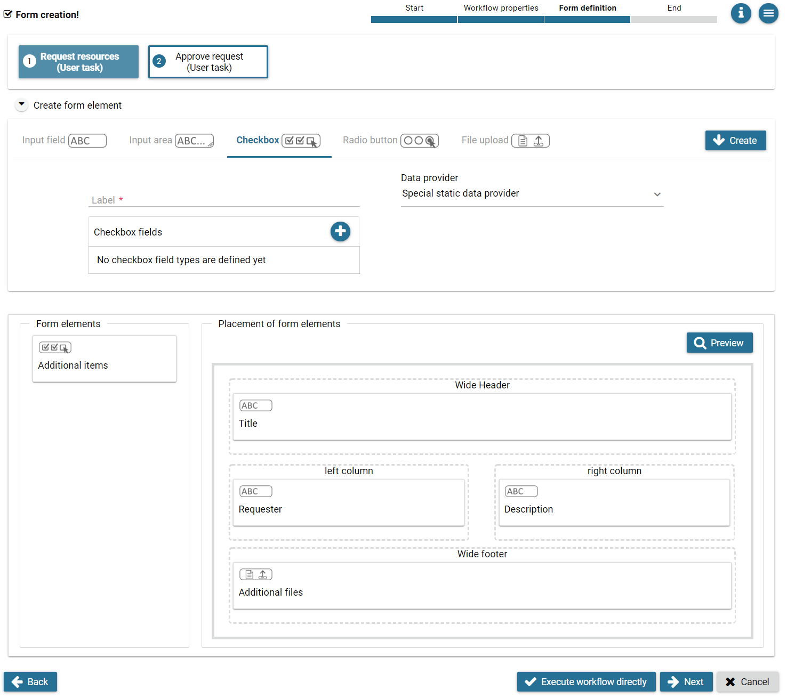

.. hint:: 
   The results of all previous tasks are included in follow-on tasks in a
   read-only view, so that the user sees the whole history.     

+-----------------------------------+-----------------------------------+
| Input element                     | Description and options           |
+===================================+===================================+
| **Input field**                   | Input field for text, numbers or  |
|                                   | dates                             |
|                                   |                                   |
|                                   | -  Text field                     |
|                                   |                                   |
|                                   | -  Number field                   |
|                                   |                                   |
|                                   | -  Date picker                    |
+-----------------------------------+-----------------------------------+
| **Input area**                    | Text input field between 1 and 10 |
|                                   | rows                              |
+-----------------------------------+-----------------------------------+
| **Checkbox**                      | List of elements which allows the |
|                                   | user a multiple selection         |
+-----------------------------------+-----------------------------------+
| **Radio button**                  | List of elements which allows the |
|                                   | user a single selection           |
+-----------------------------------+-----------------------------------+
| **File Upload**                   | Provides a file upload dialog to  |
|                                   | the user. You may define:         |
|                                   |                                   |
|                                   | -  Allowed file types             |
|                                   |                                   |
|                                   | -  Number of allowed attachments  |
+-----------------------------------+-----------------------------------+

.. centered:: Express Workflow input elements

29. For process steps with the task type user task with email /
    information email the email editor is opened.

30. Specify the addresses of the email recipients separating them by
    comma.

31. You may specify a response email address

32. Specify the subject of the email

33. Specify the email text.

34. You may specify attachments to the email

35. Use the button |arrow-right-icon| **Next** to define the next process step

Define an information email
---------------------------

   For the information email, the user sees an Email client UI, where
   several information related to the process can be added. Furthermore,
   the user must define a comma separated list of addresses. In
   addition, the user can define a “response to” email.

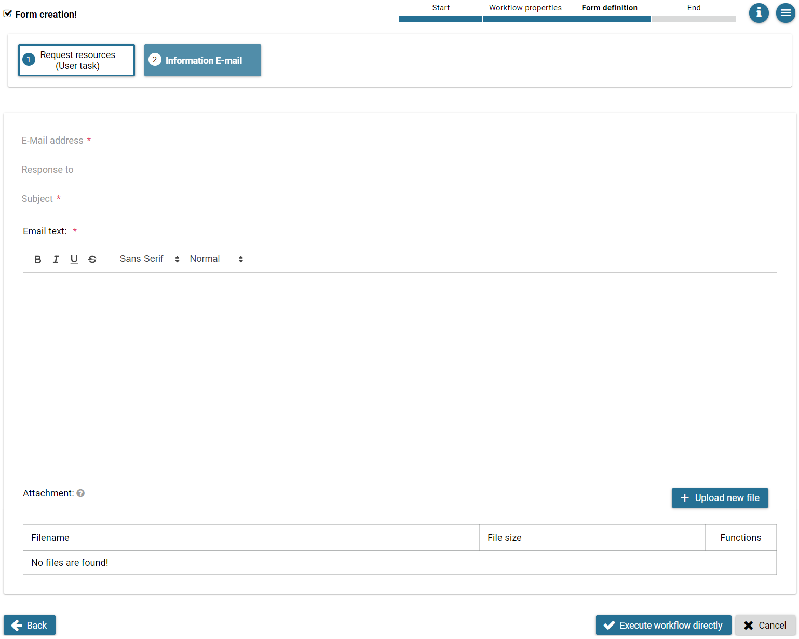

.. include:: ../includes/_common-icon.rst

|
|

Axon Express Management
-----------------------

Axon Express provides a function to help import/export the express process to Portal System.

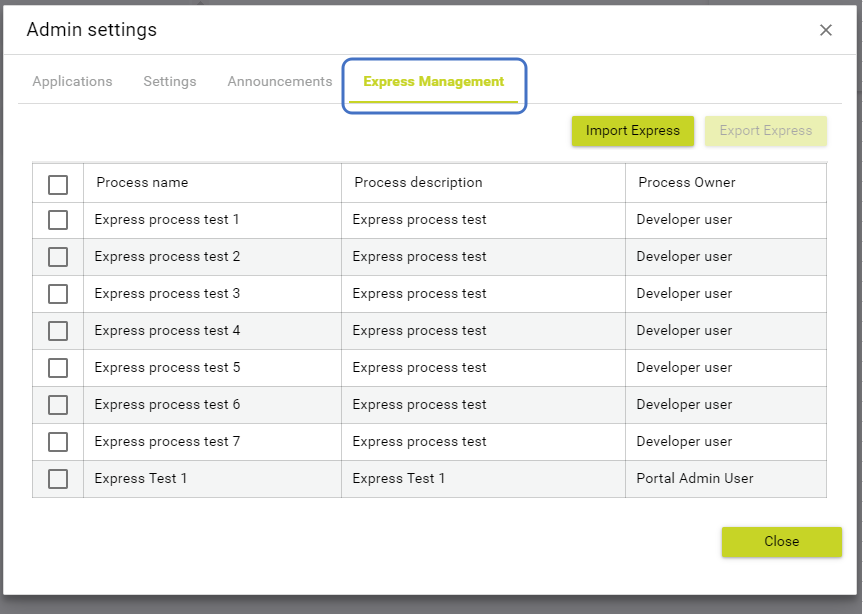

Export Express
^^^^^^^^^^^^^^

Export Express is a function to help Administrator can export the Express process in the Portal system to a JSON file for backup/restore or deploy to another environment.

How to export:
""""""""""""""
The first, you need to login by an admin user. Go to the :guilabel:`Admin Setting`, switch to the :guilabel:`Express Management` tab.

Look at the summary table of the express process, choose a process that you want to export to the JSON file.
Or click on the :guilabel:`Checkbox ALL` to export many processes.

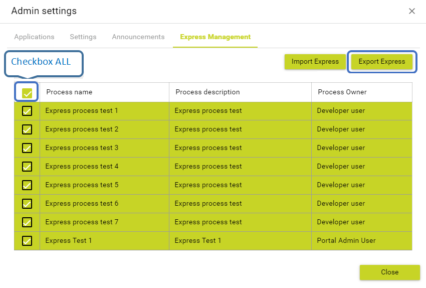

After selected the process, :guilabel:`Export Express` button will be enabled to click, so click on this button, a dialog will be shown on.

When the :guilabel:`Export Dialog` is displayed, you will see a list of the process will be exported to file.

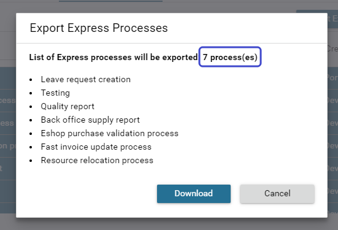

After reviewed and make sure all information is collected, press on the :guilabel:`Download` button, another dialog will be shown on. 
Select a local to store this backup file, and press the :guilabel:`Save` button.

.. important:: 

  The export file is a JSON file, it contains a version of express and express process data. Don’t edit this file manually.
..

Import Express
^^^^^^^^^^^^^^
Import Express is a function to help Administrator can import the Express process into the Portal system from a backup file.

How to import:
""""""""""""""

Login by an admin user, go to the :guilabel:`Admin Setting` and switch to :guilabel:`Express Management` tab.

Select :guilabel:`Import Express` button, a dialog will be shown on.
Once :guilabel:`Import Express` dialog is open, select the :guilabel:`Select` button and choose the Express JSON file which we exported above.

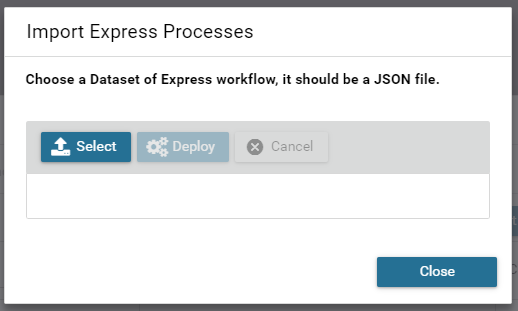

Then press the :guilabel:`Deploy` button and wait for the process is finished.

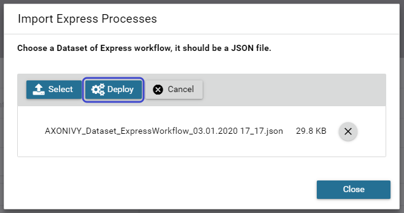

When the deploy process is finished, an output pannel will be shown. All of the logs which is collectted during the deployment to the system.

You can check the log data for more information.

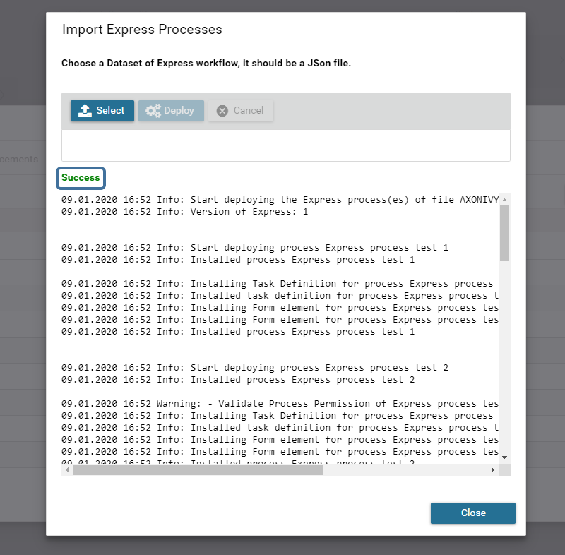
