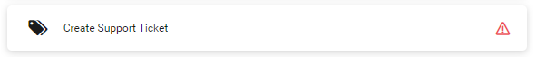

.. _dashboard:

Legacy Dashboard
****************

The |axon-ivy| Portal Dashboard is the first page you see after having logged
in. You can always get back to the dashboard using the **Dashboard** link in the
|axon-ivy| Portal menu. Alternatively, you can click on the logo in
the header.

|dash-board|

The dashboard itself is divided into three sections:

#. At the left, manage quick links to the processes you use most often in your daily work. The
   section **Processes** is described in `Process Favorites`_.

#. In the center, you see the **Tasks** section. Here you see all the open tasks
   assigned to you, your organizational unit or your roles. These tasks require
   your attention. The section is described in `Personal Tasks`_.

#. On the right, you see the **Statistics** section. Its charts provide you with
   basic information on the performance of your cases and tasks. This section is
   described in `Statistics`_.

Process Favorites
-----------------

The  **Process favorites** you find in **Processes** at the left. They allow you
to quickly access the processes you need most often in your daily work. To make
full use of this feature, the |axon-ivy| Portal offers you an easy way to
configure the process favorites to your personal needs. 

|process-favorites|

The process favorites are divided into two areas:

-  At the top, you find the **User Favorites** which you need to configure
   before you can use them. You may add here processes and external links.

-  Below the User Favourites, you find the **Application Favorites**. They are
   configured by your administrator. Therefore, you may use but not change them.

To the right of the Processes header, you see a link ``Show all processes``.
This quick link routes you to the **Full Process List** page of the |axon-ivy|
Portal. Please refer to :ref:`full-process-list` for detailed information.

If there is a red warning icon on the right side of a process, it indicates that
this process has changed its status and thus, the does no longer work.

|broken-link-process|

In this case, you can delete it by following :ref:`HowTo: Delete a process as a user favorite <howto-delete-a-process-as-a-user-favorite>`
and add the correct process link by following :ref:`HowTo: Add a process as a user favorite <howto-add-a-process-as-a-user-favorite>`.

.. _howto-add-a-process-as-a-user-favorite:

HowTo: Add a Process as a User Favorite
---------------------------------------

#. Click on the link ``Add new process`` which you find next to the
   heading **User Favorites**.

#. The dialog **Add new user process** opens.

#. Use the dropdown menu ``Selected process`` to select the process you want to
   add.

#. The ``Display name`` contains the default process name. To add multilingual
   names for your favorite processes, use :guilabel:`Add languages`.

#. To change the icon of the process, click |change-icon| :guilabel:`Change` and
   select your preferred icon from the list.

#. Confirm your configuration by clicking :guilabel:`Add`.

|how-to-add-process-favorite|

.. hint:: 
   -  The list of processes in the dropdown menu shows only the processes which are
      accessible to you. This depends on your roles.
                                    
      The list shows only processes not already added to your user favorites. 
      You cannot add a process multiple times.

   -  To add multiple languages to the favorite process display names, you need
      to create the "AppInfo/SupportedLanguages" CMS entry which defines how
      many languages your application supports. See :ref:`Language settings` below
      for details.

.. _howto-delete-a-process-as-a-user-favorite:

HowTo: Delete a Process from User Favorites
-------------------------------------------

#. Click on the ``Edit processes`` next to the heading :guilabel:`User Favorites`.

#. Click on the |trash-icon| :guilabel:`Delete` symbol next to process / processes
   you wish to remove from your user favorites.

#. Confirm the removal by clicking :guilabel:`Save` next to the heading :guilabel:`User Favorites`.

|how-to-delete-process-favorites-1|

|how-to-delete-process-favorites-2|

HowTo: Reorder User Favorites
-----------------------------

There are two ways to order the processes in your :guilabel:`User Favorites`.

Sort by Name 
^^^^^^^^^^^^

To order your processes and external links in an alphabetical order
you can use the link ``Sort by name`` next to the heading :guilabel:`User Favorites`.

|how-to-order-process-favorites-by-name|

Edit Processes
^^^^^^^^^^^^^^

#. To order your processes in an individual order, click on the link
   :guilabel:`Edit processes` next to the heading :guilabel:`User Favorites`.

#. To change the order of your processes, drag and drop processes.

#. Confirm the current order by clicking :guilabel:`Save` next to the heading :guilabel:`User Favorites`.

|how-to-delete-process-favorites-1|

|how-to-order-process-favorites-individually|

Personal Tasks
--------------

You find personal tasks under the heading :guilabel:`Tasks` in the center of
your dashboard. You see here all tasks that are assigned to you or any of the
roles you hold within the application. Therefore, this section is key in
understanding your workload within the application. You may pick any task
from the task list and start working on it.

|personal-tasks|

You see the number of tasks right next to the heading :guilabel:`Tasks`. Further
right you find the link ``Show full task list``. This quick link
routes you to the **Task List** page of the |axon-ivy| Portal. Please refer to
:ref:`full-task-list` for detailed information.

Right below the heading :guilabel:`Task`, you find the following features which
help you find the correct tasks:

#. The |axon-ivy| Portal searches for your keyword in the task ID, name and
   description of the tasks in your task list.
#. On the right side of the Tasks section, you can select the desired sort criteria (:guilabel:`Creation Date` :guilabel:`Expiry` :guilabel:`Priority`). 

|personal-tasks-sort-and-search-features|

Each task in your task list has its own entry. The entry provides you
with key information about the task.
The following information can be found in the task entries:

#. The **Task Priority**

#. The **Task Name**

#. The **Task ID**

#. The **Creation Date**

#. The **Expiry Date** which is the due date until when the task should
   be completed.

#. The **Task Description**

|personal-tasks-key-information|

Statistics
----------

The statistics you find under the heading :guilabel:`Statistics` on the
right-hand side of your dashboard. The charts in this section allow you to grasp
the overall situation at a glance.

|dashboard-statistics-section|

Next to the heading you find a link ``Show all charts``. This quick link
routes you the :guilabel:`Statistics` page of the |axon-ivy| Portal. Please refer
to :ref:`full-statistic-list` for more detailed information.

Within header of the chart, you find two navigation buttons (|pre-icon|,
|next-icon|) allowing you to toggle between the available charts. Each chart
provides you with the following information:

#. The :guilabel:`Chart Title` describing the content of the chart

#. The :guilabel:`Chart` itself, which gives you a graphical representation of
   the data. You see the exact figures in the chart as well.

#. The :guilabel:`Legend` explains the different elements of the chart.

|statistics-key-information|

If you require more or different charts, you need to create them first.
Chapter :ref:`howto-create-chart` explains in detail how to create new
charts.

.. include:: ../includes/_common-icon.rst

.. |dash-board| image:: ../../screenshots/dashboard/dashboard-3-sections.png
.. |process-favorites| image:: ../../screenshots/dashboard/process-widget.png
.. |how-to-add-process-favorite| image:: ../../screenshots/process/how-to-add-process-favorite.png
.. |how-to-delete-process-favorites-1| image:: ../../screenshots/process/how-to-edit-process-favorites.png
.. |how-to-delete-process-favorites-2| image:: ../../screenshots/process/how-to-delete-process-favorites.png
.. |how-to-order-process-favorites-by-name| image:: ../../screenshots/process/how-to-order-process-favorites-by-name.png
.. |how-to-order-process-favorites-individually| image:: ../../screenshots/process/how-to-order-process-favorites-individually.png
.. |personal-tasks| image:: ../../screenshots/dashboard/task-widget.png
.. |personal-tasks-sort-and-search-features| image:: ../../screenshots/dashboard/personal-tasks-sort-and-search-features.png
.. |personal-tasks-key-information| image:: ../../screenshots/dashboard/personal-tasks-key-information.png
.. |dashboard-statistics-section| image:: ../../screenshots/dashboard/statistic-widget.png
.. |statistics-key-information| image:: ../../screenshots/dashboard/statistics-key-information.png
