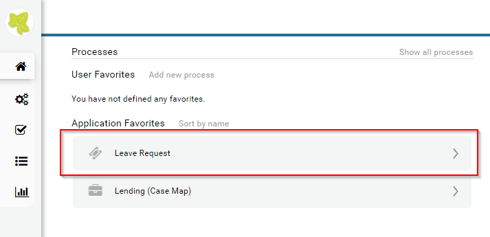
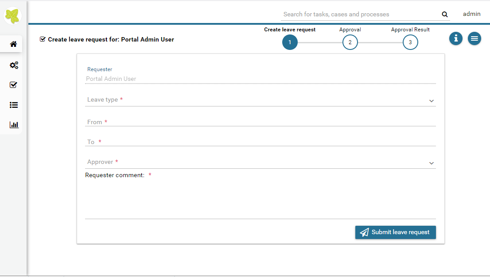
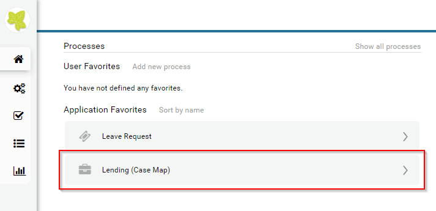
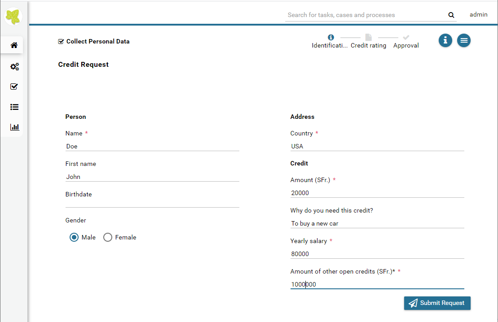
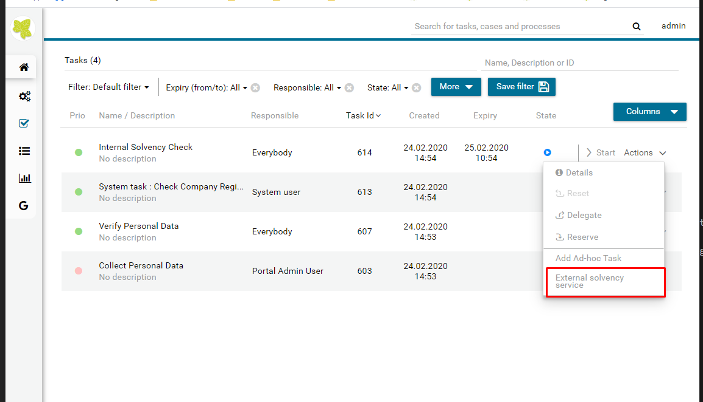
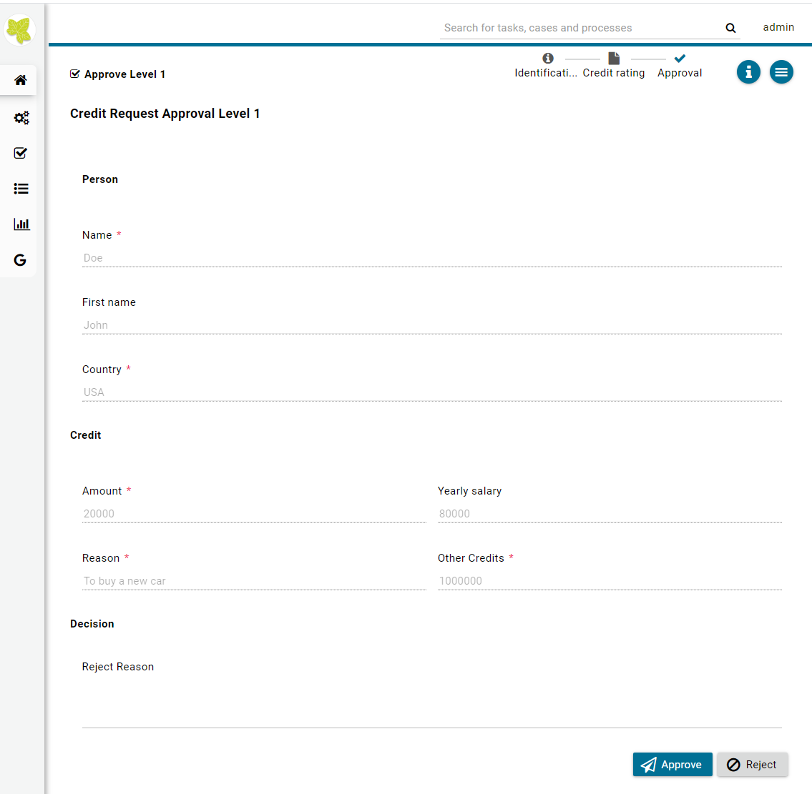

.. _demo-processes:

Demo processes
**************

When you start engine in demo mode, you will see the project :guilabel:`portal-user-examples`.
In this project, we provide some simple examples and you can play around with them
to have the feeling how ivy and Portal work.

.. hint:: 
   You can use these accounts to login into Portal in demo mode:

  +---------------------+---------------------+-------------------------+
  | Username            | Password            | Role                    |
  +=====================+=====================+=========================+
  | admin               | admin               | Portal admin            |
  +---------------------+---------------------+-------------------------+
  | demo                | demo                | Normal user             |
  +---------------------+---------------------+-------------------------+
  | guest               | guest               | Normal user             |
  +---------------------+---------------------+-------------------------+

Leave request
-------------

1. Login to Portal.

2. Select Leave Request start link.

3. You will go directly to the first task **Create leave request for: <user>**.

4. Input your data and submit leave request. Base on your selected approver, next task will be assigned to that user.

5. The 2nd task is **Leave request approval**, and after approver finishes his task, summary task will be assigned back to requester.

6. After requester finishes **summary task**, the case is Done.

Lending (Case Map)
------------------

1. Login to Portal

2. Select Lending (Case Map) start link

3. You will go directly to the first task **Collect Personal Data**

By default we'll have dummy data on all fields, or you can input your data and submit the request.

4. You will go to task **Verify Personal Data** to verify your information.

5. In **Internal Solvency Check** task, you can proceed to next task or start **External Solvency Service** sidestep by clicking **External solvency service**.

6. After finishing Internal Solvency, you will have 1 or 2 approval levels which are depended on Amount and Salary fields. If Amount is greater than or equal to 20% of Salary, you will have 2 approval levels.

7. In the approval task, you can approve to complete task and go to the last step which is created a contract. Now **Create Contract** task is finished, the case is Done. If we reject task, process will end.

