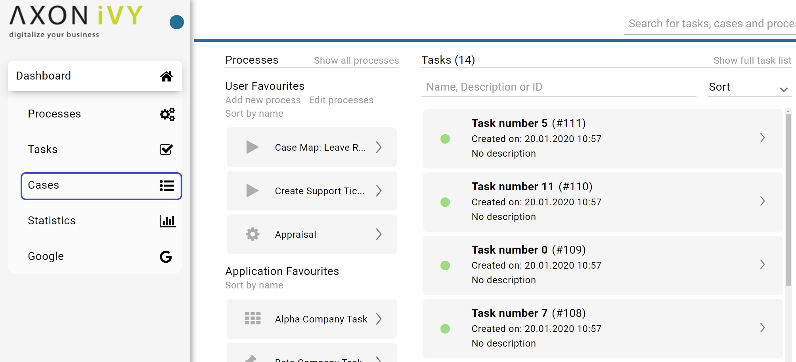
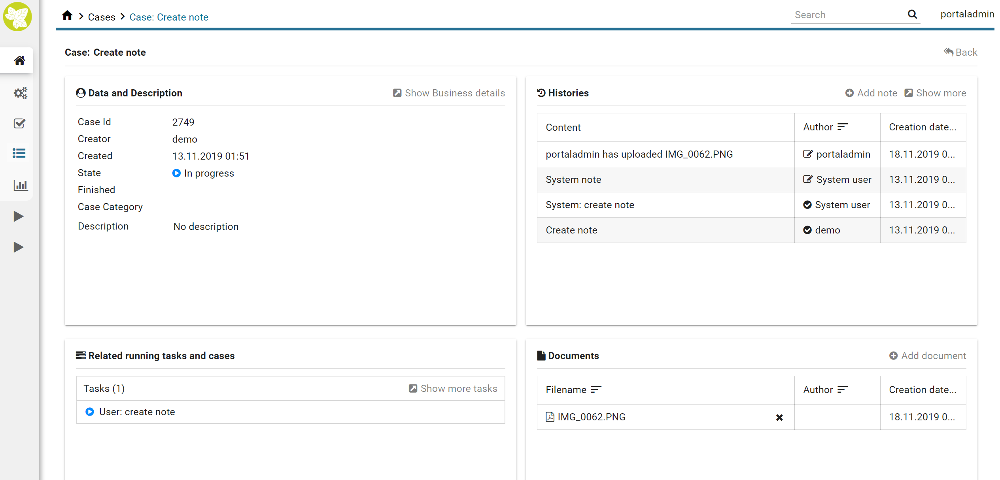
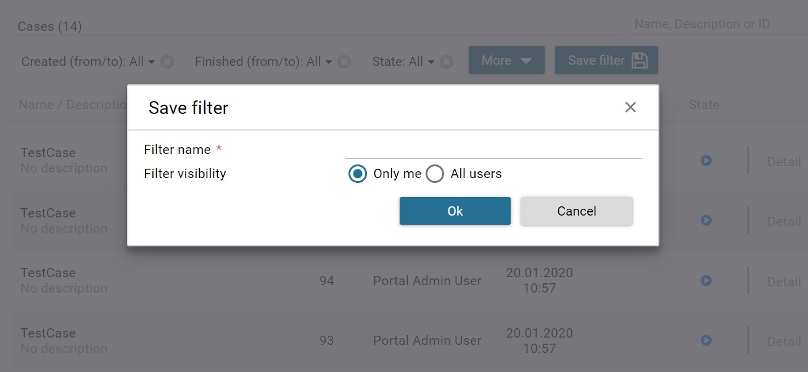
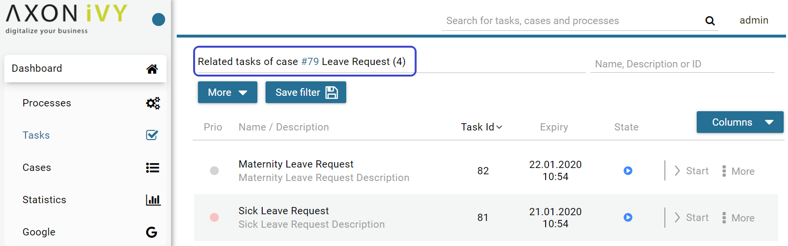
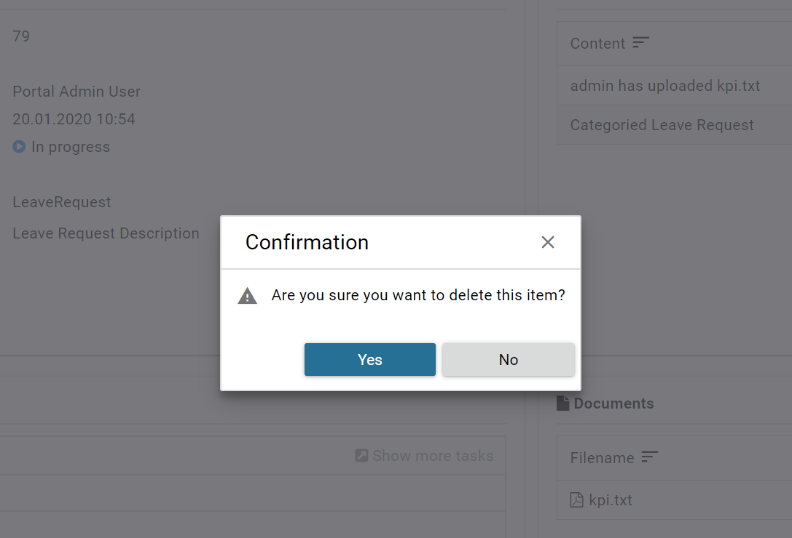

.. _full-case-list:

Full Case List
**************

The **Full Case List** page shows you all cases you’re involved in.
This page provides you with extended information on the cases, as well
as advanced search and filter capabilities. You can reach the page by
using the |case-icon| :guilabel:`Cases` link in the Axon Ivy Portal menu.

.. hint:: 
   Depending on the roles you hold in the application and the configuration of
   the Axon Ivy Portal, you might see not only the cases you’re involved in but
   all cases.                      

On the top of the **Full Case List** page you see next to the heading :guilabel:`Cases`
in brackets the overall number of cases shown to you. Further to the right you
find a |filter-icon| **Search** feature which you might use if you’re looking for a
specific case. Below you find the filter feature. The usage will be explained in
the HowTo’s further down this chapter. Finally, you see the list of cases.

For each case the following key information is shown in the list:

#. Name and Description

#. Case ID

#. Creator

#. Creation Date

#. Finished Date

#. Status

   .. figure:: images/case-key-information.png

Furthermore, at the end of each row you find a set of key features in
handling cases:

#. Detail

#. :guilabel:`Action` for further actions

Finally, you have the possibility to access the full set of the case
data by clinking the case Name/Description.

The case details are separated into 4 different sections:

#. Data and Description, you find various metadata concerning the case and description.

   .. figure:: images/case-details-data-description.png

#. Related running tasks and cases, you find a list of all related running cases and
   tasks. Moving the mouse over the tasks shows you the state and the
   responsible user of the task. To show all related tasks see the HowTo
   below.

   .. figure:: images/case-details-related-tasks-cases.png

#. Histories, the Axon Ivy Portal adds notes
   here for state changes of the case. You may add additional notes
   which is described below.

   .. figure:: images/case-details-histories.png

#. Documents, you find an area for documents that were
   attached to the case. You may add or delete documents 
   described in the HowTo’s below.

   .. figure:: images/case-details-documents.png

.. _howto-use-existing-filter-1:

HowTo: Use existing filter
--------------------------

.. hint:: 
   If there are no public filters and you didn’t create any filters so far,
   there might be no filters available. In this case, you must create a filter
   first. This is described in detail in :ref:`howto-create-new-filter-1`.
   

#. Click on the :guilabel:`Save Filter` dropdown menu.

#. Select the filter you want to use.

.. _howto-create-new-filter-1:

HowTo: Create new filter
------------------------

#. Click on the button :guilabel:`More` to select one of the available filters.
   For a list of available filters, see Table 3: Case filter criteria.

#. Click on the newly added filter and configure it.

#. Add more filters by clicking on the button :guilabel:`More` again.

#. Drop filters by clicking on the |delete-attachment-icon| icon next to
   the filter.

#. When finished, click on the button :guilabel:`Save filter`.

#. The dialog :guilabel:`Save filter` is opened.

#. Under :guilabel:`Filter name`, provide a recognizable name for the filter.

#. Under :guilabel:`Filter visibility`, you can select if the filter is only
   visible for you or shall be available to all users.

#. Save the filter by clicking the button :guilabel:`Ok`.

.. centered:: Case filter criteria

+-----------------------------------+-----------------------------------+
| Criteria                          | Description                       |
+===================================+===================================+
| ID                                | The filter lets you specify the   |
|                                   | case identify number              |
+-----------------------------------+-----------------------------------+
| Name                              | The filter lets you specify the   |
|                                   | case name                         |
+-----------------------------------+-----------------------------------+
| Created (from / to)               | The filter lets you specify in    |
|                                   | which time period the case was    |
|                                   | created.                          |
+-----------------------------------+-----------------------------------+
| Creator                           | The filter lets you specify the   |
|                                   | user who created the case.        |
+-----------------------------------+-----------------------------------+
| Description                       | The filter lets you search for    |
|                                   | keywords within the case          |
|                                   | description.                      |
+-----------------------------------+-----------------------------------+
| Finished (from / to)              | The filter lets you specify in    |
|                                   | which time period the case was    |
|                                   | finished                          |
+-----------------------------------+-----------------------------------+
| State                             | The filter lets you specify the   |
|                                   | case state                        |
+-----------------------------------+-----------------------------------+

.. hint::
   #. You can create a new filter by selecting an existing filter, reconfiguring it, and saving it.

   #. Only users with the admin role ``AXONIVY_PORTAL_ADMIN`` can save the filter for all users.

HowTo: Configure displayed cases in the Full Case List
^^^^^^^^^^^^^^^^^^^^^^^^^^^^^^^^^^^^^^^^^^^^^^^^^^^^^^

#. To choose columns to display, click on :guilabel:`Manage columns`. Then you could choose displayed columns by checking the related checkboxes.

#. To sort data, click on the column header. To change sort direction, click on that column header one more time.
   Note that some columns do not support sorting.

HowTo: Show all related Tasks
-----------------------------

#. Open the case details of a case.

#. Click the :guilabel:`Show all tasks` link.

#. You’re routed to the **Related Tasks List** page. This page resembles
   the **Full Tasks List** page (see :ref:`full-task-list`) both in
   appearance and features. The shown tasks are only down selected to the ones
   related to your case already.

.. _howto-attach-a-document-to-the-case-1:

HowTo: Attach a document to the case
------------------------------------

#. Open the case details of a case

#. Click the link |add-icon| :guilabel:`Add document`

#. The :guilabel:`Add document` dialog is opened

#. Upload a file by using the :guilabel:`Select` button or by simply dragging
   the file into the dialog.

#. Click the button :guilabel:`Close` to see the uploaded attachment

   .. figure:: images/how-to-attach-document-to-case.png

.. _howto-remove-an-attachment-from-the-case-1:

HowTo: Remove an attachment from the case
-----------------------------------------

1. Open the case details of a task

2. Click on the |delete-attachment-icon| :guilabel:`Delete attachment` button next to the
   attachment you want to remove.

3. A :guilabel:`Confirmation` dialog is opened

4. Confirm the deletion with the button :guilabel:`Yes`

HowTo: Add a note to a case
---------------------------

1. Open the case details of a case

2. Click on the |add-icon| :guilabel:`Add note` link below the notes section.

3. The :guilabel:`Add note` dialog is opened.

4. Enter your note.

5. Confirm your note by clicking the button :guilabel:`Save`.

.. figure:: images/how-to-add-task-note.png

HowTo: Export a case history
----------------------------

1. Open the case details of a case

2. Click on the |show-more-icon| :guilabel:`Show more` link below the notes section

   .. figure:: images/how-to-show-note-details.png

3. A new page with the case history is opened

4. You may export the history by clicking on the button :guilabel:`Export to Excel`

   .. figure:: images/export-case-history.png

.. include:: ../includes/_common-icon.rst