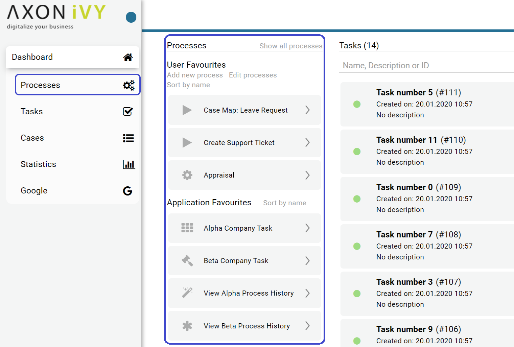
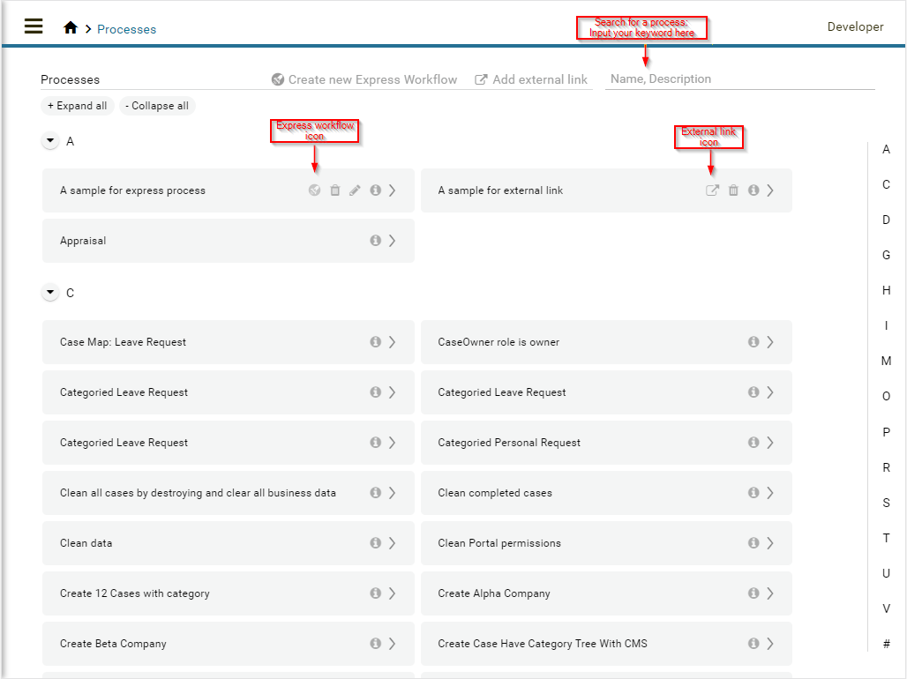
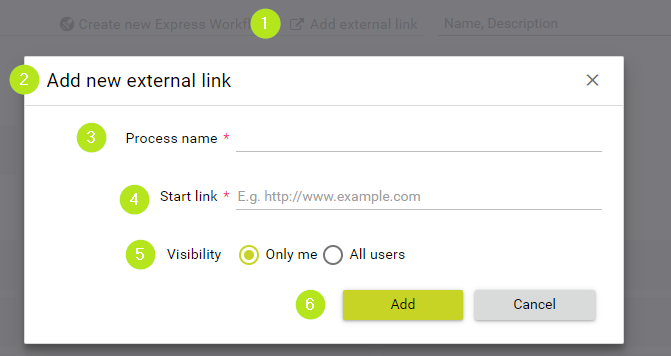

.. _full-process-list:

Full Process List
*****************

The **Full Process List** page gives you an overview on all the
processes in the application that are accessible to you. You can reach
the page by either using the :guilabel:`Processes` link in the
Axon Ivy Portal menu or the quick link :guilabel:`Show all processes` in your
dashboard.

On the **Full Process List** page, you see a list of all processes. They
are sorted alphabetically and grouped by their initial character. 
Express workflows are described in detail in :ref:`axon-ivy-express`.

If you’re looking for a specific process, you can search your keyword in search field 
marked in the image above. The search will look up your keyword in process names 
and process descriptions then filter the process list accordingly.

.. warning:: 
   Don’t confuse the process search
   with the global Axon Ivy Portal 
   search which you find in the    
   header area of the Portal.      

When you select a process from the list, a new case of this process is started.
Please be aware, that after you finished your activities in the case you will be
re-directed to the **Dashboard** and not the **Full Process
List**.

HowTo: Add an external link
--------------------------------------------

#. Select :guilabel:`Add external link` which is in Process list header.

#. The dialog :guilabel:`Add new external link` is opened.

#. For the :guilabel:`Process name`, define the best name for it.

#. For the :guilabel:`Start link`, add the URL of your external link.

#. This step is only for a user granted ``CreatePublicExternalLink`` Portal permission. 
   This user can set this link as a public link by selecting :guilabel:`All users`.
   By default, :guilabel:`Visibility` field is not displayed and this new external link is a private link.

#. Confirm your configuration with the button :guilabel:`Add`.

.. hint:: 
   Starting processes from the Full Process List page is fine if you require
   this process only on a rare basis. For all processes which you use on a
   regular basis we highly recommend configuring them on your personal
   dashboard. See :ref:`howto-add-a-process-as-a-user-favorite` for an instruction.

.. include:: ../includes/_common-icon.rst