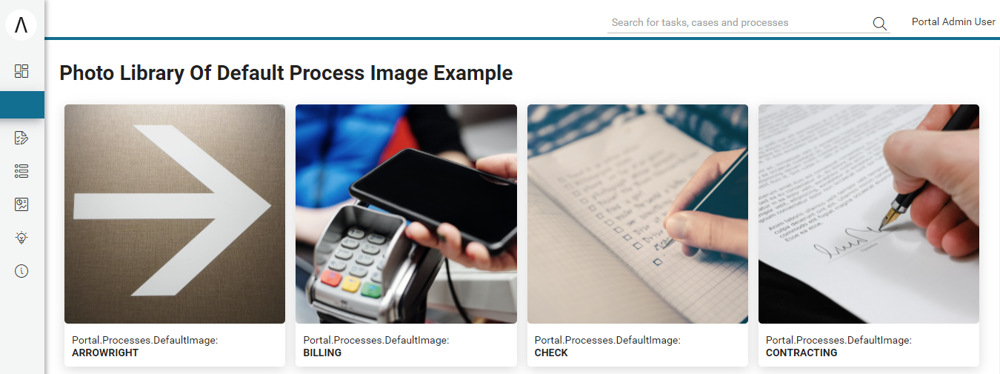

.. _full-process-list:

Full Process List
*****************

The **Full Process List** page gives you an overview of all the processes in the
application available to you. To open the page, click :guilabel:`Processes` in
the |axon-ivy| Portal menu.

|navigate-to-full-process-list|

On the **Full Process List** page, you see a list of all processes. They
are sorted alphabetically and grouped by their initial character. 
Express workflows are described in detail in :ref:`axon-ivy-express`.

|portal-full-process-list-page|

   #. Search for a process, input your keyword here
   #. Express workflow icon
   #. External link icon
   #. Change view mode

Process Display Mode
--------------------

The **Full Process List** provides three modes to display the process list. By
default, **Image mode** is activated. To change the default process display mode
in :guilabel:`My Profile`.

Image Mode
^^^^^^^^^^

|portal-process-image-view-page|

.. hint:: 
   To change the default image of processes, change
   the Portal setting **Portal.Processes.DefaultImage**.
   
   See :ref:`values_of_default_image`.

Grid Mode
^^^^^^^^^

|portal-process-grid-view-page|

Compact Mode
^^^^^^^^^^^^

|portal-process-list-view-page|

To find a specific process, search by keywords in the search field (top left
below the home icon in the image above). The search will look in process names,
process descriptions and process categories, then filter the process list
accordingly.

.. warning:: 
   Don’t confuse the process search with the global |axon-ivy| Portal 
   search which you find in the header area of the Portal.

To start a new instance of a process, select the process in the list. We call
this instance a **case**. After you finish your activities in the case, you will
be re-directed to the **Dashboard**, not to the :guilabel:`Full Process List`.

.. _values_of_default_image:

Values of Portal Setting **Portal.Processes.DefaultImage**
----------------------------------------------------------
#. You could refer to project ``portal-developer-examples`` for examples.
#. Start Process ``PhotoLibraryOfDefaultProcessImageExample``

|process-default-image-values|

HowTo: Edit process icon in Image mode
--------------------------------------
#. Click on more menu item in the process card item.
#. Click on |edit-icon| :guilabel:`Edit` menu item.
#. The dialog **Edit process information** is opened.
#. Click on :guilabel:`Change` link, besides the current icon.
#. The dialog :guilabel:`Selecting icon` is opened, and choose new icon.
#. Press on :guilabel:`Save` button, and process icon is changed

   |edit-process-menu-item|
   |edit-process-icon-dialog|

HowTo: Add an external link
---------------------------

#. Click on :guilabel:`Add external link` which is in Process list header.

#. The dialog :guilabel:`Add external link` is opened.

#. For the :guilabel:`Process name`, define the best name for it.

#. For the :guilabel:`Start link`, add the URL of your external link.

#. This step is only for a user granted ``CreatePublicExternalLink`` Portal permission. 
   This user can set this link as a public link by selecting :guilabel:`All users` .
   By default, :guilabel:`Visibility` field is not displayed and this new external link is a private link.

#. For the :guilabel:`Icon`, change the best icon for it.

#. Confirm your configuration with the button :guilabel:`Add`.

|how-to-add-a-new-external-link|

|add-external-link-dialog|

.. hint:: 
   Starting processes from the Full Process List page is fine if you require
   this process only on a rare basis. For all processes which you use on a
   regular basis we highly recommend configuring them on your personal
   dashboard. See :ref:`howto-add-a-process-as-a-user-favorite` for an instruction.

.. include:: ../includes/_common-icon.rst

.. |navigate-to-full-process-list| image:: ../../screenshots/process/navigate-to-full-process-list.png
.. |portal-full-process-list-page| image:: ../../screenshots/process/portal-full-process-list-page.png
.. |how-to-add-a-new-external-link| image:: ../../screenshots/process/how-to-add-a-new-external-link.png
.. |add-external-link-dialog| image:: ../../screenshots/process/add-external-link-dialog.png
.. |portal-process-image-view-page| image:: ../../screenshots/process/portal-process-image-view-page.png
.. |portal-process-grid-view-page| image:: ../../screenshots/process/portal-process-grid-view-page.png
.. |portal-process-list-view-page| image:: ../../screenshots/process/portal-process-list-view-page.png
.. |edit-process-menu-item| image:: ../../screenshots/process/edit-process-menu-item.png
.. |edit-process-icon-dialog| image:: ../../screenshots/process/edit-process-dialog.png
