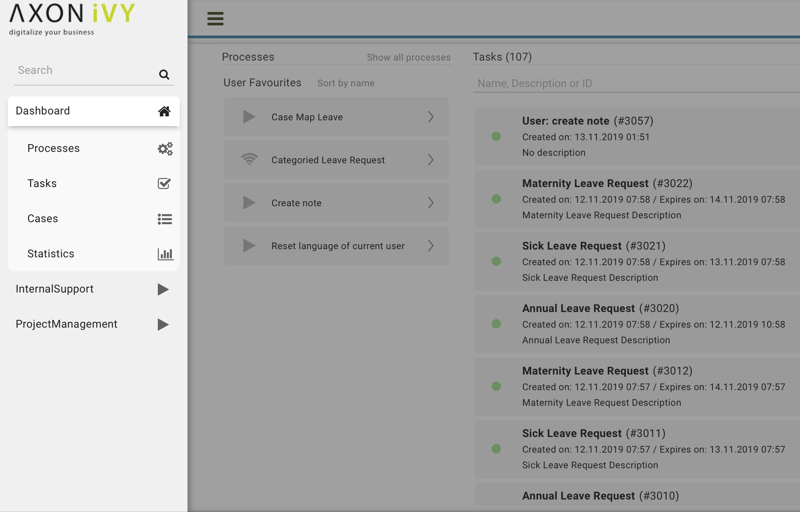
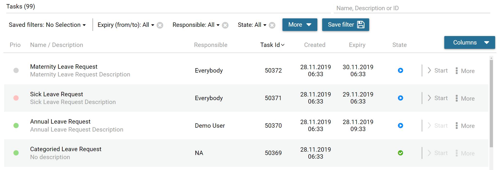
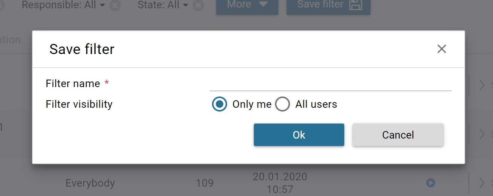
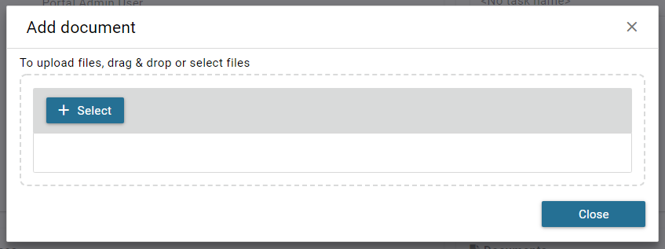
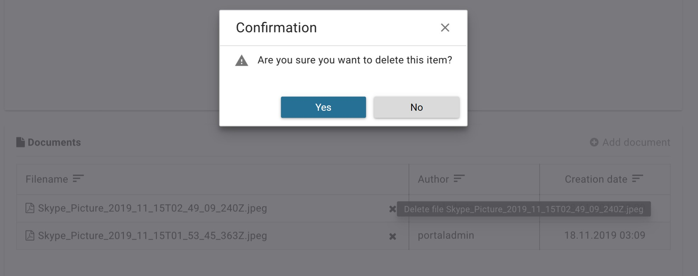
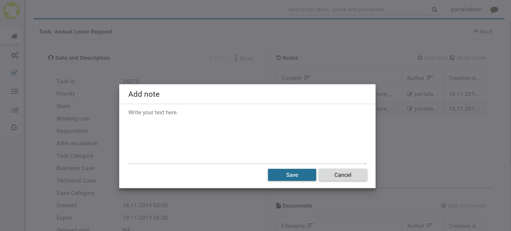
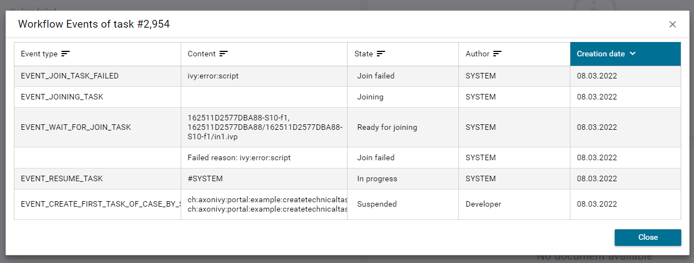
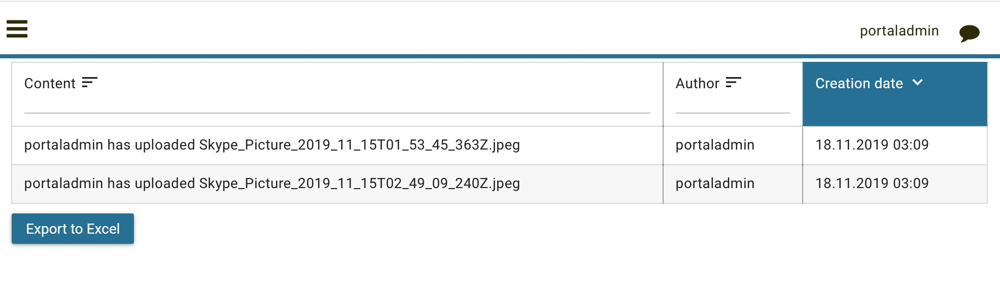

.. _full-task-list:

Full Task List
**************

The **Full Task List** page shows you the same tasks you see on your
personal dashboard. However, this page provides you with extended
information on the tasks, as well as, advanced search and filter
capabilities. You can reach the page by using the |check-icon| :guilabel:`Tasks`
link in the Axon Ivy Portal menu.

.. hint:: 
   Depending on the roles you hold
   in the application and the     
   configuration of the Axon Ivy  
   Portal, you might see not only 
   the tasks belonging to you but 
   all open tasks.                

On the top of the **Full Task List** page you see next to the heading
:guilabel:`Tasks` in brackets the overall number of tasks shown to you. Further
to the right you find a  search feature which you might use if
you’re looking for a specific task. Below you find the filter feature.
The usage will be explained in the HowTo’s further down this chapter.
Finally, you see the list of tasks.

For each task the following key information is shown in the list:

#. Priority

#. Name and Description

#. Responsible user or role

#. Task ID

#. Creation Date

#. Expiry Date

#. Status

Furthermore, at the end of each row you find a side step menu of key features in
handling tasks:

#. Reset Task

#. Delegate Task

#. Reserve

#. Add Ad-hoc Task

Finally, you have the possibility to access the full set of the task
data by clicking on the row containing the task Name and Description.

The task details are separated into 3 different sections:

#. Data and description, you find various metadata concerning the task and
   the respective case it is related to.

   .. figure:: images/detailed-task-information-data-description.png

#. Note, you may add additional notes which is described below

   .. figure:: images/detailed-task-information-note.png

#. Document, these documents once attached to the case are
   available on all tasks. You may add or delete documents 
   described in the HowTo’s below.

   .. figure:: images/detailed-task-information-documents.png

   .. figure:: images/detailed-task-information.png

HowTo: Use existing filter
--------------------------

.. hint:: 
   If there are no public filters and you didn’t create any filters so far,
   there might be no filters available. In this case, you must create a filter
   first. This is described in detail in HowTo: Create new filter.   

#. Click on the :guilabel:`Save Filter` dropdown menu. 

#. Select the filter you want to use.

HowTo: Create new filter
------------------------

#. Click on the button :guilabel:`More` to select one of the available filters.
   For a list of available filters, see `Task filter criteria`_.

#. Click on the newly added filter and configure it.

#. Add more filters by clicking on the button :guilabel:`Filter` again.

#. Drop filters by clicking on the |delete-attachment-icon| icon next to
   the filter.

#. When finished defining your filter, click on the button :guilabel:`Save
   filter`.

#. The :guilabel:`Save filter` dialog is opened.

#. Under :guilabel:`Filter name`, provide a recognizable name for the filter.

#. Under :guilabel:`Filter visibility`, you can select if the filter is only
   visible for you or shall be available to all users.

9. Save the filter by clicking the button :guilabel:`Ok`.

.. centered:: _`Task filter criteria`

+-----------------------------------+-----------------------------------+
| Criteria                          | Description                       |
+===================================+===================================+
| ID                                | The filter lets you specify the   |
|                                   | task identify number              |
+-----------------------------------+-----------------------------------+
| Name                              | The filter lets you specify the   |
|                                   | task name                         |
+-----------------------------------+-----------------------------------+
| Created (from / to)               | The filter lets you specify in    |
|                                   | which time period the task was    |
|                                   | created.                          |
+-----------------------------------+-----------------------------------+
| Description                       | The filter lets you search for    |
|                                   | keywords within the task          |
|                                   | description.                      |
+-----------------------------------+-----------------------------------+
| Expiry (from / to)                | The filter lets you specify in    |
|                                   | which time period the task will   |
|                                   | expire.                           |
+-----------------------------------+-----------------------------------+
| Priority                          | The filter lets you specify the   |
|                                   | priority of the tasks to be       |
|                                   | shown.                            |
+-----------------------------------+-----------------------------------+
| Responsible                       | The filter lets you specify a     |
|                                   | user or role which is responsible |
|                                   | for the task.                     |
+-----------------------------------+-----------------------------------+
| State                             | The filter lets you specify the   |
|                                   | task state.                       |
+-----------------------------------+-----------------------------------+

.. hint::
   #. You can create a new filter by selecting an existing filter, reconfiguring it, and saving it.

   #. Only users with the admin role ``AXONIVY_PORTAL_ADMIN`` can save the filter for all users.

HowTo: Configure displayed tasks in the Full Task List
^^^^^^^^^^^^^^^^^^^^^^^^^^^^^^^^^^^^^^^^^^^^^^^^^^^^^^

#. To choose columns to display, click on :guilabel:`Manage columns`. Then you could choose displayed columns by checking the related checkboxes.

#. To sort data, click on the column header. To change sort direction, click on that column header one more time.
   Note that some columns do not support sorting.

HowTo: Attach a document to the case
------------------------------------

#. Open the task details of a task

#. Click the link |add-icon| :guilabel:`Add document`

#. The :guilabel:`Add document` dialog is opened

#. Upload a file by using the :guilabel:`Select` button or by simply dragging
   the file into the dialog

#. Click the button :guilabel:`Close` to see the uploaded attachment

HowTo: Remove an attachment from the case
-----------------------------------------

#. Open the task details of a task

#. Click on the |delete-icon| :guilabel:`Delete` button next to the
   attachment you want to remove

#. A :guilabel:`Confirmation` dialog is opened

#. Confirm the deletion with the button :guilabel:`Yes`

HowTo: Add a note to a task
---------------------------

#. Open the task details of a task

#. Click on the |add-icon| :guilabel:`Add note` link below the notes section

#. The :guilabel:`Add note` dialog is opened

#. Enter your note

#. Confirm your note by clicking the button :guilabel:`Save`

.. _how-to-show-workflow-events:

HowTo: Show Workflow Events
---------------------------

.. note:: 
   User must to has permission ``WORKFLOW_EVENT_READ_ALL`` to see all workflow events of a task

#. Open the task details of a task

#. Click on the :guilabel:`Actions` link on the right top corner of the **Data and Description** section

#. Click :guilabel:`Workflow Events` link on the overlay panel

   .. figure:: images/how-to-show-workflow-event.png

**Workflow Events dialog**

HowTo: Export a task history
----------------------------

#. Open the task details of a task

#. Click on the |show-more-icon| :guilabel:`Show more` link below the notes section

   .. figure:: images/how-to-show-note-details.png

#. A new page with the task history is opened

#. You may export the history by clicking on the button :guilabel:`Export to
   Excel`

.. include:: ../includes/_common-icon.rst